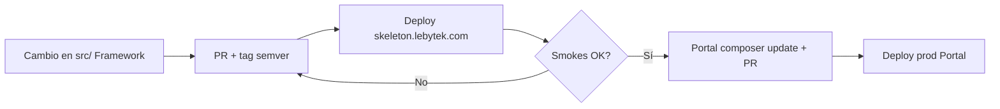

# Entornos Lebytek — skeleton, staging y producción

Documento canónico para agentes y operadores. Define **para qué sirve cada hostname**
y qué repo/paquete despliega en cada capa. No confundir skeleton con staging.

**Estado (2026-07-27):** producción Portal operativa; **skeleton.lebytek.com pendiente
de implementar**; **staging Portal (pre-prod producto) no existe aún** — documentado
como fase futura.

## Mapa de capas

```text
skeleton.lebytek.com   →  lebytek/skeleton + lebytek/framework (tag semver)
                           LAB de plataforma — sin negocio Portal

staging.lebytek.com    →  Lebytek_Portal + composer.lock  [FUTURO]
                           PRE-PROD de producto — QA E2E antes de prod

lebytek.com            →  Lebytek_Portal main + composer.lock
waapi.lebytek.com      →  Lebytek_Portal main + composer.lock
                           PRODUCCIÓN negocio Lebytek

api.lebytek.com        →  WhatsApiLebytek main
                           PRODUCCIÓN API WhatsApp (repo aparte)
```

## Comparativa

| | **skeleton** | **staging** (futuro) | **producción** |
|---|--------------|----------------------|----------------|
| **Dominio objetivo** | `skeleton.lebytek.com` | `staging.lebytek.com` (propuesto) | `lebytek.com`, `waapi.lebytek.com` |
| **Qué se despliega** | Plantilla `skeleton/` + paquete `lebytek/framework` | App completa `Lebytek_Portal` | App completa `Lebytek_Portal` |
| **Repo fuente** | Espejo `Lebytek_Skeleton` (split de `skeleton/`) + Composer VCS Framework | `Parzival2103/Lebytek_Portal` | `Parzival2103/Lebytek_Portal` |
| **Framework en VPS** | Tag semver (`v1.2.x`) vía `composer.lock` del skeleton | Mismo lock que Portal candidato | Lock commiteado en `main` |
| **Negocio Marketing** | **No** (sin leads, membresías, waapi client) | **Sí** (sandbox / datos de prueba) | **Sí** (real) |
| **Base de datos** | Propia aislada (p. ej. `lebytek_skeleton`) | Propia aislada — **nunca** BD prod | `lebytek`, `lebytekwappi`, etc. |
| **Cuándo usarlo** | Validar release Framework antes de bump en Portal | Ensayar PR Portal, Stripe sandbox, flujos E2E | Tráfico real |
| **Estado hoy** | Por implementar — ver plan abajo | No desplegado; plan Portal staging archivado | Operativo @ Framework v1.2.1 |

## skeleton.lebytek.com — laboratorio del Framework

### Propósito

Probar **solo la plataforma** empaquetada:

- Instalador web/CLI, migraciones SQL plataforma, RBAC, CRUD Engine
- `SqlFileRunner`, Payments genérico (OFF por defecto en vertical)
- Releases semver de `lebytek/framework` antes de que Portal las consuma

### Cuándo desplegar / actualizar

1. Nuevo tag `lebytek/framework` (p. ej. v1.2.2) mergeado en `main`
2. Smokes en skeleton verdes → entonces `composer update lebytek/framework` en Portal
3. Portal CI/tests local → deploy prod Portal (runbook aparte)

### Qué no hacer en skeleton

- No clonar `Lebytek_Portal` en ese hostname
- No apuntar a la BD `lebytek` de producción
- No usar como “lebytek.com de prueba” para Marketing o Stripe prod
- No consumir ramas git del Framework en VPS (solo semver Composer)

### Implementación (pendiente)

| Documento | Rol |
|-----------|-----|
| [`superpowers/specs/2026-07-26-skeleton-package-staging-design.md`](superpowers/specs/2026-07-26-skeleton-package-staging-design.md) | Diseño |
| [`superpowers/plans/2026-07-26-skeleton-package-staging.md`](superpowers/plans/2026-07-26-skeleton-package-staging.md) | Plan paso a paso (VPS, repo espejo, BD) |

Nota histórica: en el VPS existió un directorio bajo el usuario `lebytek-stg` asociado
al hostname antiguo `staging.lebytek.com` con una **copia sin git de Portal** y BD prod —
ese estado está **obsoleto y prohibido**. El reemplazo correcto es **skeleton** con BD
propia, no una copia de Portal.

## staging.lebytek.com — pre-producción Portal (fase futura)

### Propósito

Ensayar el **producto desplegable** (Portal) antes de promover a lebytek.com / waapi:

- Flujos E2E: landing, lead, pago Stripe **sandbox**, activación plan, integración api
- Cron, `migrate-marketing`, flags ops (`PAYMENTS_SUBSCRIPTION_CHECKOUT`, etc.)
- Regresiones de negocio que skeleton **no** cubre

### Cuándo crearlo

Cuando haya QA de producto recurrente (p. ej. antes de habilitar suscripciones en prod).
**No es prerequisito** para skeleton.

### Reglas obligatorias

- Checkout `Lebytek_Portal` (rama candidata o `main`), nunca monorepo Framework legacy
- `composer install` del lock del árbol desplegado
- BD **dedicada** con credenciales distintas de prod; datos sanitizados o vacíos
- Stripe / api en modo sandbox; tokens distintos de prod
- Runbook propio (a redactar en Portal cuando exista el hostname)

### Referencia histórica (no ejecutar)

Plan archivado: `Lebytek_Portal/docs/archive/superpowers/plans/2026-07-21-portal-staging-cutover.md`
— superseded; mezclaba Portal con BD prod.

## Producción — autoridad actual

| Sitio | Repo | Rama | Framework |
|-------|------|------|-----------|
| lebytek.com, waapi | `Lebytek_Portal` | `main` | `lebytek/framework` vía `composer.lock` (v1.2.1) |
| api.lebytek.com | `WhatsApiLebytek` | `main` | Laravel propio (no Portal) |

Runbook Portal: [`Lebytek_Portal/docs/DEPLOY-VPS.md`](https://github.com/Parzival2103/Lebytek_Portal/blob/main/docs/DEPLOY-VPS.md).

## Flujo recomendado de releases Framework → Portal



Staging Portal (cuando exista) encaja **entre** E y F para QA de negocio opcional.

## Rama legacy

`feature/backoffice-api-integration` en este repo es **referencia histórica congelada**.
Ningún entorno (skeleton, staging ni prod) debe desplegar desde esa rama. Ver
`.cursor/rules/no-merge-framework-main.mdc`.
