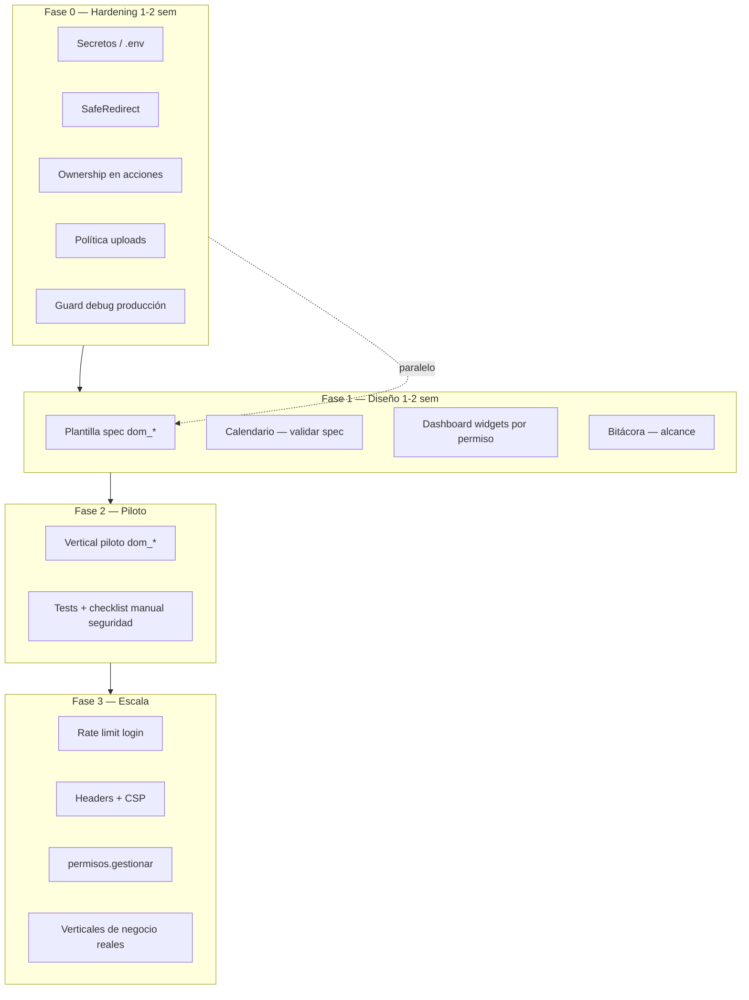

# Roadmap de continuidad — Seguridad, formularios y diseño previo a programación

> **Para ti como arquitecto/product owner:** Este documento resume qué tan listo está el framework, qué vulnerabilidades conviene cerrar **antes** de seguir agregando módulos, y qué piezas debes **diseñar y especificar** (no programar aún) para que la siguiente fase de desarrollo sea coherente y segura.

**Fecha:** 2026-06-09  
**Alcance:** Plataforma base (CRUD Engine, Calendario, RBAC, Ajustes/LAYOUT, LEBYTEK UI)  
**Relacionado:** [auth_rbac_seguridad_v0.1.md](../core/auth_rbac_seguridad_v0.1.md), [informe-capacidades-framework-examen-dominio-ficticio.md](../audits/informe-capacidades-framework-examen-dominio-ficticio.md), [2026-06-08-cierre-parciales-auditoria.md](./2026-06-08-cierre-parciales-auditoria.md)

---

## 1. Respuesta directa: ¿más módulos o seguridad primero?

**Recomendación: cerrar un “hardening mínimo” de plataforma antes de abrir módulos de negocio nuevos (`dom_*`).**

No hace falta detener todo el desarrollo, pero sí **no** empezar verticales de dominio (inventario, citas, facturación, etc.) hasta resolver los ítems de la **Fase 0** de este plan. El framework ya tiene bases sólidas; los huecos detectados son acotados pero **explotables** en escenarios multiusuario reales (IDOR en acciones CRUD, open redirect, uploads, secretos en git).

| Enfoque | Cuándo tiene sentido |
|---------|----------------------|
| **Seguridad primero (Fase 0)** | Antes de cualquier módulo `dom_*` con datos sensibles, multiusuario o archivos |
| **Diseño en paralelo (Fases 1–2)** | Especificar contratos, permisos y UX mientras se implementa Fase 0 |
| **Nuevos módulos (Fase 3+)** | Después de Fase 0 y con specs escritas de Fase 1 |

**Orden sugerido:**

```
Fase 0 (hardening)  →  Fase 1 (diseñar contratos plataforma)  →  Fase 2 (primer vertical dom_*)
         ↑                              ↑
    1–2 semanas                   documentos de spec, sin código
```

---

## 2. Inventario actual de capacidades

Lo que **ya tienes** y es reutilizable:

| Módulo / capacidad | Estado | Notas |
|--------------------|--------|-------|
| CRUD Engine | Maduro | Config JSON, validación por capas, acciones custom, scope por owner (parcial) |
| RBAC | Maduro | Slugs `modulo.accion`, middleware por ruta, sincronización segura de permisos |
| Menú dinámico | Maduro | Filtrado por permiso en runtime |
| Dashboard | Parcial | Proveedores extensibles; filtrado por permiso aún manual |
| Calendario | En curso / planificado | Capa de lectura sobre CRUD; spec en `docs/superpowers/plans/2026-06-09-modulo-calendario.md` |
| Ajustes / LEBYTEK UI | Maduro | `cfg_configuraciones`, layout, confirm modal global |
| Bitácora | Base | Registro en operaciones CRUD |

Lo que **aún no es plataforma** (correcto — va en verticales):

- Lógica de negocio de dominio (`dom_*`)
- Reportes, integraciones, colas
- API REST completa para terceros

---

## 3. Revisión de conceptos de seguridad

### 3.1 Lo que ya está bien resuelto

| Concepto | Implementación | Evidencia |
|----------|----------------|-----------|
| **Autenticación** | bcrypt, verificación con `password_verify` | `app/Kernel/Security/Hash.php` |
| **Fijación de sesión** | `session_regenerate_id(true)` al iniciar sesión | `AuthService::iniciarSesion()` |
| **Cookie de sesión** | `HttpOnly`, `SameSite=Lax`, `Secure` configurable | `config/session.php`, `Session.php` |
| **CSRF (web)** | Token por sesión, `hash_equals`, campo oculto + meta | `Csrf.php`, `CsrfMiddleware.php` |
| **Autorización** | Middleware RBAC por ruta + permisos CRUD por recurso | `RbacMiddleware`, `CrudResourceService` |
| **SQL injection** | Prepared statements, identificadores con lista blanca | Repositorios, `GenericCrudRepository` |
| **Mass assignment** | Solo campos declarados en JSON; columnas protegidas | `CrudDataService::buildPayload()`, `PROTECTED_COLUMNS` |
| **XSS en vistas** | `ViewHelper::e()` sistemático | Vistas admin, CRUD, login |
| **XSS en JS dinámico** | `esc()` / `escapeHtml()` | `app.js`, `calendar.js` |
| **Permisos manipulados en POST** | IDs filtrados contra BD existente | `PermisoRepository::filterExistingPermisoIds` |

### 3.2 Huecos por severidad

#### Crítico — resolver de inmediato

| ID | Hallazgo | Riesgo | Acción de diseño |
|----|----------|--------|------------------|
| **C1** | `.env` no está en `.gitignore` y aparece modificado en git | Fuga de `DB_PASSWORD`, `APP_KEY` al remoto (VPS auto-pull) | Política: solo `.env.example` en repo; rotación de secretos si hubo push |

#### Alto — bloquean módulos multiusuario

| ID | Hallazgo | Riesgo | Acción de diseño |
|----|----------|--------|------------------|
| **H1** | Redirect a `Referer` sin validar en fallo CSRF y en `back()` | Open redirect → phishing | Especificar `SafeRedirect::toInternal()` (solo rutas relativas same-origin) |
| **H2** | `CrudActionService` no llama `assertOwnership()` | IDOR: usuario con scope `owner` ejecuta acciones sobre registros ajenos | Contrato: toda mutación (CRUD + acciones + bulk) pasa por ownership |
| **H3** | Uploads en `public/`, extensión opcional, sin MIME ni tamaño | Malware servible, DoS | Política de uploads documentada (ver §4.3) |

#### Medio — planificar en Fase 0–1

| ID | Hallazgo | Riesgo |
|----|----------|--------|
| **M1** | Sin rate limiting en login | Fuerza bruta |
| **M2** | POST `/logout` sin CSRF | Logout forzado cross-site |
| **M3** | Exclusión global `/api/` del CSRF | Futuras APIs session-based vulnerables |
| **M4** | Security headers solo en `.htaccess` | `php -S` sin headers; sin CSP |
| **M5** | `SESSION_SECURE=false` por defecto | Cookie en HTTP en producción mal configurada |
| **M6** | `APP_DEBUG=true` en `.env.example` | Stack traces en producción |
| **M7** | Permisos admin con `administracion.ver` en lugar de slug dedicado | Privilegio excesivo |
| **M9** | Columna owner editable si se expone en formulario | Reasignación de ownership |
| **M10** | `APP_KEY` definido pero sin uso | Falsa sensación de cifrado |

#### Bajo — higiene

| ID | Hallazgo |
|----|----------|
| L1 | Checkbox “Recordarme” sin efecto |
| L2 | CSRF no se rota en login |
| L3 | `Hash::needsRehash()` no se usa tras login |
| L4 | Clave de recurso CRUD sin regex estricta en loader |
| L5 | HTML crudo en partials de ajustes (`$bodyHtml`) — solo seguro si callers son confiables |

### 3.3 Modelo de amenazas simplificado

Para el tipo de sistema que construyes (admin interno, PHP monolito, sesión cookie):

```
Atacante externo ──► fuerza bruta login (M1)
                  ──► CSRF en logout / futura API (M2, M3)
                  ──► open redirect post-CSRF (H1)

Usuario autenticado bajo privilegio ──► IDOR en acciones CRUD (H2)
                                     ──► manipular owner_id en POST (M9)
                                     ──► subir archivo ejecutable (H3)

Operador / deploy ──► .env en git (C1)
                   ──► debug activo en prod (M6)
```

**Conclusión:** el perfil de riesgo dominante no es “falta de RBAC”, sino **consistencia de controles en rutas secundarias** (acciones, redirects, uploads) y **configuración de despliegue**.

---

## 4. Revisión de campos y formularios seguros

### 4.1 Pipeline actual del CRUD Engine (fortaleza del framework)

Cada campo de formulario pasa por un pipeline explícito en `CrudFieldValidationService`:

```
Entrada HTTP
    → sanitizeRawInput()     # trim, strip_tags (salvo allow_html)
    → normalizeValue()       # tipos canónicos (checkbox, email, etc.)
    → validatePayload()      # reglas: required, min, max, regex, email, etc.
    → toStorageValue()       # forma persistible
    → buildPayload()         # solo campos en formFields(); PROTECTED_COLUMNS ignoradas
    → columnas de sistema    # created_by, timestamps — re-aplicadas tras hooks
```

**Implicación de diseño:** al definir un recurso `dom_*`, la seguridad del formulario se logra **declarando bien el JSON**, no escribiendo validación ad hoc en controladores.

### 4.2 Reglas de diseño para campos (checklist para specs)

Al diseñar cada formulario de módulo, documenta por campo:

| Pregunta | Regla recomendada |
|----------|-------------------|
| ¿El campo es editable por el usuario? | Si es auditoría (`created_by`, `updated_at`), **no** incluirlo en `form.fields` |
| ¿Es clave foránea de ownership? | Excluir de formulario o marcar `readonly: true`; forzar server-side en create |
| ¿Acepta HTML? | Solo con `validation.allow_html: true` y política explícita de salida (hoy las vistas escapan todo) |
| ¿Es archivo? | Obligar `allowed_extensions`, tamaño máximo, y decidir: ¿público o descarga autenticada? |
| ¿Es select con opciones dinámicas? | Opciones desde repositorio, nunca desde input libre del cliente |
| ¿Es numérico/dinero? | `min`, `max`, `decimal_places`; evitar floats para dinero crítico (considerar centavos enteros) |
| ¿Tiene regex custom? | Mantener patrones cortos (<512 chars, ya validado anti-ReDoS) |
| ¿Es único en BD? | Usar validador de constraints DB si aplica |

### 4.3 Política de uploads (diseñar antes de usar `type: file`)

**Estado actual:** archivos van a `public/{uploadsPath}/` con nombre aleatorio; validación de extensión solo si config la declara.

**Política objetivo a especificar:**

1. **Lista blanca obligatoria** por campo: `allowed_extensions: ["pdf","jpg","png"]`
2. **Tamaño máximo** por campo y global (`MAX_UPLOAD_MB` en env, aplicado en código)
3. **Verificación MIME** con `finfo` además de extensión
4. **Ubicación:** preferir `storage/uploads/` + endpoint de descarga con RBAC, no URL pública directa
5. **Servidor:** si se mantiene en `public/`, bloquear ejecución PHP/HTML en ese directorio (Apache/Nginx)
6. **Nombres:** mantener patrón actual (sin nombre original completo) ✓

### 4.4 Formularios fuera del CRUD Engine

| Pantalla | Patrón actual | Qué diseñar |
|----------|---------------|-------------|
| Login | CSRF ✓, escape ✓ | Rate limit + mensaje genérico (no revelar si email existe) |
| Usuarios / Roles / Permisos | CSRF ✓, whitelist de campos ✓ | Slug dedicado `permisos.gestionar` |
| Ajustes | CSRF ✓ | Inventario de claves `cfg_*` editables vs solo sistema |
| Confirm modal global | Contrato `data-confirm-*` | Matriz acción → nivel de confirmación (destructiva / irreversible) |

### 4.5 Matriz de validación por tipo de campo CRUD

| Tipo | Sanitización | Validación típica | Riesgo si mal configurado |
|------|--------------|-------------------|---------------------------|
| `text` | strip_tags | max_length, regex | XSS almacenado (mitigado por escape en vista) |
| `textarea` | strip_tags | max_length | Idem |
| `email` | lowercase | filter_var EMAIL | Cuentas inválidas, lógica de notificación rota |
| `number` / `decimal` | cast | min, max | Overflow lógico, negativos no deseados |
| `date` / `datetime` | parse | formato ISO | Fechas inválidas en calendario |
| `select` | contra opciones | in_list | Inyección de valor no permitido |
| `checkbox` | 0/1 | — | Estados ambiguos |
| `file` | — | extension, size, mime | **Alto** — ver H3 |
| `hidden` | strip_tags | no usar para secrets | Manipulación de IDs sensibles |
| `relation` | FK validada | exists en BD | Referencias a registros fuera de scope |

---

## 5. Qué diseñar antes de programar (Fases 1–2)

Estas son piezas que conviene **escribir como spec** (1–3 páginas cada una) antes de tocar código de dominio.

### 5.1 Fase 0 — Spec de hardening (implementación corta, diseño mínimo)

| Documento / decisión | Contenido |
|---------------------|-----------|
| **Política de secretos** | `.env` fuera de git, rotación, checklist deploy VPS |
| **SafeRedirect** | Algoritmo: aceptar solo paths que empiecen con `/` y no `//` |
| **Ownership unificado** | Diagrama: `index/list` → scope SQL; `show/edit/delete/action/bulk` → assertOwnership |
| **Política de uploads** | §4.3 como spec formal en `docs/core/seguridad_uploads.md` |

### 5.2 Fase 1 — Contratos de plataforma (diseño, sin código)

#### A. Módulo de dominio tipo (`dom_*`)

Plantilla de spec que todo vertical debe completar:

- Tablas y prefijos `dom_`
- Permisos: `{recurso}.ver|crear|editar|eliminar` + acciones custom
- Scope: ¿global, por owner, por rol, por sucursal?
- Menú: ítem en `core_menu_items` con `permiso_slug`
- CRUD JSON o módulo especializado (si toca credenciales)
- Campos con tabla §4.2
- Calendario: ¿necesita vista calendario? ¿qué columnas mapean a start/end?
- Dashboard: ¿KPIs? ¿qué permiso por widget?

**Entregable sugerido:** `docs/modules/plantilla-spec-vertical-dom.md`

#### B. Calendario (completar diseño)

Ya existe plan de implementación. Antes de codear, validar en diseño:

- Qué recursos tendrán calendario (solo lectura)
- Mapeo columna fecha / hora / título / color
- Filtros por scope heredados del CRUD
- Permisos: ¿mismo `{prefix}.ver` o slug `calendario.{key}.ver`?
- Interacción: clic en evento → show CRUD (sin edición inline)

#### C. Dashboard por perfil

Diseñar modelo declarativo (no editor visual aún):

```yaml
# Ejemplo conceptual — config/dashboard_widgets.php
widgets:
  - id: kpi_usuarios_activos
    provider: DefaultPlatformDashboardProvider
    required_permission: usuarios.gestionar
    roles: []  # vacío = solo permiso
```

Decisiones a tomar:

- ¿Filtrado solo por permiso o también por rol?
- ¿Widgets fijos vs configurables por instancia?
- ¿Calendario mini-widget en dashboard?

#### D. Bitácora y auditoría

- Qué eventos son obligatorios (`crud.create`, login, cambio de rol, exportación)
- Retención y quién puede ver `log_*`
- ¿Pantalla admin de auditoría o solo tabla?

#### E. API (si la necesitas)

Diseñar antes de exponer endpoints:

- ¿Sesión cookie o token Bearer?
- Si cookie: CSRF obligatorio o SameSite strict + rutas explícitas
- Versionado `/api/v1/`
- Rate limiting por IP/token
- No reutilizar exclusión global `/api/` actual

### 5.3 Fase 2 — Primer vertical de negocio piloto

Elegir **un** dominio ficticio pequeño para validar el framework end-to-end (recomendación del informe de auditoría):

**Candidato piloto:** “Agenda de visitas” o “Pedidos demo” (ya hay demos parciales)

El piloto debe ejercitar:

- CRUD con scope owner
- Al menos una acción custom con confirm modal
- Un calendario alimentado por tabla
- Un KPI en dashboard filtrado por permiso
- Un rol “operador” sin eliminar

**No empezar** con el vertical más grande del negocio real; usar el piloto para encontrar fricción en specs.

---

## 6. Roadmap visual



---

## 7. Plan de implementación por fases (resumen ejecutivo)

### Fase 0 — Hardening mínimo (programar primero)

| # | Tarea | Prioridad | Esfuerzo est. |
|---|-------|-----------|---------------|
| 0.1 | Añadir `.env` a `.gitignore`; verificar historial git; rotar secretos | P0 | 1 h |
| 0.2 | `SafeRedirect` + usar en CSRF y `BaseController::back()` | P0 | 2–3 h |
| 0.3 | `assertOwnership` en `CrudActionService` (run + runBulk) | P0 | 3–4 h |
| 0.4 | Uploads: extensión obligatoria, tamaño, finfo MIME | P0 | 4–6 h |
| 0.5 | Guard: `APP_DEBUG` prohibido si `APP_ENV=production` | P1 | 1 h |
| 0.6 | Checklist deploy: `SESSION_SECURE=true`, `APP_DEBUG=false` | P1 | 1 h |

**Criterio de salida:** tests unitarios para redirect y ownership; checklist manual §11 de `auth_rbac_seguridad_v0.1.md` pasando.

> **Estado:** Fase 0 implementada en `docs/superpowers/plans/2026-06-10-hardening-seguridad-fase0.md`
> (C1, H1, H2, H3, M6 + checklist de despliegue). M1/M2/M3/M4/M5/M7 quedan para Fase 3.

### Fase 1 — Documentación de diseño (sin programar dominio)

| # | Entregable | Responsable |
|---|------------|-------------|
| 1.1 | `docs/modules/plantilla-spec-vertical-dom.md` | Tú / equipo |
| 1.2 | `docs/core/seguridad_uploads.md` | Tú / equipo |
| 1.3 | `docs/core/seguridad_formularios_crud.md` (checklist §4.2 formalizado) | Tú / equipo |
| 1.4 | Revisión spec calendario vs necesidades reales | Tú |
| 1.5 | Borrador `config/dashboard_widgets.php` (solo diseño YAML/JSON comentado) | Tú |

### Fase 2 — Piloto `dom_*`

| # | Tarea |
|---|-------|
| 2.1 | Elegir dominio piloto (1 entidad principal + 1 relación) |
| 2.2 | Completar plantilla spec §5.2.A |
| 2.3 | Migración `dom_*`, seeds permisos, menú |
| 2.4 | `config/cruds/{recurso}.json` con scope owner |
| 2.5 | Calendario opcional sobre el mismo recurso |
| 2.6 | Ejecutar `php scripts/rbac_integrity_report.php` |
| 2.7 | Pruebas manuales seguridad + regresión CRUD |

### Fase 3 — Paralelo con nuevos módulos

| # | Tarea |
|---|-------|
| 3.1 | Rate limiting login |
| 3.2 | CSRF en logout |
| 3.3 | Security headers en PHP bootstrap + CSP report-only |
| 3.4 | Slug `permisos.gestionar` |
| 3.5 | Validador config: prohibir owner column en form editable |
| 3.6 | Verticales de negocio adicionales usando plantilla |

---

## 8. Checklist de decisión antes de cada nuevo módulo

Responde **sí** a todo antes de programar un vertical:

- [ ] ¿Fase 0 completada o el módulo no usa acciones CRUD, uploads ni multiusuario?
- [ ] ¿Spec `dom_*` completada con permisos, scope y campos?
- [ ] ¿Permisos `{prefix}.ver|crear|editar|eliminar` definidos en seed?
- [ ] ¿Menú con `permiso_slug` alineado a `auth_permisos`?
- [ ] ¿Campos de ownership fuera del formulario o readonly?
- [ ] ¿Archivos con política §4.3?
- [ ] ¿Acciones destructivas usan `#confirmModal`?
- [ ] ¿`rbac_integrity_report.php` sin discrepancias nuevas?

---

## 9. Qué NO hacer todavía

Para mantener foco y evitar deuda:

| Tentación | Por qué esperar |
|-----------|-----------------|
| Más módulos plataforma (chat, notificaciones push, API pública) | Aún no hay contrato API ni rate limits |
| Editor visual de dashboard | Primero filtrado declarativo por permiso |
| Microservicios / colas | Monolito onion no está agotado |
| Tailwind / React en admin | LEBYTEK UI + Bootstrap 5 es la regla vigente |
| Permisos granulares por campo | RBAC por acción + scope row-level es suficiente por ahora |

---

## 10. Siguiente paso concreto para ti

**Esta semana (diseño):**

1. Leer y aprobar prioridades Fase 0 de este documento.
2. Elegir el **vertical piloto** (una frase de negocio: qué gestiona, quién lo usa).
3. Completar mentalmente la checklist §4.2 para cada campo del piloto.
4. Decidir si el piloto necesita calendario y archivos adjuntos.

**Después (programación ordenada):**

1. Implementar Fase 0 (hardening).
2. Redactar plantilla spec `dom_*` (Fase 1.1).
3. Implementar piloto (Fase 2).
4. Recién ahí abrir el segundo vertical de negocio real.

---

## 11. Referencias de código clave

| Tema | Archivo |
|------|---------|
| CSRF | `app/Kernel/Security/Csrf.php`, `app/Presentation/Middlewares/CsrfMiddleware.php` |
| Ownership CRUD | `app/Application/Services/CrudResourceService.php` (`assertOwnership`) |
| Acciones sin ownership | `app/Application/Services/CrudActionService.php` |
| Validación campos | `app/Application/Services/CrudFieldValidationService.php` |
| Payload / mass assignment | `app/Application/Services/CrudDataService.php` |
| Uploads | `CrudDataService::handleUpload()` |
| RBAC rutas | `routes/web.php`, `config/rbac_route_permissions.php` |
| Informe integridad | `php scripts/rbac_integrity_report.php` |

---

*Documento de planificación — no sustituye implementación. Para ejecutar Fase 0 con tareas TDD detalladas, solicitar plan de implementación derivado (`2026-06-09-hardening-seguridad-fase0.md`).*
