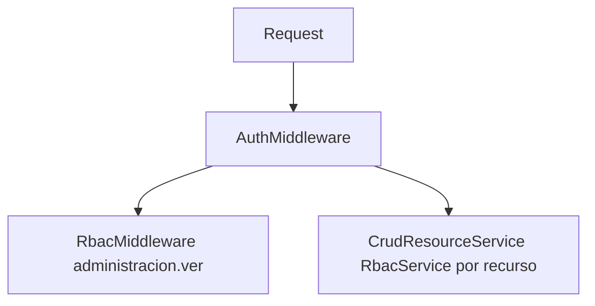

# Auditoría de alineación de módulos v0.1

**Tipo:** auditoría interna (solo análisis y propuesta).  
**Alcance:** alineación de secciones admin con CRUD Engine, LEBYTEK UI, componentes reutilizables, configuración dinámica, menú dinámico y RBAC.  
**Fecha de referencia:** 2026-05-02.  
**Metodología:** revisión estática de código, rutas, configuración y documentación; sin ejecución de tests como parte de este informe.

**Lecturas de contexto:** [arquitectura.md](../core/arquitectura.md), [ui_ux.md](../core/ui_ux.md), [ui_ux_implementacion_v0.1.md](../core/ui_ux_implementacion_v0.1.md), [modulo-crud-engine.md](../modules/crud/modulo-crud-engine.md), [uso-crud-engine.md](../modules/crud/uso-crud-engine.md), [modulo-menu.md](../modules/modulo-menu.md), [modulo-dashboard.md](../modules/modulo-dashboard.md), [auditoria_crud_engine_v0.1.md](./auditoria_crud_engine_v0.1.md), [auditoria_documentacion.md](./auditoria_documentacion.md).

---

## 1. Resumen ejecutivo

### Estado general

El sistema combina correctamente **dos modos de construcción**, alineados con la arquitectura Onion y con el contrato del CRUD Engine:

1. **Plataforma / seguridad:** usuarios, roles, permisos, ajustes (`cfg_configuraciones`) y catálogo de menú (`core_menu_items`) se implementan con **controladores y casos de uso dedicados**, no con el motor genérico.
2. **Dominio de negocio declarable:** recursos sobre tablas `dom_*` con JSON en `config/cruds/` operan vía **CRUD Engine** (`CrudController`, `CrudResourceService`, vistas bajo `admin/crud/`).

El motor [bloquea explícitamente](../modules/crud/modulo-crud-engine.md) tablas con prefijos `auth_*`, `cfg_*`, `core_*` y `log_*`. Por tanto, la no utilización del CRUD Engine en esas áreas es **coherente con el diseño vigente**, no una omisión casual.

### Porcentaje aproximado de alineación

Se informan **dos métricas** para no confundir uniformidad visual con adopción del motor:

| Métrica | Estimación | Comentario breve |
|--------|------------|------------------|
| **Alineación LEBYTEK UI (shell admin)** | ~80–90 % | `AdminBaseController` + `LebytekUiConfig`; vistas admin usan `.ct-page`, `.ct-card`, `.ct-table-card`; CRUD alineado según [ui_ux_implementacion_v0.1.md](../core/ui_ux_implementacion_v0.1.md). |
| **Alineación “CRUD Engine como único stack admin”** | Baja para el núcleo de plataforma | **Por diseño y seguridad:** las tablas sensibles no son elegibles para el motor sin cambiar política de producto. En dominio `dom_*`, el patrón JSON + motor está operativo. |

### Principales riesgos

1. **RBAC a nivel de ruta vs menú:** rutas como `/admin/dashboard` y `/admin/ajustes` solo exigen autenticación (`AuthMiddleware` en `routes/web.php`), mientras el menú filtra por `permiso_slug` en `core_menu_items`. Un usuario autenticado podría acceder por **URL directa** sin el permiso asociado al ítem de menú (si conoce la ruta).
2. **Permisos granulares en semillas no aplicados en HTTP:** existen slugs como `usuarios.gestionar` y `roles.gestionar` en seeds, pero el bloque `/admin/administracion/*` usa un único `RbacMiddleware('administracion.ver')`.
3. **Redirects de usuarios inconsistentes con rutas reales:** `UsuariosController` redirige en varios flujos a `/admin/usuarios`, mientras las rutas registradas son `/admin/administracion/usuarios` — riesgo de 404 o desalineación tras guardados (hallazgo operativo, no de arquitectura de módulos).
4. **Superficie del CRUD Engine:** handlers, menú padre/hijos y bitácora fueron discutidos en [auditoria_crud_engine_v0.1.md](./auditoria_crud_engine_v0.1.md); siguen siendo factores a vigilar al escalar recursos dinámicos.

### Principales oportunidades de refactor (sin ejecutarlas en esta auditoría)

- Endurecer RBAC en rutas de dashboard y ajustes (y/o comprobar permisos en proveedores de dashboard de forma explícita).
- Alinear redirects de usuarios con el prefijo real de rutas.
- Reutilizar `partials/empty_state.php` en listados admin pendientes ([ui_ux_implementacion_v0.1.md](../core/ui_ux_implementacion_v0.1.md) §8).
- Documentar formalmente las excepciones al CRUD Engine (este informe propone reglas en §6).

### Diagrama: flujo RBAC simplificado

---

## 2. Tabla de evaluación

| Sección | Usa CRUD Engine | Usa LEBYTEK UI | Usa RBAC | Tipo de módulo | Recomendación | Prioridad |
|--------|-----------------|----------------|----------|----------------|---------------|-----------|
| Dashboard | No | Sí (`.ct-page`, partials KPI) | Parcial (menú; ruta solo auth) | Plataforma / proveedores | Mantener arquitectura por `DashboardContributionProviderInterface`; alinear RBAC en ruta o en contribuciones | Alta (seguridad ruta) |
| Ajustes | No | Sí | Parcial (menú; ruta solo auth) | Plataforma / `cfg_*` | Mantener especializado; restringir ruta con permiso administrativo | Alta (seguridad ruta) |
| Usuarios | No | Sí | Sí en bloque `administracion.ver`; granular en BD no en middleware | Seguridad / `auth_usuarios` | Mantener especializado; corregir redirects; valorar `usuarios.gestionar` en capa HTTP | Media |
| Roles | No | Sí | Igual que usuarios | Seguridad / `auth_roles` + matriz permisos | Mantener especializado; opcional dividir UI (metadata vs matriz), no motor CRUD | Media |
| Permisos | No | Sí | Igual que usuarios | Seguridad / `auth_permisos` | Mantener especializado; catálogo técnico con validaciones fuertes | Media |
| CRUD Engine (`demo_*`, `clientes`) | Sí | Sí (vistas `admin/crud`) | Sí granular (`{prefix}.*`) | Dominio `dom_*` | Extender con nuevos JSON + permisos + menú según [uso-crud-engine.md](../modules/crud/uso-crud-engine.md) | Según negocio |
| Menú (`core_menu_items`) | No (sin UI CRUD) | N/A (infraestructura nav) | Sí vía slugs en ítems | Infraestructura | Mantener vía SQL/seeds o módulo administrativo futuro **separado** del CRUD genérico | Baja–media |
| Login | No | Sí (login tema) | N/A | Autenticación | Fuera de alcance de CRUD Engine | — |

---

## 3. Análisis por sección

Para cada bloque se responden las preguntas 1–10 de forma integrada en texto.

### 3.1 Dashboard (`/admin/dashboard`)

| # | Respuesta corta |
|---|-----------------|
| 1 ¿CRUD Engine? | **No** — no hay tabla única de listado; el contenido es agregado por proveedores. |
| 2 ¿LEBYTEK UI? | **Sí** — `ct-page`, integración con layout y partials ([modulo-dashboard.md](../modules/modulo-dashboard.md)). |
| 3 ¿Componentes reutilizables? | **Sí** — `partials/dashboard/` (KPI, actividad, accesos rápidos, estado). |
| 4 ¿RBAC correctamente? | **Parcial** — menú puede exigir `dashboard.ver`; la **ruta** no valida ese permiso; `DefaultPlatformDashboardProvider` no filtra por permiso al mostrar KPIs/enlaces. |
| 5 ¿Lógica especial? | **Sí** — composición de `DashboardViewModel`, prioridad de proveedores, contexto de sesión. |
| 6 ¿Razón válida para no CRUD Engine? | **Sí** — patrón de extensión documentado; no encaja en “tabla + JSON”. |
| 7 ¿Migración total al motor? | **No**. |
| 8 ¿Migración parcial? | **No hacia CRUD**; mejora parcial = RBAC explícito en ruta y/o en cada proveedor. |
| 9 ¿Módulo especializado? | **Sí**, núcleo de plataforma. |
| 10 ¿Riesgo de migrar? | **Alto conceptual** — perdería el modelo de contribuciones y forzaría artificialmente un CRUD. |

**Estado actual:** [DashboardController](../../app/Presentation/Controllers/Admin/DashboardController.php), `BuildDashboardViewModelUseCase`, [config/dashboard.php](../../config/dashboard.php).

**Hallazgos:** alineación visual y arquitectónica buena; brecha de seguridad coherente con “menú como UX” pero no con “ruta como frontera de confianza”.

**Excepción CRUD Engine:** válida.

**Propuesta de refactor:** añadir comprobación de permiso en la ruta o al inicio del caso de uso; en proveedores, omitir enlaces a secciones que el usuario no puede usar (defensa en profundidad).

---

### 3.2 Ajustes (`/admin/ajustes`)

| # | Respuesta corta |
|---|-----------------|
| 1 ¿CRUD Engine? | **No** — tabla `cfg_configuraciones` está en prefijo bloqueado. |
| 2 ¿LEBYTEK UI? | **Sí** — página y controles alineados; preview/theme documentado como pendiente menor en [ui_ux_implementacion_v0.1.md](../core/ui_ux_implementacion_v0.1.md). |
| 3 ¿Componentes reutilizables? | **Parcial** — mismo layout global; posible extraer más partials para preview. |
| 4 ¿RBAC? | **Parcial** — ítem de menú ligado a `administracion.ver` en seeds; **ruta** sin `RbacMiddleware`. |
| 5 ¿Lógica especial? | **Sí** — validación de enumerados LEBYTEK (`ui_layout_width`, densidad, etc.), caché de tema (`AdminBaseController::resetSystemConfigCache`), impacto global en apariencia. |
| 6 ¿Razón válida sin motor? | **Sí** — configuración sensible, efecto sistémico, no debe exponerse como CRUD genérico. |
| 7–8 Migración | **No total ni parcial al CRUD Engine**; solo endurecer permisos y possibly más claves documentadas. |
| 9 ¿Especializado? | **Sí**. |
| 10 ¿Riesgo de migración al motor? | **Crítico** — violaría política de prefijos y ampliaría superficie de ataque. |

**Propuesta:** mantener módulo dedicado; documentar como excepción obligatoria (§6); cerrar brecha de ruta con middleware o política explícita.

---

### 3.3 Usuarios (`/admin/administracion/usuarios`)

| # | Respuesta corta |
|---|-----------------|
| 1 ¿CRUD Engine? | **No** — `auth_usuarios` bloqueada; además contraseñas, roles N:N, reglas de negocio. |
| 2 ¿LEBYTEK UI? | **Sí** — listado y formularios con convenciones `.ct-*`. |
| 3 ¿Componentes? | **Parcial** — conviene unificar empty state ([ui_ux_implementacion_v0.1.md](../core/ui_ux_implementacion_v0.1.md)). |
| 4 ¿RBAC? | **Bloque** con `administracion.ver`; permisos finos en BD no reflejados en middleware de ruta. |
| 5 ¿Lógica especial? | **Sí** — hashing, asignación de roles, desactivación vs sesión, DTOs y use cases. |
| 6 ¿Razón válida? | **Sí** — datos sensibles y flujo de seguridad. |
| 7–8 Migración al motor | **No** / **No**. |
| 9 ¿Especializado? | **Sí**, módulo de seguridad del core. |
| 10 ¿Riesgo migración? | **Crítico** (credenciales, privilegios). |

**Hallazgo adicional:** redirects que apuntan a `/admin/usuarios` frente a rutas bajo `/admin/administracion/usuarios` deben tratarse en un ticket de corrección.

---

### 3.4 Roles (`/admin/administracion/roles`)

| # | Respuesta corta |
|---|-----------------|
| 1 ¿CRUD Engine? | **No** — `auth_roles` bloqueada; matriz de permisos es UI compleja. |
| 2 ¿LEBYTEK UI? | **Sí**. |
| 3 ¿Componentes? | Formularios con agrupación por módulo — patrón propio justificado. |
| 4 ¿RBAC? | Igual que usuarios (bloque grueso). |
| 5 ¿Lógica especial? | **Sí** — sincronización `auth_roles_permisos`, slugs únicos, integridad con menú y permisos existentes. |
| 6 ¿Razón válida? | **Sí**. |
| 7 ¿Migración total? | **No**. |
| 8 ¿Parcial? | Posible **solo a nivel de UX** (tabs: “Datos del rol” / “Permisos”), no vía CRUD Engine sobre `auth_*`. |
| 9 ¿Especializado? | **Sí**. |
| 10 ¿Riesgo migración? | **Alto** — confusión de permisos, rotura de RBAC, exposición indebida. |

---

### 3.5 Permisos (`/admin/administracion/permisos`)

| # | Respuesta corta |
|---|-----------------|
| 1 ¿CRUD Engine? | **No** — `auth_permisos` bloqueada. |
| 2 ¿LEBYTEK UI? | **Sí**. |
| 3 ¿Componentes? | Listados agrupados por módulo. |
| 4 ¿RBAC? | Igual que bloque administración. |
| 5 ¿Lógica especial? | Slugs estables, impacto en menú y en `RbacPolicy`; validación de entidad dominio. |
| 6 ¿Razón válida? | **Sí** — catálogo técnico que define superficie de autorización. |
| 7–8 Migración | **No** al motor; opcional endurecer quién puede crear/editar slugs (solo súper-operadores). |
| 9 ¿Especializado? | **Sí**. |
| 10 ¿Riesgo migración? | **Alto** — slugs incoherentes rompen menú y CRUDs que dependen de `{prefix}.*`. |

---

### 3.6 CRUD Engine (recursos en `config/cruds/`)

Recursos observados: `demo_clientes`, `demo_productos`, `clientes` (tablas `dom_*`).

| # | Respuesta corta |
|---|-----------------|
| 1 ¿CRUD Engine? | **Sí**. |
| 2 ¿LEBYTEK UI? | **Sí** — vistas dedicadas y badges/tabla compacta. |
| 3 ¿Componentes? | **Sí** — partials bajo `partials/crud/`, empty states en listado. |
| 4 ¿RBAC? | **Granular por recurso** en `CrudResourceService` + permisos en `auth_permisos`. |
| 5 ¿Lógica especial? | En hooks registrados y validación de campos; dominio simple en JSON. |
| 6 ¿Razón para no usar motor? | **N/A** en dominio declarativo. |
| 7 ¿Migración total? | **N/A** — ya es el estándar para `dom_*`. |
| 8 ¿Parcial? | Handlers y validaciones donde el JSON no alcanza. |
| 9 ¿Especializado? | **Motor genérico**, no módulo monolítico. |
| 10 ¿Riesgo? | Configuración en disco, menú jerárquico vs permisos (ver auditoría CRUD histórica); mitigar con gobernanza. |

---

### 3.7 Menú dinámico (`core_menu_items`)

| # | Respuesta corta |
|---|-----------------|
| 1 ¿CRUD Engine? | **No** — no hay UI integrada; tabla `core_*` bloqueada para el motor. |
| 2 ¿LEBYTEK UI? | Se refleja en **navegación** (side/top/bottom), no en una pantalla “Menú”. |
| 3 ¿Componentes? | Partials `nav_*`, `topbar`, etc. |
| 4 ¿RBAC? | **Sí** — filtrado por `AdminNavigationMenuService` y permisos en sesión ([modulo-menu.md](../modules/modulo-menu.md)). |
| 5 ¿Lógica especial? | Jerarquía, orden, visibilidad, `vertical` opcional. |
| 6 ¿Razón válida sin motor? | **Sí** — impacto global en navegación y autorización implícita. |
| 7–8 | Un futuro **editor de menú** sería módulo especializado con reglas estrictas, **no** CRUD JSON genérico. |
| 9 | **Infraestructura / posible módulo admin dedicado**. |
| 10 | Riesgo alto si se expone como CRUD ingenuo (escalada de privilegios vía URLs o permisos mal asignados). |

---

### 3.8 Login (contexto)

Fuera del menú admin autenticado; no debe usar CRUD Engine. LEBYTEK en tema login documentado en [ui_ux_implementacion_v0.1.md](../core/ui_ux_implementacion_v0.1.md).

---

## 4. Clasificación final

| Sección | Clasificación |
|---------|----------------|
| Dashboard | **Mantener especializado** (+ **solo alinear** RBAC ruta/contribuciones) |
| Ajustes | **Mantener especializado** (+ **solo alinear** RBAC ruta) |
| Usuarios | **Mantener especializado** |
| Roles | **Mantener especializado** (opcional **migración parcial** solo de UX interna, no de persistencia vía motor) |
| Permisos | **Mantener especializado** |
| CRUD Engine / dominio | **Estándar para nuevos `dom_*` declarables** |
| Menú | **Documentar excepción**; mantenimiento por datos o futuro módulo **no genérico** |
| Login | **Mantener especializado** (implícito) |

---

## 5. Propuesta de roadmap

### Corto plazo

- Ajustes visuales: empty states unificados en administración legacy ([ui_ux_implementacion_v0.1.md](../core/ui_ux_implementacion_v0.1.md) §8).
- Documentar excepciones al CRUD Engine en `docs/modules/` o `docs/core/` (reglas §6).
- Corregir inconsistencia de **redirects** en usuarios (tarea de código puntual).
- Evaluar **RbacMiddleware** (o equivalente) en `/admin/dashboard` y `/admin/ajustes` alineado a `dashboard.ver` y permiso de ajustes.

### Mediano plazo

- Nuevos catálogos de negocio solo en `dom_*` + JSON + permisos + filas en `core_menu_items`.
- Si se requiere edición de menú: **vista híbrida** con validación de slugs, detección de rutas existentes y auditoría; no reutilizar motor sobre `core_menu_items` sin política de riesgo explícita.

### Largo plazo

- **Componentes reutilizables de seguridad** (plantillas de formulario, bloques de matriz de permisos, asistentes de slugs) compartidos entre Roles y Permisos sin acoplar a Presentation la lógica de dominio.
- Revisar convergencia entre permisos definidos en BD y middleware HTTP (`usuarios.gestionar`, etc.) según modelo de amenazas del despliegue.

---

## 6. Reglas nuevas sugeridas (documentación)

Estas reglas pueden incorporarse como anexo en [modulo-crud-engine.md](../modules/crud/modulo-crud-engine.md), en [core-schema-and-modules.md](../core/core-schema-and-modules.md) o en un nuevo `docs/core/modulos_especializados_plataforma.md`.

### 6.1 Cuándo usar CRUD Engine

- La entidad persiste en tabla **`dom_*`** (o excepción explícita aprobada y documentada con `security` del JSON).
- El flujo es **CRUD estándar** (alta, listado, detalle, edición, bajo borrado lógico) sin secretos ni efectos globales críticos.
- Los campos y validaciones pueden **declararse** en JSON (con apoyo de handlers registrados en `config/crud_handlers.php` cuando haga falta lógica acotada).
- Existen los cuatro permisos `{recurso}.ver|crear|editar|eliminar` en `auth_permisos` y asignación a roles.

### 6.2 Cuándo NO usar CRUD Engine

- Tablas con prefijos de plataforma: **`auth_*`**, **`cfg_*`**, **`core_*`**, **`log_*`** (bloqueo permanente del validador; ver [modulo-crud-engine.md](../modules/crud/modulo-crud-engine.md) §6).
- Datos que incluyan **contraseñas**, **tokens de sesión**, **secretos** o configuración que afecte **toda la plataforma** sin revisión contextual.
- Flujos que requieran **transacciones multi-tabla complejas**, **máquinas de estados** o **concurrencia** no expresable de forma segura en JSON.
- Cualquier pantalla donde un error de configuración en disco **amplifique privilegios** (p. ej. menú o permisos crudos sin revisión).

### 6.3 Cómo documentar una excepción válida

Plantilla sugerida (copiar por módulo):

- **Nombre del módulo / ruta base**
- **Tablas o contratos afectados**
- **Motivo:** seguridad | complejidad de negocio | efecto global | requisito legal/auditoría
- **Por qué el CRUD Engine no aplica** (prefijo bloqueado o criterio §6.2)
- **Superficie RBAC** (slugs, middleware, comprobaciones en Application)
- **Responsable de cambios** (equipo / revisiones requeridas)
- **Fecha y versión del documento**

### 6.4 Cómo crear un módulo especializado del core

1. **Presentation:** controlador delgado bajo `app/Presentation/Controllers/Admin/`, requests/CSRF, sin reglas de negocio pesadas.
2. **Application:** casos de uso, DTOs, servicios de orquestación ([arquitectura.md](../core/arquitectura.md) §6).
3. **Domain:** entidades, reglas, excepciones de validación donde correspondan.
4. **Infrastructure:** repositorios concretos; sin definir políticas de autorización nuevas “ad hoc” en SQL suelto desde Presentation.
5. **Rutas:** registrar en `routes/web.php` con middleware explícito; alinear permisos con `core_menu_items` y con slugs en `auth_permisos`.
6. **Tests / checklist manual:** según criticidad (usuarios, roles, permisos, ajustes = alta).

---

## Referencias rápidas de código

| Elemento | Ubicación |
|----------|-----------|
| Rutas admin | `routes/web.php` |
| CRUD genérico | `app/Presentation/Controllers/Admin/CrudController.php` |
| Permisos por recurso CRUD | `app/Application/Services/CrudResourceService.php` |
| Menú filtrado | `app/Application/Services/AdminNavigationMenuService.php` |
| Tema LEBYTEK | `app/Kernel/Helpers/LebytekUiConfig.php`, `app/Presentation/Controllers/AdminBaseController.php` |
| Definiciones CRUD | `config/cruds/*.json` |

---

*Fin del informe v0.1 — solo auditoría y propuesta; sin cambios de código en el repositorio como parte de esta entrega.*
