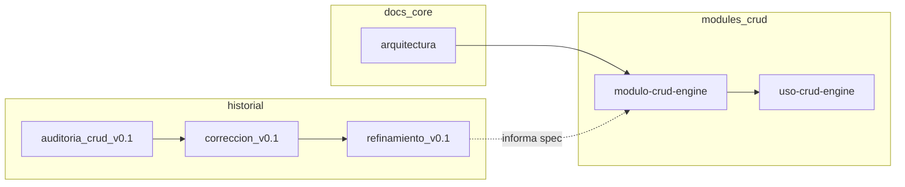

# Auditoría documental — carpeta `/docs`

**Fecha del informe:** 2026-04-30.

**Alcance:** todos los documentos bajo [`/docs`](../README.md); lectura cruzada con [`.cursor/rules`](../../.cursor/rules) donde aplica.

**Decisión de arquitectura documental:** los informes **Corrección** y **Refinamiento** del CRUD Engine se ubican en [`docs/modules/crud/history/`](../modules/crud/history/) como registro de implementación (no son auditorías formales).

---

## 1. Resumen

| Dimensión | Estado |
|-----------|--------|
| **Cobertura** | Buena: normas transversales (arquitectura, estructura, convenciones, API, IA, despliegue), módulos operativos (menú, dashboard, dominio, CRUD), mapa schema↔código, vertical. |
| **Coherencia global** | Media: el núcleo arquitectónico es coherente entre documentos en `docs/core/`, pero coexisten **dos canales normativos** — markdown en `docs/` y reglas en `.cursor/rules/` — con contenido paralelo para IA/equipo. |
| **CRUD Engine** | Mejorada tras esta entrega: la **especificación** vive en [`modulo-crud-engine.md`](../modules/crud/modulo-crud-engine.md) alineada con código; la **guía operativa** en [`uso-crud-engine.md`](../modules/crud/uso-crud-engine.md). [`auditoria_crud_engine_v0.1.md`](./auditoria_crud_engine_v0.1.md) conserva valor como **informe puntual archivado** (2026-04-28), parcialmente superado por corrección/refinamiento. |

**Nivel de coherencia:** adecuado para onboarding si se usa el **índice** [`docs/README.md`](../README.md) y las **fuentes de verdad** de la tabla de la §5.

---

## 2. Problemas detectados

### 2.1 Obsoletos o de lectura delicada

| Documento | Riesgo | Mitigación aplicada |
|-----------|--------|---------------------|
| [`auditoria_crud_engine_v0.1.md`](./auditoria_crud_engine_v0.1.md) | Describe hallazgos y estado previo (p. ej. `security.mode` sin efecto, handlers por FQCN) ya **corregidos** en código e informes posteriores. | Aviso de contexto temporal en cabecera del archivo; enlaces desde este informe a `history/` y spec actualizada. |
| [`example-domain-imprenta.md`](../legacy/example-domain-imprenta.md) | Anexo conceptual; dominio ya no existe en código. | Movido a `docs/legacy/`. Referencias actualizadas. |

### 2.2 Contradicciones (entre archivos o doc vs código)

1. **Handlers CRUD:** la spec antigua citaba FQCN en JSON; el sistema exige **clave** registrada en `config/crud_handlers.php`. Corregido en [`modulo-crud-engine.md`](../modules/crud/modulo-crud-engine.md).
2. **`security.mode`:** el informe de auditoría CRUD indicaba falta de efecto; **`CrudConfigValidator`** valida `restricted` / `strict` y `allow_core_table`. Documentado en el módulo.
3. **Agregaciones en listado:** la spec mencionaba agrupación/sumatorias sin **`list.aggregation`**; comportamiento y límites documentados según código e informe de refinamiento.
4. **Idioma en nombres:** `convenciones_nombres.md` vs `.cursor/rules/convenciones-nombres.mdc`. Alineados en redacción (§ trabajo `align-idioma-rules`).
5. **Diagrama de carpetas raíz:** `arquitectura.md` omitía `/storage` y `/scripts` en el ejemplo; alineado con [`estructura_proyecto.md`](../core/estructura_proyecto.md).

### 2.3 Duplicación

- Reglas de arquitectura / flujo / IA: `docs/core/arquitectura.md`, `docs/core/reglas_ia.md` y `.cursor/rules/arquitectura-base.mdc`, `dependencias-y-flujo.mdc`, `reglas-para-ia.mdc`.
- Estructura: `docs/core/estructura_proyecto.md` ↔ `estructura-proyecto.mdc`.
- Convenciones de nombres: `docs/core/convenciones_nombres.md` ↔ `convenciones-nombres.mdc`.
- CRUD: solapamiento deliberado entre **spec** y **uso** — se mantiene con roles explícitos en [`README.md`](../README.md).

---

## 3. Propuesta de estructura (implementada)

```text
docs/
  README.md
  core/           … normativa y referencia transversal
  modules/        … procedimientos por módulo/plataforma
    crud/
      modulo-crud-engine.md
      uso-crud-engine.md
      history/
        correccion_crud_engine_v0.1.md
        refinamiento_crud_engine_v0.1.md
  audits/         … informes puntuales
    auditoria_crud_engine_v0.1.md
    auditoria_documentacion.md
  legacy/         … material histórico / anexos no vigentes como procedimiento
    example-domain-imprenta.md
```

Los enlaces relativos entre documentos y las rutas citadas desde código/README del repo se actualizaron a esta disposición.

---

## 4. Recomendaciones

**Mantener**

- Auditoría CRUD archivada: trazabilidad de decisiones.
- Doble especificación/use-case CRUD (`modulo-` vs `uso-`): reducir duplicación textual en el tiempo derivando checklist del módulo si se desea.

**Fusionar más adelante (opcional)**

- Política explícita “**docs/canónico ↔ rules**”: un cambio normativo debe tocar ambos o generar uno desde el otro.
- `table-prefix-convention.md` y `core-schema-and-modules.md` podrían unificarse en un solo doc con anclas si el equipo lo prefiere.

**No borrar**

- Informes históricos; solo ubicarlos en `legacy/`, `audits/` o `history/` según tipo.

---

## 5. Fuentes de verdad por tema

| Tema | Documento principal |
|------|----------------------|
| Capas y flujo | [`docs/core/arquitectura.md`](../core/arquitectura.md) |
| Árbol de carpetas | [`docs/core/estructura_proyecto.md`](../core/estructura_proyecto.md) |
| Nombres (DB, PHP, API, JSON) | [`docs/core/convenciones_nombres.md`](../core/convenciones_nombres.md) |
| Reglas para IA (legible humanos) | [`docs/core/reglas_ia.md`](../core/reglas_ia.md) |
| API HTTP | [`docs/core/reglas_api.md`](../core/reglas_api.md) |
| Prefijos y vista plataforma | [`docs/core/table-prefix-convention.md`](../core/table-prefix-convention.md) + [`docs/core/core-schema-and-modules.md`](../core/core-schema-and-modules.md) |
| Mapa tabla ↔ código | [`docs/core/schema-code-map.md`](../core/schema-code-map.md) |
| Nuevo módulo de dominio | [`docs/modules/uso-de-modulo-dominio.md`](../modules/uso-de-modulo-dominio.md) |
| Menú / dashboard | [`docs/modules/modulo-menu.md`](../modules/modulo-menu.md), [`docs/modules/modulo-dashboard.md`](../modules/modulo-dashboard.md) |
| Contrato CRUD Engine (JSON, seguridad, listados) | [`docs/modules/crud/modulo-crud-engine.md`](../modules/crud/modulo-crud-engine.md) |
| Pasos para habilitar un CRUD | [`docs/modules/crud/uso-crud-engine.md`](../modules/crud/uso-crud-engine.md) |
| Auditoría CRUD 2026-04-28 | [`docs/audits/auditoria_crud_engine_v0.1.md`](./auditoria_crud_engine_v0.1.md) |
| Esta auditoría de documentación | Este archivo |

**IDE:** Cursor aplica [.cursor/rules](../../.cursor/rules); debe mantenerse coherente con `docs/core/` cuando cambien las normas.

---

## 6. Flujo sugerido de lectura (CRUD)



---

*Fin del informe — limpieza documental aplicada mediante reorganización, enlaces y actualización de spec CRUD sin eliminar historia.*
