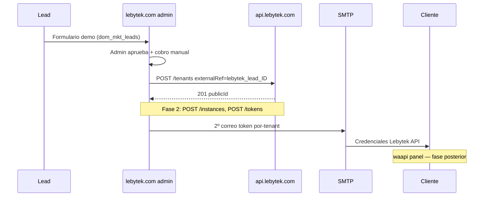

# Delegación de roles — lebytek.com ↔ api

Documento para el ecosistema **lebytek.com** (back-office) y **api.lebytek.com** (motor Laravel). Define qué implementa cada lado, cómo conectar el Framework al contrato HTTP y qué nunca debe vivir en el back-office.

**Contrato técnico completo:** [waapi-api-contract.md](waapi-api-contract.md)

---

## Mapa de dominios

**Deploy hoy:**

| Dominio | Dónde vive ahora | Target |
|---------|------------------|--------|
| lebytek.com | Hosting México FTP (monolito pre-1.0) | `/home/lebytek/htdocs/lebytek.com` en VPS (branch feature) |
| api.lebytek.com | VPS, `main` | sin cambio |
| waapi.lebytek.com | VPS, congelado | sin cambio |
| docs.lebytek.com | placeholder | sin cambio |

```
lebytek.com (VPS futuro)          api.lebytek.com              waapi.lebytek.com
back-office + landing pública   motor Laravel                panel cliente (fase final)
Framework + skeleton v1.0       WhatsApiLebytek              congelado por ahora
FTP México = legacy pre-1.0     auto-pull main               token en .env (lectura)
        │                              ▲
        │  Bearer plataforma           │
        └──────── POST /tenants ───────┘
                    POST /instances (Fase 2)
                    POST /tenants/{id}/tokens

docs.lebytek.com — sin tocar (placeholder)
Green API ──webhooks──► api únicamente
```

---

## Tabla de responsabilidades

| Capa | lebytek.com (Framework) | api (Laravel) |
|------|-------------------------|---------------|
| Landing / captación leads | Sí (`dom_mkt_leads`, marketing) | No |
| Aprobar lead + cobro manual | Sí (admin CRUD) | No |
| `POST /tenants`, Fase 2 instances/tokens | Orquesta | Ejecuta |
| Mapeo lead ↔ tenant | columnas en `dom_mkt_leads` | `core_tenants.external_ref` |
| Green API | **Nunca** | Sí |
| Webhooks Green | **Nunca** | Sí |
| Token plataforma | `.env` `LEBYTEK_API_TOKEN` | emite artisan |
| 2º correo al cliente | Sí (SMTP) | No |
| Panel waapi | No (fase final) | No |

> **Regla de oro:** Un dato, un dueño. WhatsApp técnico vive en **api**. El back-office **orquesta** y **comunica** al cliente por correo. waapi solo lee (más adelante).

---

## Esquema SQL — `dom_mkt_leads`

Migración canónica (documentar en Framework; no ejecutar desde este repo):

```sql
ALTER TABLE dom_mkt_leads
  ADD COLUMN api_tenant_public_id CHAR(26) NULL,
  ADD COLUMN external_ref VARCHAR(255) NULL,
  ADD COLUMN api_provisioned_at TIMESTAMP NULL,
  ADD COLUMN api_provision_error TEXT NULL,
  ADD UNIQUE KEY dom_mkt_leads_api_tenant_public_id_unique (api_tenant_public_id),
  ADD UNIQUE KEY dom_mkt_leads_external_ref_unique (external_ref);
```

### Convención `external_ref`

Valor enviado a api en provisioning:

```
external_ref = lebytek_lead_{id}
```

Ejemplo: lead con `id = 42` → `externalRef: lebytek_lead_42` en `POST /tenants`.

> **Alias legacy:** identificador `org_{id}` del modelo waapi-orquestador — solo en migraciones de datos antiguos; no usar en código nuevo.

Columnas locales tras provisioning exitoso:

| Columna | Uso |
|---------|-----|
| `api_tenant_public_id` | ULID devuelto por api (`publicId`) |
| `external_ref` | Mismo valor enviado a api (idempotencia) |
| `api_provisioned_at` | Timestamp del último éxito |
| `api_provision_error` | Texto del último fallo (nullable) |

---

## Variables `.env` — lebytek.com

```env
LEBYTEK_API_URL=https://api.lebytek.com/api/v1
LEBYTEK_API_TOKEN=<token del comando artisan en api>
LEBYTEK_API_TIMEOUT=30
LEBYTEK_API_RETRY_MAX=3
LEBYTEK_API_RETRY_DELAY_MS=500
```

Token plataforma: emitido en api con `php artisan integration:issue-waapi-token [--revoke]`. Usuario servicio api (código actual): `WAAPI_SERVICE_EMAIL` — ver contrato.

> waapi.lebytek.com puede mantener copia legacy del token para fase panel; **no** es orquestador de provisioning.

---

## Flujo de onboarding (documentado)

1. **Captación:** el lead completa formulario demo → fila en `dom_mkt_leads`.
2. **Revisión admin:** operador en lebytek.com aprueba lead y registra cobro manual (transferencia).
3. **Provisioning Fase 1:** back-office llama `POST /tenants` con `externalRef=lebytek_lead_{id}`, header `Idempotency-Key` (UUID) y Bearer plataforma.
4. **Persistencia local:** guardar `publicId` en `api_tenant_public_id`, `api_provisioned_at`, limpiar `api_provision_error`.
5. **Fase 2 (pendiente api):** `POST /instances`, `POST /tenants/{publicId}/tokens` — ver contrato.
6. **2º correo:** back-office envía credenciales al cliente (token Sanctum por-tenant obligatorio en v1; enlace waapi opcional / fase posterior).



---

## Cliente HTTP (requisitos)

El back-office implementa un cliente curl (sin Laravel) — ver [lebytek-implementation-real.md](lebytek-implementation-real.md).

| Requisito | Detalle |
|-----------|---------|
| Transporte | curl / PHP nativo |
| Auth | `Authorization: Bearer {LEBYTEK_API_TOKEN}` |
| Content-Type | `application/json` en POST/PATCH |
| Idempotencia | Header `Idempotency-Key: {uuid}` en toda escritura |
| Accept | `application/json` |
| Prohibido | Llamadas a green-api.com, webhooks Green, tokens Green en BD o correo |

Ejemplo mínimo (health):

```bash
curl -sS -H "Authorization: Bearer $LEBYTEK_API_TOKEN" \
  -H "Accept: application/json" \
  "$LEBYTEK_API_URL/health"
```

Ejemplo provisioning:

```bash
curl -sS -X POST "$LEBYTEK_API_URL/tenants" \
  -H "Authorization: Bearer $LEBYTEK_API_TOKEN" \
  -H "Content-Type: application/json" \
  -H "Accept: application/json" \
  -H "Idempotency-Key: $(uuidgen)" \
  -d '{"name":"Acme Demo","slug":"acme-demo","externalRef":"lebytek_lead_42"}'
```

---

## Checklist implementación back-office

- [ ] Migración `dom_mkt_leads` con columnas api aplicada
- [ ] `.env` con `LEBYTEK_API_URL` y `LEBYTEK_API_TOKEN` (fuera de git)
- [ ] `LebytekApiClient` (curl) con Idempotency-Key en escrituras
- [ ] `LeadApiProvisioningService` al aprobar lead (no post-registro org)
- [ ] `externalRef` = `lebytek_lead_{id}` en todo provisioning
- [ ] Persistir `api_tenant_public_id`, `api_provisioned_at`, `api_provision_error`
- [ ] Health check periódico contra api
- [ ] Plantilla 2º correo (token por-tenant; waapi link omitido en v1)
- [ ] Desactivar camino legacy Green (`GREEN_API_ENABLED=false` cuando api wired)
- [ ] Sin referencias a green-api.com en `app/`

---

## Referencias cruzadas

| Documento | Rol |
|-----------|-----|
| [waapi-api-contract.md](waapi-api-contract.md) | Contrato HTTP v1, headers, endpoints |
| [lebytek-implementation-real.md](lebytek-implementation-real.md) | Guía operativa Framework (cliente, servicios, E2E) |
| [VPS_CHECKLIST.md](VPS_CHECKLIST.md) | Deploy smoke tests |
| [../ARCHITECTURE.md](../ARCHITECTURE.md) | Mapa ecosistema |

Repo back-office: `Parzival2103/Lebytek_Framework`, branch `feature/backoffice-api-integration`.
