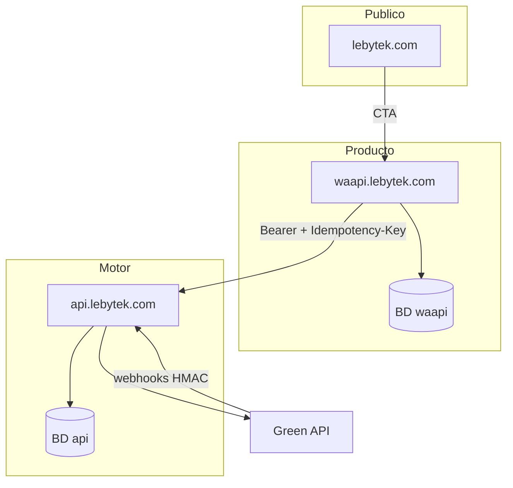

# Delegación de roles — waapi ↔ api

Documento para llevar al repositorio **Lebytek_Framework** (`waapi.lebytek.com`). Define qué implementa cada lado y cómo conectar waapi al contrato de api.

**Contrato técnico completo:** ver `WhatsApiLebytek/docs/integration/waapi-api-contract.md` (o copia de este archivo en el repo api).

---

## Mapa de dominios

| Dominio | Rol | Repo |
|---------|-----|------|
| `lebytek.com` | Marketing / leads públicos | Framework + skeleton (hosting simple) |
| `waapi.lebytek.com` | SaaS v2: catálogo + panel cliente | `Parzival2103/Lebytek_Framework` |
| `api.lebytek.com` | Motor WhatsApp + admin ops | `Parzival2103/WhatsApiLebytek` |

`lebytek.com` **no** se integra con api. Solo enlaza a waapi.

---

## Tabla de responsabilidades

| Capa | waapi (Framework) | api (Laravel) |
|------|-------------------|---------------|
| Login del cliente final | Sí | No |
| Catálogo productos v2 | Sí | No |
| Registro / organizations | Sí (BD local) | No |
| Provisioning tenant técnico | Orquesta `POST /tenants` | Ejecuta y persiste `core_tenants` |
| Mapeo org ↔ tenant | `api_tenant_public_id`, `external_ref` | `external_ref` en `core_tenants` |
| Credenciales Green API | **Nunca** | Sí (`int_credenciales`, cifrado) |
| Colas, campañas, rate limits | UI solamente | Redis + Horizon |
| Webhooks Green API | **Nunca** | `POST /api/v1/webhooks/incoming` |
| Token Sanctum plataforma | Guarda en `.env` | Emite `integration:issue-waapi-token` |
| Panel admin operaciones | No (salvo soporte futuro) | Sí (`/admin`, Horizon) |
| Logs técnicos WhatsApp | Muestra vía API (fase 2) | Fuente de verdad |

### Regla de oro

> **Un dato, un dueño.** Para WhatsApp, la verdad técnica es **api**. waapi es fachada SaaS + orquestación.

---

## Esquema mínimo en waapi

Migración sugerida en la tabla de organizaciones (nombre adaptable al skeleton):

```sql
ALTER TABLE organizations
  ADD COLUMN api_tenant_public_id CHAR(26) NULL UNIQUE COMMENT 'ULID de core_tenants.public_id',
  ADD COLUMN api_provisioned_at TIMESTAMP NULL,
  ADD COLUMN external_ref VARCHAR(255) NULL UNIQUE COMMENT 'Mismo valor enviado a api';
```

Convención `external_ref`: `waapi_org_{id}` donde `{id}` es el PK local de la organization.

---

## Variables de entorno en waapi

```env
LEBYTEK_API_URL=https://api.lebytek.com/api/v1
LEBYTEK_API_TOKEN=<sanctum token de plataforma>
LEBYTEK_API_TIMEOUT=30
```

Obtener token en el VPS api:

```bash
cd /home/lebytek-api/htdocs/api.lebytek.com
sudo -u lebytek-api php artisan integration:issue-waapi-token --revoke
```

---

## Flujo de onboarding

1. Usuario se registra en waapi → se crea `Organization` local.
2. waapi llama `POST /api/v1/tenants` con:
   - `name`: nombre comercial de la org
   - `slug`: slug único (ej. `acme-corp`)
   - `externalRef`: `waapi_org_{organization.id}`
   - Header `Idempotency-Key`: UUID nuevo por intento
3. waapi guarda `publicId` de la respuesta en `api_tenant_public_id` y `api_provisioned_at = now()`.
4. Health check periódico: `GET /api/v1/health` (monitoreo / status page interna).
5. **Fase 2:** pantallas WhatsApp usan el mismo token + `X-Tenant-Id: {api_tenant_public_id}`.

### Reintentos e idempotencia

- Si el POST falla por red, reintentar con el **mismo** `externalRef` → api devuelve el tenant existente (`200`).
- Usar `Idempotency-Key` distinto en cada intento HTTP; la idempotencia de negocio es `externalRef`.

---

## Cliente HTTP sugerido (PHP)

Ubicación sugerida en skeleton: `app/Integrations/LebytekApi/LebytekApiClient.php`

Requisitos:

- Base URL desde `LEBYTEK_API_URL`
- Bearer token desde `LEBYTEK_API_TOKEN`
- Timeout 30s configurable
- Retry en `429` y `5xx` (máx. 3, backoff)
- Log de correlation: `X-Request-Id` o UUID local por llamada
- Métodos fase 1: `health()`, `provisionTenant()`, `getTenant()`, `updateTenant()`, `listTenants()`
- En writes: header `Idempotency-Key` automático
- En ops tenant-scoped futuras: header `X-Tenant-Id`

**Prohibido en waapi:**

- Llamadas a `api.green-api.com` o SDK Green directo
- Almacenar tokens Green API
- Procesar webhooks de Green

---

## Diagrama de integración



---

## Checklist de implementación en waapi

- [ ] Variables `LEBYTEK_API_URL` y `LEBYTEK_API_TOKEN` en `.env`
- [ ] Migración `organizations` con `api_tenant_public_id`, `external_ref`, `api_provisioned_at`
- [ ] Cliente HTTP `LebytekApiClient` con manejo de errores
- [ ] Hook post-registro org → `provisionTenant()`
- [ ] Job o comando de reconciliación: orgs sin `api_tenant_public_id` → reprovisionar
- [ ] Health check programado (`GET /health`)
- [ ] Auditoría: log de llamadas api sin volcar token
- [ ] Verificar que no exista código Green API directo

---

## Prompt para Cursor (repo waapi)

Copiar y pegar en el proyecto **Lebytek_Framework**:

---

Conecta **waapi.lebytek.com** al motor **api.lebytek.com** siguiendo el contrato en `docs/integration/waapi-api-contract.md` del repositorio `Parzival2103/WhatsApiLebytek` (o el documento `role-delegation-waapi.md` adjunto).

**Implementar:**

1. Cliente HTTP PHP (`LebytekApiClient`) con base URL `LEBYTEK_API_URL`, Bearer `LEBYTEK_API_TOKEN`, timeout 30s, retry en 429/5xx, headers `Idempotency-Key` en POST/PATCH.
2. Migración en `organizations`: `api_tenant_public_id` (ULID), `external_ref`, `api_provisioned_at`.
3. Al crear una organization (registro), llamar `POST /api/v1/tenants` con `externalRef = waapi_org_{id}` y guardar `publicId` retornado.
4. Health check: `GET /api/v1/health` (comando artisan o job programado).
5. Documentar en README las variables de entorno requeridas.

**No implementar:**

- Llamadas directas a Green API.
- Webhooks de Green en waapi.
- Duplicar lógica de colas/campañas (eso vive en api, fase 2).

**Contrato fase 1 endpoints:** `GET /health`, `GET|POST /tenants`, `GET|PATCH /tenants/{publicId}`.

Usar el framework Lebytek existente (Onion); no introducir Laravel ni el paquete `lebytek/framework` de Composer si el skeleton ya lo trae embebido.

---

## Referencias cruzadas

| Documento | Ubicación |
|-----------|-----------|
| Contrato API | `docs/integration/waapi-api-contract.md` |
| **Implementación concreta waapi** | `docs/integration/waapi-implementation-real.md` |
| Auditoría prompt2 pre-waapi | `docs/integration/prompt2-review-pre-waapi.md` |
| Arquitectura 3 dominios | `docs/ARCHITECTURE.md` |
| Deploy api | `docs/DEPLOY.md` |
| Checklist VPS | `docs/integration/VPS_CHECKLIST.md` |
