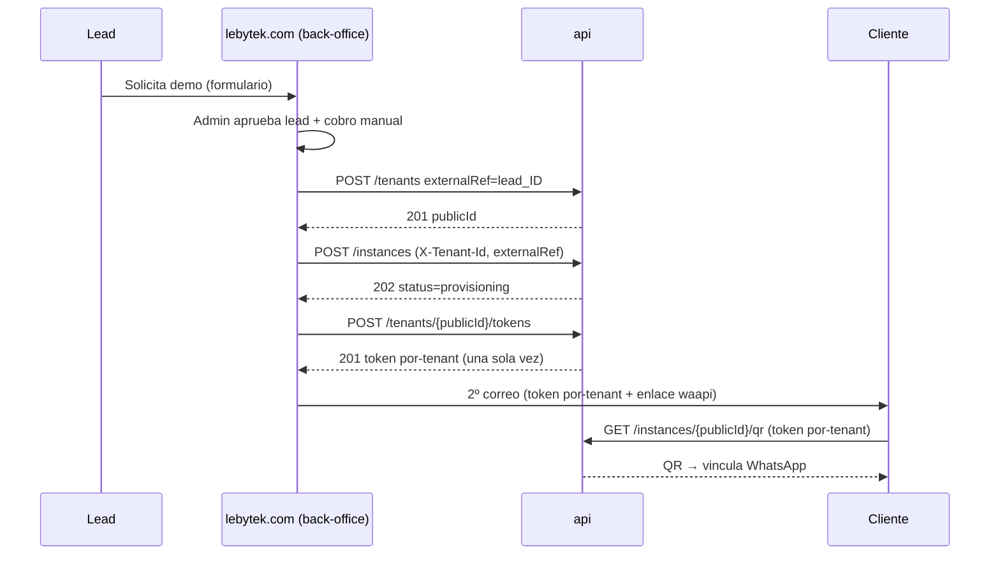

# Contrato API — api.lebytek.com

Contrato técnico de integración del motor **api.lebytek.com** (WhatsApiLebytek / Laravel) con sus tres consumidores:

- **Back-office de `lebytek.com`** (capa de adquisición/leads): provisiona tenants e instancias con el **token de plataforma** al aprobar un lead.
- **Cliente final**: llama a api directamente con un **token por-tenant** (envío, lectura de su instancia/estado).
- **Panel `waapi.lebytek.com`**: panel de **lectura** del cliente (consumo, fallos, adeudos, facturación futura).

**Versión:** `v1`  
**Base URL:** `https://api.lebytek.com/api/v1`  
**OpenAPI (Scribe):** `https://api.lebytek.com/docs` (generado en deploy)

---

## Modelo de autenticación (dos tokens)

api expone **dos tipos de token Sanctum**. El tenant en contexto lo resuelve `ResolveActingTenant`.

### 1. Token de plataforma (back-office de lebytek.com)

Cuenta de servicio única que provisiona y administra. Lo usa el back-office de `lebytek.com`, **no** el cliente ni waapi.

| Elemento | Valor |
|----------|-------|
| Header | `Authorization: Bearer {LEBYTEK_API_TOKEN}` |
| Emisión del token | En el VPS api: `php artisan integration:issue-waapi-token` |
| Usuario api | `WAAPI_SERVICE_EMAIL` (platform admin, `tenant_id = null`) |
| Permisos | `api.health`, `tenants.ver`, `tenants.provisionar`, `tenants.gestionar`, `instancias.ver`, `instancias.crear`, `instancias.eliminar` |

El token se guarda en el back-office como `LEBYTEK_API_TOKEN` (secreto, nunca en repositorio).

### 2. Token por-tenant (cliente)

api emite un token Sanctum propio del tenant durante el provisioning (ver `POST /tenants/{publicId}/tokens`). El **cliente final** lo usa para llamar a api directamente; el **panel waapi** lo usa para leer datos del tenant.

| Elemento | Valor |
|----------|-------|
| Header | `Authorization: Bearer {token por-tenant}` |
| Emisión | `POST /tenants/{publicId}/tokens` (solo token de plataforma) — devuelto **una sola vez** en claro |
| Confinamiento | confinado a su propio `tenant_id`; **ignora** `X-Tenant-Id` |
| Permisos | `instancias.ver` (lectura de su instancia/estado/QR); en Fase 2 de envío: `mensajes.enviar`, etc. |

El back-office entrega este token al cliente en el "2º correo" (junto al enlace/login a waapi). Pago manual (correo/transferencia) lo gestiona `lebytek.com`.

> **El `apiTokenInstance` crudo de Green API nunca se expone** en respuestas ni correos. El producto es gestionado: el cliente usa su token Lebytek contra `api.lebytek.com`, no Green API directo.

---

## Headers comunes

| Header | Obligatorio | Uso |
|--------|-------------|-----|
| `Authorization` | Sí | Bearer token de plataforma |
| `Accept` | Sí | `application/json` |
| `Content-Type` | En writes | `application/json` |
| `Idempotency-Key` | POST/PATCH | UUID; requerido en escrituras API |
| `X-Tenant-Id` | Condicional | ULID del tenant (`publicId`) cuando el token es de plataforma y la ruta no incluye el tenant en el path |

### `X-Tenant-Id`

Cuando el back-office opera en nombre de un cliente con el token de plataforma:

- En rutas **sin** `{tenant}` en el path (futuro vertical WhatsApp), enviar `X-Tenant-Id: {publicId}`.
- En rutas con `{tenant}` en el path (`/tenants/{publicId}`), el path es suficiente; el header es opcional.
- Si el header apunta a un ULID inexistente → `404`.
- El **token por-tenant del cliente** ignora el header (queda confinado a su `tenant_id`).

---

## Formato de respuesta

- JSON en **camelCase** (API Resources).
- Fechas en ISO 8601.
- Claves públicas de recursos: **ULID** (`publicId`), nunca IDs autoincrementales.
- Paginación Laravel estándar en listados (`data`, `links`, `meta`).

### Errores HTTP

| Código | Significado |
|--------|-------------|
| 401 | Token ausente o inválido |
| 403 | Sin permiso RBAC o sin acceso platform/tenant |
| 404 | Recurso o tenant acting no encontrado |
| 422 | Validación fallida |
| 429 | Rate limit (60 req/min por token/usuario) |

Cuerpo típico 422:

```json
{
  "message": "The slug has already been taken.",
  "errors": {
    "slug": ["The slug has already been taken."]
  }
}
```

---

## Rate limiting

- 60 solicitudes/minuto por combinación `tenant_id:user_id` o IP.
- En `429`, reintentar con backoff exponencial.

---

## Endpoints — Fase 1 (implementados)

### `GET /health`

**Permiso:** `api.health`  
**Idempotency-Key:** no requerido

**Respuesta 200:**

```json
{
  "status": "ok",
  "checks": {
    "database": { "ok": true, "message": "connected" },
    "redis": { "ok": true, "message": "connected" }
  },
  "timestamp": "2026-06-29T12:00:00+00:00",
  "actingTenant": "01JXYZ..."
}
```

`actingTenant` refleja el tenant en contexto (usuario tenant o `X-Tenant-Id`).

---

### `GET /tenants`

**Permiso:** `tenants.ver`  
**Acceso:** solo cuenta de plataforma  
**Query:** `page`, `perPage` (default 15)

**Respuesta 200:** colección paginada de `TenantResource`.

---

### `POST /tenants`

**Permiso:** `tenants.provisionar`  
**Acceso:** solo cuenta de plataforma  
**Idempotency-Key:** requerido

**Body:**

```json
{
  "name": "Acme Corp",
  "slug": "acme-corp",
  "externalRef": "lebytek_lead_42"
}
```

| Campo | Tipo | Reglas |
|-------|------|--------|
| `name` | string | requerido, max 255 |
| `slug` | string | requerido, `alpha_dash`, único |
| `externalRef` | string | opcional, único; clave de idempotencia waapi |

**Idempotencia por `externalRef`:** si ya existe un tenant con el mismo `externalRef`, devuelve `200` con el tenant existente (no crea duplicado). Creación nueva → `201`.

**Respuesta (TenantResource):**

```json
{
  "publicId": "01JXYZABCDEF",
  "name": "Acme Corp",
  "slug": "acme-corp",
  "externalRef": "lebytek_lead_42",
  "isActive": true,
  "createdAt": "2026-06-29T12:00:00+00:00",
  "updatedAt": "2026-06-29T12:00:00+00:00"
}
```

El back-office persiste `publicId` en `dom_mkt_leads.api_tenant_public_id`.

---

### `GET /tenants/{publicId}`

**Permiso:** `tenants.ver`  
**Acceso:** plataforma (cualquier tenant) o usuario del mismo tenant

---

### `PATCH /tenants/{publicId}`

**Permiso:** `tenants.gestionar`  
**Acceso:** solo cuenta de plataforma  
**Idempotency-Key:** requerido

**Body (parcial):**

```json
{
  "name": "Acme Corp SA",
  "isActive": false
}
```

---

### `POST /tenants/{publicId}/tokens`

> **Estado implementación (api):** **Implementado** — `routes/api.php` (`api.v1.tenants.tokens.store`), commit `c9b1bc2+`.

**Permiso:** `tenants.gestionar`  
**Acceso:** solo cuenta de plataforma (back-office)  
**Idempotency-Key:** requerido

Emite un **token Sanctum por-tenant** para que el cliente final llame a api directamente y el panel waapi lea sus datos. El back-office lo entrega al cliente en el 2º correo.

**Body:**

```json
{
  "name": "cliente-acme",
  "abilities": ["instancias.ver"]
}
```

| Campo | Tipo | Reglas |
|-------|------|--------|
| `name` | string | requerido; etiqueta del token (p. ej. `cliente-{slug}`) |
| `abilities` | array | opcional; default a los permisos del rol cliente del tenant |

**Respuesta 201:**

```json
{
  "publicId": "01JABCD...",
  "token": "12|abcdef...",
  "name": "cliente-acme",
  "abilities": ["instancias.ver"],
  "createdAt": "2026-06-30T12:00:00+00:00"
}
```

> El campo `token` (texto en claro) se devuelve **una sola vez**; api guarda solo su hash (mecanismo estándar de Sanctum). Para rotar, emitir uno nuevo y revocar el anterior. El token queda confinado al `tenant_id` del path e ignora `X-Tenant-Id`.

---

### `POST /instances`

**Estado:** **Implementado**  
**Permiso:** `instancias.crear`  
**Acceso:** solo cuenta de plataforma  
**Header:** `X-Tenant-Id: {tenantPublicId}`  
**Idempotency-Key:** requerido  

**Body:**

```json
{
  "label": "Demo Acme",
  "externalRef": "lebytek_lead_42_instance",
  "purpose": "demo"
}
```

**Respuesta:** `202` provisioning (async Green Partner job) or `200`/`201` when idempotent/existing.

Also implemented: `GET /instances`, `GET /instances/{publicId}`, `GET /instances/{publicId}/qr`, `DELETE /instances/{publicId}`.

---

## Webhooks entrantes (Green API → api)

**No consumidos por waapi.** Green API envía eventos solo a api.

| Method | Path | Auth |
|--------|------|------|
| POST | `/api/v1/webhooks/incoming` | HMAC `X-Webhook-Signature` + `X-Event-Id` |

Secreto: `WEBHOOK_SECRET` en `.env` de api.

---

## Endpoints — Fase 2 (planned, no implementados)

Marcados para el vertical WhatsApp. waapi **no debe** implementar llamadas a estos endpoints hasta que aparezcan en OpenAPI.

| Method | Path | Permiso (previsto) | Propósito |
|--------|------|-------------------|-----------|
| PUT | `/credentials/green-api` | `credenciales.gestionar` | Credenciales cifradas por tenant |
| GET | `/campaigns` | `campanias.ver` | Listar campañas |
| POST | `/campaigns` | `campanias.crear` | Crear campaña |
| POST | `/campaigns/{publicId}/dispatch` | `campanias.enviar` | Despachar cola |
| POST | `/messages` | `mensajes.enviar` | Envío transaccional |
| GET | `/messages/{publicId}` | `mensajes.ver` | Estado de mensaje |

Todas las rutas fase 2 requerirán `X-Tenant-Id` con token de plataforma salvo que el tenant vaya en el path.

---

## Flujo de onboarding (back-office de lebytek.com)



---

## Entrega al cliente (2º correo)

Tras aprobar lead y provisioning en api, el back-office de **lebytek.com** envía un segundo correo al cliente.

| Elemento | v1 operativa | Notas |
|----------|--------------|-------|
| Token Sanctum por-tenant | **Obligatorio** | Emitido vía `POST /tenants/{publicId}/tokens` (**implementado**) |
| URL / login waapi | Opcional | Fase posterior; panel congelado |
| Instrucciones API (`api.lebytek.com`) | Recomendado | Base URL + uso del token |
| Token Green API crudo | **Prohibido** | Nunca en correo ni respuestas api |

Pago manual (transferencia) lo gestiona lebytek.com antes del 2º correo.

---

## Bootstrap en producción (api)

```bash
# Tras migrate/seed
php artisan integration:issue-waapi-token --revoke
# Copiar token → lebytek.com .env LEBYTEK_API_TOKEN
```

Variables api (código actual — ver `config/nucleo.php`):

```env
WAAPI_SERVICE_EMAIL=waapi-service@lebytek.internal
WAAPI_SERVICE_NAME="Lebytek Platform Service"
```

> Alias futuro documentado: `PLATFORM_SERVICE_*` (renombrado P2, no bloqueante).

Variables back-office **lebytek.com** (primario):

```env
LEBYTEK_API_URL=https://api.lebytek.com/api/v1
LEBYTEK_API_TOKEN=<token del comando artisan>
```

> waapi.lebytek.com mantiene copia legacy del token para fase panel; no es orquestador.

---

## Referencias en código

| Componente | Ruta |
|------------|------|
| Rutas | `routes/api.php` |
| Provisioning tenant | `app/Services/TenantProvisioningService.php` |
| Provisioning instancia | `app/Services/GreenApi/InstanceProvisioningService.php` |
| Controller tenants | `app/Http/Controllers/Api/V1/TenantController.php` |
| Controller instancias | `app/Http/Controllers/Api/V1/InstanceController.php` |
| Acting tenant | `app/Http/Middleware/ResolveActingTenant.php` |
| Token plataforma CLI | `php artisan integration:issue-waapi-token` |
| Delegación roles | `docs/integration/role-delegation-lebytek-api.md` |
