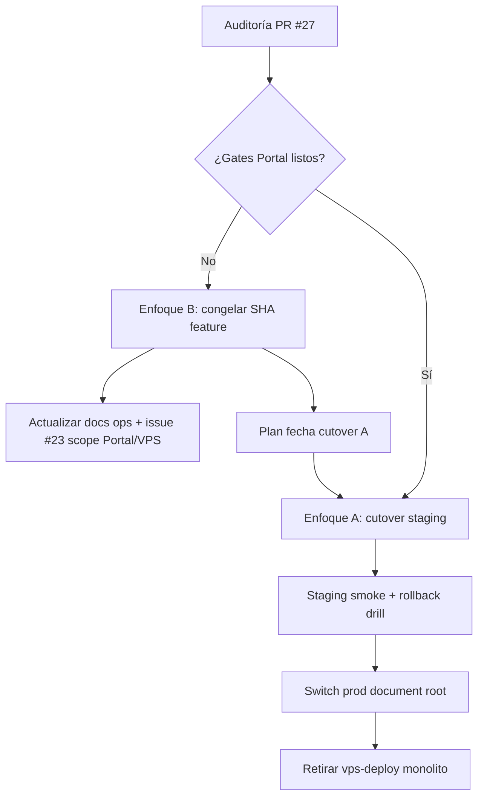

# Design: Alineación VPS post-FPS y cutover Portal

**Fecha:** 2026-07-24  
**Repo:** `Lebytek_Framework` (package source)  
**Estado:** diseño — sin implementación  
**Auditoría fuente:** [PR #27](https://github.com/Parzival2103/Lebytek_Framework/pull/27) — `docs/audits/2026-07-24-auditoria-tecnica-main.md`  
**Pases aplicados:** deuda técnica (D1–D6) + compatibilidad / UX / responsive (K1–K6, U1–U7, R1–R6)  
**Rama base de trabajo:** `feature/backoffice-api-integration` (referencia VPS actual)  
**Contexto FPS:** `main` @ `607a3c6` (merge PR #26) — paquete sin Marketing/Portal

---

## Problema

Tras el merge de PR #26 (separación Framework ↔ Portal), `main` es el paquete Composer `lebytek/framework` sin código de negocio Lebytek. Sin embargo, **producción en lebytek.com sigue desplegándose desde el monolito obsoleto**:

| Evidencia | Detalle |
|-----------|---------|
| Script VPS | `scripts/vps-deploy-lebytek-com.sh` línea 6: `BRANCH=feature/backoffice-api-integration` |
| Divergencia | ~239 archivos de delta; 46↔53 commits divergentes entre `main` y feature |
| Política | `docs/CUTOVER-PORTAL.md` marca VPS cutover como **deferred**; el auto-deploy contradice la política FPS |
| Docs ops | `docs/core/seguridad_secretos_deploy.md` afirma auto-pull de `main`; la realidad es feature branch |

Hallazgos críticos relacionados que **persisten en la rama VPS** y no se resuelven solo con documentación:

1. **C2 — Bootstrap `marketing.sql` incompleto:** columnas API lifecycle/churn ausentes en schema base; migraciones listadas en manifiesto pero no reflejadas en greenfield install (issue #23).
2. **C3 — Stripe subscriptions:** seis criticals abiertos en issue #21; `PAYMENTS_SUBSCRIPTION_CHECKOUT` debe permanecer `false` en VPS.
3. **M1 — CRUD `mkt_ordenes`:** campo `status` editable manualmente en feature branch.

El riesgo principal ya no es deuda interna de `main`, sino **desalineación operativa**: cada deploy automático refuerza un modelo arquitectónico que FPS eliminó del package source.

---

## Comportamiento esperado

### Estado objetivo (post-cutover)

1. **lebytek.com** se despliega desde el repo consumidor **`Lebytek_Portal`**, no desde `Lebytek_Framework`.
2. El Framework llega al VPS **únicamente vía Composer** (`vendor/lebytek/framework`), con versión pinneada en `composer.lock`.
3. El script de deploy VPS (o su reemplazo en Portal `docs/DEPLOY-VPS.md`) referencia la rama/tag del **Portal**, no `feature/backoffice-api-integration`.
4. Bootstrap SQL de Marketing (leads, órdenes, churn) vive en el Portal y está **alineado** con migraciones y repositorios PHP.
5. Gates documentados en `docs/CUTOVER-PORTAL.md` están verdes en staging antes de cualquier switch de producción.
6. Issues #21 y #23 se gestionan en el contexto correcto (Portal / rama VPS congelada), no como bugs de `main`.

### Estado interino aceptable (pre-cutover)

Si el cutover completo no puede ejecutarse de inmediato:

1. VPS despliega un **SHA explícito y documentado** de feature (no HEAD flotante), con checklist de migraciones manuales verificadas.
2. Deploy automático **congelado o deshabilitado** hasta sign-off humano; ningún cron auto-pull sin revisión.
3. `PAYMENTS_SUBSCRIPTION_CHECKOUT=false`, `STRIPE_ENABLED` según política ops, sin habilitar checkout recurrente hasta cierre #21.
4. Documentación ops (`seguridad_secretos_deploy.md`, `VPS_CHECKLIST.md`) refleja la realidad, no el estado deseado post-FPS.

---

## Alcance

### Incluido

- Diseño de la transición VPS: monolito feature → Portal + Composer.
- Criterios de go/no-go y rollback alineados con `docs/CUTOVER-PORTAL.md`.
- Plan de remediación para bootstrap Marketing (#23) en el repo correcto.
- Política de congelamiento temporal del monolito VPS si cutover se difiere.
- Actualización documental de deploy (Framework maintainer view + Portal DEPLOY-VPS).
- Re-etiquetado/actualización de issues #21 y #23 al contexto FPS.

### Fuera de alcance (no-alcance)

- Implementación de código en `app/` o `src/` de este repo (incl. fixes #21, #23, CRUD `mkt_ordenes`).
- Merge `feature/backoffice-api-integration` → `main` (prohibido sin orden explícita).
- Deploy, SSH, DNS, migraciones de producción, ni edición de `.env`/secretos en VPS.
- Fix automático de criticals Stripe (#21) — requiere diseño e implementación en Portal.
- Creación del repo remoto `Lebytek_Portal` (requiere orden explícita del usuario).
- Ejecución de tests runtime en agente cloud (sin PHP/Composer en entorno de auditoría).
- Parche directo de `vendor/lebytek/framework` en consumidores.
- Desactivar RBAC, CSRF, rate limits, Horizon, firmas webhook Stripe, ni tests de seguridad.
- Cierre automático de PRs #25, #16, #27 — requiere revisión humana.
- Confirmación operativa de crontab/cron health VPS — fuera de alcance agente; solo documentar en checklist.

---

## Contexto del proyecto

| Ámbito | Repo / ruta | Rol |
|--------|-------------|-----|
| Plataforma | `Lebytek_Framework` → `src/` | Paquete Composer; no deployable |
| Portal Lebytek | `Lebytek_Portal` (pendiente remoto) | lebytek.com / waapi — negocio Marketing |
| VPS actual | `feature/backoffice-api-integration` @ `4789f95` | Monolito legacy en producción |
| Skeleton | `skeleton/` | Plantilla tenant genérico |

**Restricciones absolutas (automatización y política FPS):**

- No desactivar RBAC, tests, Horizon ni firmas de webhook.
- No fusionar feature → main.
- Negocio Marketing no vuelve al package source.
- Cutover VPS requiere sign-off humano en `docs/CUTOVER-PORTAL.md`.

**Criterios de éxito del diseño:**

- Un operador puede decidir entre cutover completo o congelamiento temporal con checklist claro.
- No queda ambigüedad sobre qué repo despliega lebytek.com.
- Bootstrap greenfield no falla por columnas faltantes en leads/churn.
- Stripe recurrente permanece OFF hasta evidencia de cierre #21.

---

## Deuda técnica identificada (auditoría PR #27)

Inventario concreto derivado de `docs/audits/2026-07-24-auditoria-tecnica-main.md` y revisión estática de `feature/backoffice-api-integration` @ `4789f95`. **No auto-fix** en este pipeline — solo requisitos del diseño.

### D1 — Bootstrap / schema drift (#23)

| Ítem | Evidencia | Impacto |
|------|-----------|---------|
| Columnas API lifecycle ausentes en bootstrap | `origin/feature/.../database/schema/modules/marketing.sql` define `api_tenant_public_id` pero **no** `api_instance_public_id` ni `api_lifecycle_status` (migraciones `20260701160000_*`, `20260701170000_*` sí existen en `database/migrations/`) | `PdoLeadRepository` (`app/Infrastructure/Marketing/PdoLeadRepository.php` L127–216) ejecuta `UPDATE` con columnas inexistentes en greenfield |
| Columnas churn ausentes en bootstrap | `marketing.sql` sin `demo_started_at`, `demo_expires_at`, `paquete_id`, `plan_slug`, `converted_at`, `cancelled_at`, `last_activity_at`, `first_authorized_at`, `first_message_sent_at` (migración `20260706120000_mkt_leads_churn_columns.sql`) | Reportes churn (`ComputeChurnSnapshotService`) y jobs de expiración demo fallan tras `install.php` sin `migrate.php` completo |
| Manifiesto vs bootstrap desalineados | `config/modules/marketing.php` lista **15** migraciones `202606*`/`202607*`; bootstrap no las incorpora | Instalador modular aplica SQL base incompleto; dependencia de migraciones ad-hoc en deploy |
| Reportes churn no registrado (main) | En `main`, `config/modules/reportes.php` → `migraciones: []`; en feature existe `20260706120200_rep_churn_metrics.sql` | Fresh install con módulo reportes no crea métricas churn aunque el SQL exista en disco |
| Deploy enmascara fallos de migración | `scripts/vps-deploy-lebytek-com.sh` L56: `migrate.php 2>/dev/null \|\| true`; L60–70: `apply-sql-migration.php ... \|\| echo "migration skipped"` | Prod puede quedar con schema parcial sin alerta ops |
| Test no detecta drift de columnas | `tests/Marketing/SchemaBootstrapTest.php` valida tablas/permisos/seed pero **no** paridad bootstrap ↔ manifiesto de migraciones | Regresión C2 puede reintroducirse sin fallo en CI feature |

**Remediación requerida (Portal o feature pinneada):** fusionar columnas de migraciones `20260701160000`, `20260701170000`, `20260706120000` en bootstrap; registrar `20260706120200` en manifiesto reportes; añadir test `SchemaBootstrapTest` que falle si faltan columnas referenciadas por repos; eliminar `|| true` silencioso en script deploy (o sustituir script en cutover A).

### D2 — Stripe subscriptions (#21) — seis criticals abiertos

Issue #21 documenta gaps de activación/recover. Archivos afectados en rama VPS (contexto Portal post-cutover):

| Critical | Archivo | Síntoma |
|----------|---------|---------|
| C1 first-activation | `app/Application/Marketing/ConfirmarPagoStripeUseCase.php` L81–84 | Checkout subscription → no-op; orden `pending_payment` permanente |
| C2 invoice metadata | `src/Infrastructure/Payments/StripeGateway.php` (`extractExternalRef`) | `invoice.paid` sin `metadata.order_public_id` → no activa membresía |
| C3 recover desync | `app/Application/Marketing/RecoverMembershipPaymentService.php` | Retry crea nuevo Checkout en lugar de Billing Portal acordado |
| C4 post-claim swallow | `ConfirmarPagoStripeUseCase::ejecutar` | catch + log; webhook 200 → Stripe no reintenta |
| C5 cancelled desync | `RecoverMembershipPaymentService` | `markActive` local aunque API falle |
| C6 amount bypass | `StripeGateway` + `ConfirmarPagoStripeUseCase` | `amount=0` si currency ≠ `mxn` salta validación de monto |

**Gate obligatorio:** `PAYMENTS_SUBSCRIPTION_CHECKOUT=false` y `config/payments.php` sin habilitar checkout recurrente hasta tests Portal verdes (`ConfirmarPagoStripeUseCaseTest`, `StripeWebhookControllerTest`, `CompraStripeFlowTest`).

### D3 — Capas y RBAC (rama VPS)

| Ítem | Evidencia | Deuda |
|------|-----------|-------|
| CRUD `mkt_ordenes` bypass | `config/cruds/mkt_ordenes.json` — campo `status` tipo `select` incluye `paid` editable (L55–60) | Bypass de `AutorizarOrdenMembresiaUseCase` / flujo Stripe |
| RBAC CRUD implícito | `routes/web.php` — rutas `/admin/crud/*` sin entrada en `config/rbac_route_permissions.php`; permiso vía `CrudResourceService` + `permission_prefix` JSON | Patrón válido pero trazabilidad RBAC incompleta (M5 auditoría) |
| Marketing en package source (feature) | `app/Domain|Application|Infrastructure/Marketing/`, `routes/marketing.php`, 40+ tests `tests/Marketing/` | Violación FPS resuelta en `main` @ `607a3c6`; persiste solo en rama VPS — refuerza necesidad cutover |

### D4 — Docs ↔ código / ops

| Ítem | Doc | Realidad |
|------|-----|----------|
| Rama de deploy | `docs/core/seguridad_secretos_deploy.md` L6: “auto-pull de `main`” | `scripts/vps-deploy-lebytek-com.sh` L6: `BRANCH=feature/backoffice-api-integration` |
| Cutover policy | `docs/CUTOVER-PORTAL.md` (main): VPS cutover **deferred** | Auto-deploy feature contradice gates FPS |
| VPS checklist obsoleto | `docs/integration/VPS_CHECKLIST.md` — deploy ≥ `c2d51cd` (2026-07-01) | HEAD feature @ `4789f95`; cron health L16/L118 sin confirmar |
| `.env.example` package | Root `.env.example` L54–100: `MKT_*`, `LEBYTEK_API_*` | Post-FPS deben vivir en Portal; `skeleton/.env.example` sí está limpio (main) |
| `INSTALL_TOKEN` | `public/install/index.php` exige token en prod | Fix en PR #27 (draft) — **no mergeado** a `main` al cierre de auditoría |
| PRs draft abiertos | #25 (auditoría 2026-07-21), #16 (docs FPS) | Riesgo de confusión sobre qué está en `main` vs feature |

### D5 — Tests faltantes / no ejecutados

| Suite | Estado en auditoría | Acción requerida |
|-------|---------------------|------------------|
| `php tests/run.php` (platform) | No corrida — entorno sin PHP/Composer | Ejecutar gates FPS en CI local antes cutover: `SkeletonPurity`, `FrameworkRootNotPortal`, `PackageAutoloadBoundary`, `PlatformSqlResolve` |
| Marketing suite (`tests/Marketing/*`) | 40+ archivos en feature; **eliminada de `main`** | Migrar a Portal; incluir test bootstrap↔migraciones |
| Stripe/Payments | `tests/Payments/StripeGateway*.php`, `tests/Marketing/ConfirmarPagoStripeUseCaseTest.php` | Deben pasar antes de #21 close; no habilitar prod |
| VPS smoke runtime | `lebytek-api-health.php`, `email-render-smoke.php` en deploy script L79–86 | Re-ejecutar post-cutover; registrar RC en checklist ops |

### D6 — Checklist VPS incompleto (`docs/integration/VPS_CHECKLIST.md`)

Items pendientes relevantes al cutover (§ E2E Fase 0 y lebytek.com):

- [ ] Cron health cada 5 min — script en repo; **crontab operador no confirmado** (L16, L118)
- [ ] Clone/pull feature branch — debe migrar a Portal + Composer pin post-cutover (L89–93)
- [ ] Installer / `migrate.php` + seed — sin verificación de columnas lifecycle/churn post-install (L102–103)
- [ ] DNS lebytek.com — “Do not point DNS here until E2E green” (L122) — estado prod real no verificado en auditoría
- [ ] waapi.lebytek.com — integración diferida; no bloquea cutover A pero genera deuda panel (L126–142)

---

## Compatibilidad (pase UX — PHP, navegadores, admin, móvil)

Inventario derivado de revisión estática de `feature/backoffice-api-integration` @ `4789f95`, `docs/core/ui_ux.md`, install wizard y flujos públicos Marketing. **Solo requisitos de diseño** — sin implementación en este pipeline.

### K1 — Runtime PHP y dependencias Composer

| Ítem | Evidencia | Requisito |
|------|-----------|-----------|
| PHP mínimo | `composer.json`: `"php": ">=8.1"` | VPS y staging Portal deben ejecutar **PHP ≥ 8.1** antes del cutover; verificar en smoke post-deploy |
| VOs Payments | PR #10: `readonly class` en domain Payments | Hosting con PHP 8.0 o inferior **no compatible** — bloqueante para cutover |
| Extensiones | Install wizard + PDO repos | `pdo_mysql`, `mbstring`, `json`, `openssl` requeridas; documentar en checklist ops |

### K2 — Navegadores soportados (admin vs público)

| Superficie | Stack | Compatibilidad esperada |
|------------|-------|-------------------------|
| Admin / CRUD | Bootstrap 5.3 + jQuery + DataTables Responsive (CDN) | Chrome/Firefox/Safari/Edge **últimas 2 versiones**; sin soporte IE11 |
| Landing v1 | Bootstrap 5.3 (`publico/layout.php`) | Misma baseline admin |
| Landing v2 | CSS/JS standalone (`landing_v2.css/js`) — **sin Bootstrap** | Requiere `IntersectionObserver`, CSS `clamp()`, `prefers-reduced-motion`; Safari iOS ≥ 15 recomendado |
| Install wizard | Bootstrap 5.3, layout 720px | Funcional en móvil; token 403 es texto plano (ver U3) |

**Requisito cutover:** smoke manual en **Safari iOS + Chrome Android** para landing activa (v1/v2 según `LANDING_VARIANT`) y login admin.

### K3 — Divergencia de stacks público vs admin post-FPS

Tras cutover, lebytek.com consumirá **Portal + vendor framework**. El package `main` ya no incluye Marketing; la compatibilidad de rutas públicas (`/`, `/lead`, `/comprar/*`, `/verificar-demo/*`, `/webhooks/stripe`) debe validarse **en Portal**, no en harness Framework.

| Ruta pública | Middleware / deps | Riesgo compat |
|--------------|-------------------|---------------|
| `POST /marketing/collect` | Sin CSRF (by design); rate limit en use case | Bloqueo por WAF/CDN si body JSON mal formado |
| `POST /webhooks/stripe` | Fuera CSRF; firma Stripe | Content-Type y body raw intactos en proxy nginx |
| `GET /portal` | Magic-link | Links rotos si `APP_URL` desalineado post-cutover DNS |

### K4 — Schema drift → errores 500 en admin y API (no navegador)

Hallazgo D1: columnas lifecycle/churn ausentes en bootstrap provocan SQL exceptions en `PdoLeadRepository` y reportes churn. Desde UX de compatibilidad, **cualquier navegador** verá pantalla de error 500 en CRUD leads u órdenes tras greenfield install incompleto — no es bug de cliente sino de schema.

**Requisito:** gate cutover incluye query de columnas (`api_instance_public_id`, `demo_expires_at`, etc.) antes de exponer admin a operadores.

### K5 — Stripe Checkout y return URLs móvil

Flujos `IniciarPagoStripeUseCase` → redirect Stripe → `/comprar/orden/{publicId}/pago/exito|cancelado` y rutas `/membresia/reintentar-pago`, `/membresia/reactivar`.

| Condición | Impacto compat/UX |
|-----------|-------------------|
| `PAYMENTS_SUBSCRIPTION_CHECKOUT=true` (#21) | Checkout subscription no activa orden — usuario vuelve a "exito" pero membresía pendiente |
| Webhook 200 con fallo silencioso (C4) | Página éxito muestra copy optimista independiente del estado real |
| `RecoverMembershipPaymentService` (C3) | Nuevo Checkout en lugar de Billing Portal — sesiones duplicadas en Stripe mobile |

**Gate:** mantener checkout recurrente OFF; smoke return URL en viewport móvil 375px.

### K6 — Install wizard y entornos productivos

| Ítem | Evidencia | Requisito |
|------|-----------|-----------|
| `INSTALL_TOKEN` | `public/install/index.php` L54–61: `hash_equals` en prod | Documentado en PR #27; merge o equivalente antes cutover |
| Respuesta 403 | Texto plano sin layout HTML | Ops debe conocer formato `?token=` — ver U3 |
| `storage/install.lock` | Bloquea reinstalación | Copy en `ya_instalado.php` debe ser claro post-cutover Portal |

---

## UX (pase UX — flujos, copy, estados error/vacío)

### U1 — CRUD `mkt_ordenes`: bypass de flujo de pago (M1)

`config/cruds/mkt_ordenes.json` expone `status` como `select` editable incluyendo `paid`, mientras las acciones de fila `autorizar_pago` y `activar_plan` dependen de estados específicos.

| Problema UX | Impacto |
|-------------|---------|
| Operador marca `paid` manualmente | Usuario cree activado; `api_activation_error` puede quedar vacío o confuso |
| Transiciones JSON no impiden select directo | Inconsistencia entre badge "Pagada" y tenant API sin provisionar |
| Help text en `api_tenant_public_id` mezcla flujos transferencia/Stripe | Riesgo de error operativo en móvil (campo largo, truncate en lista) |

**Requisito Portal:** `status` **read-only** en formulario o restringido a transiciones RBAC; acciones primarias visibles y accesibles sin editar select.

### U2 — Confirmación de pago Stripe: copy optimista vs realidad (#21)

Vista `publico/compra_pago_exito.php`:

```text
"Estamos confirmando tu pago. Te avisaremos cuando se active tu membresía."
```

No distingue: pago one-shot confirmado, subscription pendiente de webhook, ni fallo de activación API. Con C1/C4 abiertos, el usuario recibe mensaje de éxito aunque la orden permanezca `pending_payment`.

**Requisito:** estados diferenciados en página de retorno según `order.status` + `metodo_pago` + presencia de `api_activation_error`; enlace a soporte si activación falla tras  N minutos.

### U3 — Install wizard: error de token sin guía visual

`public/install/index.php` L59–60 responde 403 con string plano:

```text
Instalador protegido. Proporcione ?token=INSTALL_TOKEN (definido en .env).
```

Sin layout, sin enlace a `docs/core/despliegue-y-versionado.md`, sin indicación de contacto ops. Operador en móvil ve página en blanco con texto crudo.

**Requisito:** página 403 con layout wizard mínimo + instrucciones copy-paste URL con token (Portal o Framework según repo).

### U4 — Pago cancelado: recuperación de intención débil

`publico/compra_pago_cancelado.php` solo enlaza a `/?compras=1#paquetes` — pierde contexto de orden (`publicId`), plan y ciclo seleccionados.

**Requisito:** CTA secundario "Reintentar pago" hacia checkout/transferencia de la misma orden cuando `status` lo permita; copy que confirme que no hubo cargo.

### U5 — Verificación demo: estados terminales sin CTA de retorno

`verificar_demo.php` maneja bien `wrong_code`, `ok`, `already_verified`, `expired`, `locked`, `invalid` con alerts Bootstrap.

| Estado | Gap UX |
|--------|--------|
| `expired`, `locked`, `invalid` | Sin botón "Solicitar demo de nuevo" → `/#demo` o landing v2 `#demo` |
| `ok` | Copy genérico "te contactaremos" — no indica tiempo esperado ni siguiente paso |

**Requisito Portal:** enlace consistente al formulario demo en todos los estados de error; anchor `#demo` funcional en v1 y v2.

### U6 — Flujo transferencia bancaria vs Stripe en admin

Acciones CRUD condicionadas por `visible_when.status`:

- `autorizar_pago` → `pending_transfer`, `awaiting_review`
- `activar_plan` → `paid`

Si operador no ve acciones (estado incorrecto o ocultas en móvil), no hay empty-state que explique el siguiente paso. Columna `api_activation_error` con badge danger ayuda pero depende de schema (D1).

**Requisito:** empty-state o banner en detalle de orden con checklist del flujo según `metodo_pago`; mensaje si falta columna/error de activación por schema incompleto.

### U7 — Recuperación de membresía / dunning (#21 C3, C5)

Rutas `/membresia/reintentar-pago`, `/membresia/reactivar` + páginas éxito/cancelado duplicadas.

| Problema | UX |
|----------|-----|
| Recover crea nuevo Checkout (C3) | Usuario ve múltiples cargos potenciales; confusión en email de Stripe |
| `markActive` local con API caída (C5) | Portal cliente muestra activo; producto no funciona |

**Requisito:** unificar copy de reactivación; fail-closed con mensaje claro si API comercial no responde; no mostrar "activo" hasta confirmación.

---

## Responsive (pase UX — breakpoints, layout admin/público)

Referencia canónica admin: `docs/core/ui_ux.md` §8 y §542 — **breakpoint único 992px (`lg`)** para navegación panel. Landing v2 usa breakpoints propios (decisión consciente del diseño público).

### R1 — Admin: navegación y layout (992px)

| Componente | Comportamiento | Verificación cutover |
|------------|----------------|----------------------|
| Sidebar / offcanvas | `< 992px` offcanvas; `≥ 992px` fijo | Login admin + navegar a Marketing → Órdenes en 375px y 1280px |
| Bottombar móvil | `d-lg-none` en layout bottom | Acciones CRUD no quedan bajo barra inferior |
| Contenido CRUD | `table-responsive` + DataTables Responsive | Ver R2 |

### R2 — CRUD `mkt_ordenes`: densidad columnas en móvil

Lista con **9 columnas** priorizadas (`priority` 1–5) incluyendo `api_tenant_public_id` (truncate 26) y `api_activation_error`.

| Columna | priority | Riesgo móvil |
|---------|----------|--------------|
| email, status | 1 | Siempre visibles — OK |
| public_id, paquete_slug, api_* | 3–4 | Colapsan en expand row — OK si DataTables init |
| Acciones fila (4 acciones max) | — | **Autorizar pago / Activar plan** no deben quedar solo en hover desktop |

**Requisito:** smoke en 375px — expandir fila `pending_transfer` y confirmar tap en `Autorizar pago`; `table_compact: true` no debe reducir área táctil bajo 44px.

### R3 — Landing v2: breakpoints distintos al admin (860px / 560px)

`landing_v2.css` usa `@media (max-width: 860px)` y `(max-width: 560px)` — **no** 992px. Pricing grid, nav sticky glass y hero deben probarse en:

- 860px (tablet landscape)
- 560px (móvil grande)
- 320px (móvil pequeño)

Lead form v2: padding sección `80px 28px` — en 320px verificar que inputs no desborden (`box-sizing: border-box` presente en inline styles).

### R4 — Landing v1 y páginas compra/verificación (Bootstrap)

| Vista | Patrón responsive | Notas |
|-------|-------------------|-------|
| `compra_form.php`, transferencia | `container` + grid Bootstrap | Validar formulario compra en móvil con teclado email abierto |
| `verificar_demo.php` | `col-md-8 col-lg-5` centrado | Input código 6 chars — `text-center`, `autocomplete=one-time-code` OK para iOS |
| `compra_pago_*` | `max-width: 720px` | Botones full-width opcional en `< sm` |

### R5 — Install wizard responsive

`_layout.php`: `viewport` meta + `container max-width: 720px` + card — usable en móvil. Pasos multi-campo (`paso_bd`, `paso_admin`) deben apilar campos; verificar teclado no oculta botón submit en iOS Safari.

### R6 — Smoke responsive obligatorio en cutover (staging)

Checklist mínimo antes switch prod (`docs/CUTOVER-PORTAL.md` staging smoke ampliado):

| # | Viewport | Flujo |
|---|----------|-------|
| 1 | 375×812 | Landing → demo form → flash success/error |
| 2 | 375×812 | `/comprar/starter` → selección ciclo → submit |
| 3 | 375×812 | Admin login → CRUD `mkt_ordenes` → expand row → acción |
| 4 | 1280×800 | Mismo flujo admin con sidebar fijo |
| 5 | 860px | Landing v2 pricing toggle mensual/anual |
| 6 | prefers-reduced-motion | Landing v2 sin animaciones obligatorias |

---

## Enfoques propuestos

### Enfoque A — Cutover Portal completo (recomendado)

**Descripción:** Ejecutar la sección "VPS cutover" de `docs/CUTOVER-PORTAL.md`: crear/publicar Portal, pin Composer, staging smoke, switch de document root, retirar auto-pull del monolito.

| Ventajas | Desventajas |
|----------|-------------|
| Alineación arquitectónica definitiva con FPS | Requiere repo Portal, auth Composer privado, staging |
| Elimina drift permanente feature ↔ main | Ventana de riesgo en switch de producción |
| Un solo lugar para Marketing, Stripe, leads | Dependencia de gates Portal (`Marketing`, `PortalOwnership`) |
| Rollback documentado en Portal DEPLOY-VPS | No ejecutable sin sign-off ops + maintainer |

**Cuándo elegir:** gates FPS y Portal verdes; staging smoke passed; rollback validado.

### Enfoque B — Congelamiento controlado del monolito VPS (puente)

**Descripción:** Mantener deploy desde feature branch pero **congelar SHA**, deshabilitar auto-pull ciego, aplicar parches de bootstrap (#23) y CRUD (#25 diff) solo en feature hasta cutover A.

| Ventajas | Desventajas |
|----------|-------------|
| Menor riesgo inmediato de switch | Sigue violando modelo FPS |
| Permite cerrar #23/#21 en código conocido | Deuda duplicada si se parchea feature y Portal |
| Tiempo para preparar Portal sin presión de prod caída | Docs y scripts siguen confusos si no se actualizan |
| Reversible hacia A cuando gates estén listos | HEAD flotante = riesgo de regresión silenciosa |

**Cuándo elegir:** cutover A no viable en ventana operativa actual; ops necesita estabilidad inmediata.

### Enfoque C — Continuar parcheando feature como línea principal (no recomendado)

**Descripción:** Seguir mergeando fixes en `feature/backoffice-api-integration`, actualizar deploy script, tratar feature como "prod branch" indefinidamente.

| Ventajas | Desventajas |
|----------|-------------|
| Familiar para el equipo pre-FPS | Contradice PR #26 y toda la inversión FPS |
| Sin migración de repo | Drift crece; imposible alinear skeleton/consumidores |
| Fixes rápidos posibles | Confunde issues #23 scoped a "main" vs realidad |
| | Prohibido por política: no merge feature → main, pero prod sigue en feature |

**Recomendación:** **Enfoque A** como norte; **Enfoque B** como puente acotado con fecha límite y SHA pinneado. Descartar Enfoque C salvo emergencia extrema con registro explícito de deuda.

---

## Diseño recomendado (A con puente B)

### Fase 0 — Decisión y congelamiento (inmediato, humano)



**Acciones Framework (solo docs/issues, este repo):**

1. Actualizar issue #23: scope "main bootstrap" → "Portal repo + VPS feature branch greenfield".
2. Marcar PR draft #25 para cierre/archivo tras comparar diff vs `main` actual (evitar confusión).
3. Alinear `docs/core/seguridad_secretos_deploy.md` con rama real o marcar script como legacy pendiente cutover.
4. Mantener `INSTALL_TOKEN` en `.env.example` (ya en PR #27).

**Acciones Portal (repo consumidor, fuera de este spec):**

1. Bootstrap `marketing.sql` alineado con migraciones `202606*`/`202607*` y repos (`PdoLeadRepository`, churn).
2. Cierre #21 antes de `PAYMENTS_SUBSCRIPTION_CHECKOUT=true`.
3. CRUD `mkt_ordenes`: quitar edición directa de `status` o restringir a transiciones RBAC.
4. `docs/DEPLOY-VPS.md` con rollback validado en staging.

### Fase 1 — Preparación Portal (Enfoque A)

| Componente | Responsable | Entrega |
|------------|-------------|---------|
| Repo `Lebytek_Portal` | Maintainer + orden usuario | Remoto con `composer.json` pinneado |
| Composer auth VPS | Ops | Token deploy read-only |
| Gates | CI local + staging | Tabla `docs/CUTOVER-PORTAL.md` verde |
| Staging | Ops | landing, admin login, api health |
| Rollback drill | Ops | restore web root + DB backup |

### Fase 2 — Switch producción

1. Backup DB + `.env` (patrón ya en `vps-deploy-lebytek-com.sh`).
2. Deploy Portal tag/SHA acordado; `composer install --no-dev`.
3. `migrate.php` completo; verificar tablas leads/churn.
4. Smoke: login admin, lead demo, webhook Stripe test mode (sin activar checkout recurrente).
5. Deshabilitar cron/script que clona `Lebytek_Framework` feature branch.
6. Sign-off tabla `docs/CUTOVER-PORTAL.md`.

### Fase 3 — Puente B (si Fase 1 no lista)

1. Fijar `DEPLOY_SHA=4789f95` (o posterior acordado) en script VPS; prohibir `--depth 1` sin tag.
2. Checklist migraciones manuales post-deploy (sin `|| true` silencioso).
3. Verificar columnas leads en BD prod; aplicar migraciones faltantes si necesario.
4. Fecha límite documentada para iniciar Fase 1.

---

## Riesgos

### Stripe (#21)

| Riesgo | Evidencia | Mitigación |
|--------|-----------|------------|
| Activación subscription incorrecta | `ConfirmarPagoStripeUseCase` no-op en `subscriptionId !== null` | `PAYMENTS_SUBSCRIPTION_CHECKOUT=false` hasta cierre issue |
| Primer pago invoice sin metadata | `StripeGateway::extractExternalRef` depende de `metadata.order_public_id` en Invoice | Diseño Portal: propagar metadata o resolver por `subscriptionId` |
| Webhook 200 con fallo silencioso | catch `\Throwable` + log en `ConfirmarPagoStripeUseCase::ejecutar` | Cola/reintento o respuesta 5xx transitoria; no habilitar prod |
| Recover crea suscripción duplicada | `RecoverMembershipPaymentService::checkoutUrlForMembresia` | Unificar flujo Billing Portal (diseño #21) |
| Membresía `active` local con API caída | `reactivateCommercial` en catch vacío + `markActive` | Fail-closed + alerta ops |
| Amount bypass multi-moneda | `StripeGateway` `amount=0` si currency ≠ `mxn` | Fix + test `StripeGatewayTest` / `ConfirmarPagoStripeUseCaseTest` antes de ON |
| Habilitación accidental en deploy | `.env` prod puede tener flags ON aunque script no los toque | Checklist pre-deploy: verificar `PAYMENTS_SUBSCRIPTION_CHECKOUT=false` |

### Bootstrap / migraciones (#23)

| Riesgo | Evidencia | Mitigación |
|--------|-----------|------------|
| Greenfield install sin columnas API lifecycle | `marketing.sql` vs migraciones `20260701160000`, `20260701170000` | Alinear bootstrap + manifiesto en Portal |
| Greenfield sin columnas churn | `20260706120000_mkt_leads_churn_columns.sql` no reflejada en bootstrap | Idem; incluir en test `SchemaBootstrapTest` ampliado |
| Reportes churn huérfano | `20260706120200_rep_churn_metrics.sql` sin entrada en `config/modules/reportes.php` (main) | Registrar en manifiesto Portal |
| `migrate.php` parcial en deploy VPS | `vps-deploy-lebytek-com.sh` L56 `2>/dev/null \|\| true` | Log explícito + fail-fast o checklist manual post-deploy |
| Migraciones SQL manuales con skip | L60–70: `echo "migration skipped"` sin abortar deploy | Tratar como error en Enfoque B; eliminar en Enfoque A |
| Issue #23 scoped a `main` incorrectamente | Issue body referencia `main` @ `2c71d3f` | Re-etiquetar scope Portal/VPS feature pinneada |
| Regresión silenciosa | `SchemaBootstrapTest` no valida columnas | Añadir test paridad como gate Portal |

### VPS / operaciones

| Riesgo | Evidencia | Mitigación |
|--------|-----------|------------|
| Deploy rama incorrecta post-FPS | `vps-deploy-lebytek-com.sh` L6 + `--depth 1` sin SHA pinneado | Cutover A o congelamiento B con `DEPLOY_SHA` |
| Marketing forzado ON vía `sed` en deploy | L22–23: `sed` en `config/vertical.php` | Reemplazar por config Portal explícita |
| Docs ops desactualizadas | `seguridad_secretos_deploy.md` L6 vs script real | PR doc-only Framework + Portal `DEPLOY-VPS.md` |
| Checklist VPS stale | `VPS_CHECKLIST.md` referencia `c2d51cd`; HEAD `4789f95` | Actualizar SHA/commit y pendientes cron/DNS |
| Install wizard expuesto | `INSTALL_TOKEN` no en `.env.example` mergeado | Merge PR #27 o doc ops manual |
| Sin verificación SSH/cron en auditoría | Auditoría estática únicamente | Checklist ops manual pre-switch (D6) |
| Rollback no probado | `CUTOVER-PORTAL.md` rollback triggers sin drill | Drill staging obligatorio antes prod switch |
| PRs draft confunden estado | #25, #16 abiertos | Archivar/cerrar tras diff vs `main` |

---

## Criterios de aceptación

### Deuda técnica documentada (este spec)

- [ ] Sección **Deuda técnica** (D1–D6) revisada por maintainer; issues #21 y #23 re-etiquetados con scope Portal/VPS.
- [ ] Columnas faltantes en bootstrap listadas explícitamente: `api_instance_public_id`, `api_lifecycle_status`, churn (`demo_expires_at`, etc.).
- [ ] Archivos Stripe (#21) y deploy script (`vps-deploy-lebytek-com.sh` L56–70) referenciados con líneas concretas.
- [ ] Gap de tests `SchemaBootstrapTest` documentado como requisito Portal.

### Compatibilidad / UX / Responsive (pase UX — este spec)

- [ ] Secciones **Compatibilidad** (K1–K6), **UX** (U1–U7) y **Responsive** (R1–R6) revisadas por maintainer.
- [ ] Smoke pre-cutover incluye PHP ≥ 8.1 verificado en VPS/staging y Safari iOS + Chrome Android (K2).
- [ ] CRUD `mkt_ordenes`: campo `status` no editable a `paid` manualmente; acciones fila accesibles en móvil (U1, R2).
- [ ] Página retorno Stripe distingue estados reales de orden — no copy optimista único si webhook/activación pendiente (U2).
- [ ] Install wizard 403 con layout/guía ops o documentación equivalente mergeada (U3, K6).
- [ ] Pago cancelado ofrece reintento contextual por orden cuando aplique (U4).
- [ ] Verificación demo: CTA "Solicitar demo" en estados `expired`/`locked`/`invalid` (U5).
- [ ] Checklist responsive R6 ejecutado en staging antes switch prod.

### Cutover completo (Enfoque A)

- [ ] lebytek.com document root desplegado desde `Lebytek_Portal`, no desde clone directo de Framework feature branch.
- [ ] `vendor/lebytek/framework` presente; versión coincide con `composer.lock` Portal.
- [ ] Gates `docs/CUTOVER-PORTAL.md` firmados (Maintainer + Ops).
- [ ] Greenfield install Portal crea `dom_mkt_leads` con columnas API lifecycle (`api_instance_public_id`, `api_lifecycle_status`) y churn (`demo_expires_at`, `plan_slug`, etc.) sin error SQL.
- [ ] Manifiesto `config/modules/marketing.php` Portal: bootstrap SQL incluye todas las columnas de migraciones listadas (sin depender de `|| true` en deploy).
- [ ] `config/modules/reportes.php` Portal registra `20260706120200_rep_churn_metrics.sql` si módulo reportes activo.
- [ ] Script/cron legacy `vps-deploy-lebytek-com.sh` deshabilitado o reemplazado; documentación coherente.
- [ ] `PAYMENTS_SUBSCRIPTION_CHECKOUT=false` en prod hasta cierre #21 con evidencia de tests Portal (`ConfirmarPagoStripeUseCaseTest`, `CompraStripeFlowTest`).
- [ ] CRUD `mkt_ordenes`: campo `status` no editable a `paid` manualmente (transiciones RBAC únicamente).
- [ ] Rollback probado en staging: restore web root + DB backup en ventana acordada.
- [ ] `docs/integration/VPS_CHECKLIST.md` actualizado: SHA deploy, cron health confirmado, DNS/cutover FPS.

### Puente congelado (Enfoque B)

- [ ] SHA de deploy documentado y fijado (`4789f95` o posterior acordado); no deploy desde HEAD flotante de feature.
- [ ] Issue #23 actualizado con scope Portal/VPS; checklist migraciones aplicado en prod (verificar columnas lifecycle/churn en BD).
- [ ] Post-deploy: query de verificación `SHOW COLUMNS FROM dom_mkt_leads LIKE 'api_%'` y `'demo_%'` sin NULL schema.
- [ ] `docs/core/seguridad_secretos_deploy.md` refleja rama/SHA real o marca legacy explícita.
- [ ] PR #25 revisado y archivado/cerrado para evitar drift documental.
- [ ] Fecha límite registrada para iniciar cutover A.
- [ ] Stripe checkout recurrente permanece OFF (#21); verificar `.env` prod.
- [ ] Deploy script: migraciones fallidas registradas en log ops (no silenciar con `|| true` sin revisión).

### Framework package (independiente de cutover)

- [ ] `main` permanece libre de Marketing/Portal (gates `SkeletonPurity`, `FrameworkRootNotPortal`, `PackageAutoloadBoundary`, `PlatformSqlResolve` verdes).
- [ ] `.env.example` package documenta `INSTALL_TOKEN` (PR #27 mergeado o equivalente).
- [ ] Limpieza opcional `MKT_*` / `LEBYTEK_API_*` del `.env.example` harness (Q4 auditoría) — PR pequeño separado.
- [ ] `docs/CUTOVER-PORTAL.md` accesible en `main`; VPS cutover permanece deferred hasta sign-off explícito.

---

## Referencias

| Recurso | Ubicación |
|---------|-----------|
| PR auditoría fuente | https://github.com/Parzival2103/Lebytek_Framework/pull/27 |
| Reporte auditoría | `docs/audits/2026-07-24-auditoria-tecnica-main.md` (rama PR #27) |
| Cutover checklist | `docs/CUTOVER-PORTAL.md` |
| Deploy VPS actual | `scripts/vps-deploy-lebytek-com.sh` |
| Issue Stripe criticals | #21 |
| Issue bootstrap leads | #23 |
| PR auditoría feature (draft) | #25 — archivar tras revisión |
| FPS boundary | `docs/superpowers/BOUNDARY-framework-vs-portal-fps.md` (main) |
| Plan cutover readiness | `docs/superpowers/plans/2026-07-17-fps-08-publication-cutover-readiness.md` (main) |
| UI/UX canónico admin | `docs/core/ui_ux.md` (breakpoint 992px, CRUD responsive) |

---

## Próximo paso (fuera de este documento)

Invocar skill `writing-plans` para generar plan de implementación acotado — probablemente en repo **Portal** para bootstrap/deploy, y PR doc-only en Framework para alinear issues y `seguridad_secretos_deploy.md`. **No implementar código de producto en esta automatización.**
