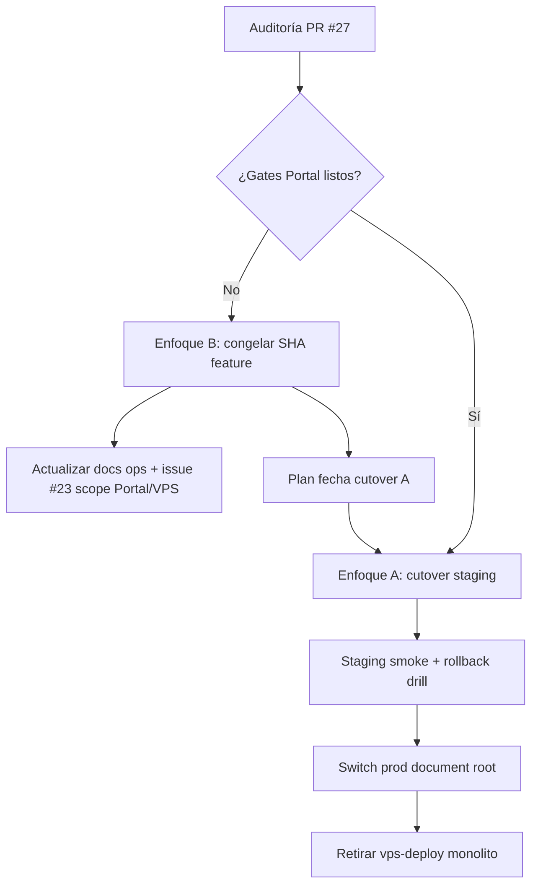

# Design: Alineación VPS post-FPS y cutover Portal

**Fecha:** 2026-07-24  
**Repo:** `Lebytek_Framework` (package source)  
**Estado:** diseño — sin implementación  
**Auditoría fuente:** [PR #27](https://github.com/Parzival2103/Lebytek_Framework/pull/27) — `docs/audits/2026-07-24-auditoria-tecnica-main.md`  
**Rama base de trabajo:** `feature/backoffice-api-integration` (referencia VPS actual)  
**Contexto FPS:** `main` @ `607a3c6` (merge PR #26) — paquete sin Marketing/Portal

---

## Problema

Tras el merge de PR #26 (separación Framework ↔ Portal), `main` es el paquete Composer `lebytek/framework` sin código de negocio Lebytek. Sin embargo, **producción en lebytek.com sigue desplegándose desde el monolito obsoleto**:

| Evidencia | Detalle |
|-----------|---------|
| Script VPS | `scripts/vps-deploy-lebytek-com.sh` línea 6: `BRANCH=feature/backoffice-api-integration` |
| Divergencia | ~239 archivos de delta; 46↔53 commits divergentes entre `main` y feature |
| Política | `docs/CUTOVER-PORTAL.md` marca VPS cutover como **deferred**; el auto-deploy contradice la política FPS |
| Docs ops | `docs/core/seguridad_secretos_deploy.md` afirma auto-pull de `main`; la realidad es feature branch |

Hallazgos críticos relacionados que **persisten en la rama VPS** y no se resuelven solo con documentación:

1. **C2 — Bootstrap `marketing.sql` incompleto:** columnas API lifecycle/churn ausentes en schema base; migraciones listadas en manifiesto pero no reflejadas en greenfield install (issue #23).
2. **C3 — Stripe subscriptions:** seis criticals abiertos en issue #21; `PAYMENTS_SUBSCRIPTION_CHECKOUT` debe permanecer `false` en VPS.
3. **M1 — CRUD `mkt_ordenes`:** campo `status` editable manualmente en feature branch.

El riesgo principal ya no es deuda interna de `main`, sino **desalineación operativa**: cada deploy automático refuerza un modelo arquitectónico que FPS eliminó del package source.

---

## Comportamiento esperado

### Estado objetivo (post-cutover)

1. **lebytek.com** se despliega desde el repo consumidor **`Lebytek_Portal`**, no desde `Lebytek_Framework`.
2. El Framework llega al VPS **únicamente vía Composer** (`vendor/lebytek/framework`), con versión pinneada en `composer.lock`.
3. El script de deploy VPS (o su reemplazo en Portal `docs/DEPLOY-VPS.md`) referencia la rama/tag del **Portal**, no `feature/backoffice-api-integration`.
4. Bootstrap SQL de Marketing (leads, órdenes, churn) vive en el Portal y está **alineado** con migraciones y repositorios PHP.
5. Gates documentados en `docs/CUTOVER-PORTAL.md` están verdes en staging antes de cualquier switch de producción.
6. Issues #21 y #23 se gestionan en el contexto correcto (Portal / rama VPS congelada), no como bugs de `main`.

### Estado interino aceptable (pre-cutover)

Si el cutover completo no puede ejecutarse de inmediato:

1. VPS despliega un **SHA explícito y documentado** de feature (no HEAD flotante), con checklist de migraciones manuales verificadas.
2. Deploy automático **congelado o deshabilitado** hasta sign-off humano; ningún cron auto-pull sin revisión.
3. `PAYMENTS_SUBSCRIPTION_CHECKOUT=false`, `STRIPE_ENABLED` según política ops, sin habilitar checkout recurrente hasta cierre #21.
4. Documentación ops (`seguridad_secretos_deploy.md`, `VPS_CHECKLIST.md`) refleja la realidad, no el estado deseado post-FPS.

---

## Alcance

### Incluido

- Diseño de la transición VPS: monolito feature → Portal + Composer.
- Criterios de go/no-go y rollback alineados con `docs/CUTOVER-PORTAL.md`.
- Plan de remediación para bootstrap Marketing (#23) en el repo correcto.
- Política de congelamiento temporal del monolito VPS si cutover se difiere.
- Actualización documental de deploy (Framework maintainer view + Portal DEPLOY-VPS).
- Re-etiquetado/actualización de issues #21 y #23 al contexto FPS.

### Fuera de alcance

- Implementación de código en `app/` o `src/` de este repo.
- Merge `feature/backoffice-api-integration` → `main` (prohibido sin orden explícita).
- Deploy, SSH, DNS, migraciones de producción, ni edición de `.env`/secretos.
- Fix automático de criticals Stripe (#21) — requiere diseño e implementación en Portal.
- Creación del repo remoto `Lebytek_Portal` (requiere orden explícita del usuario).
- Ejecución de tests runtime en agente cloud (sin PHP/Composer en entorno de auditoría).

---

## Contexto del proyecto

| Ámbito | Repo / ruta | Rol |
|--------|-------------|-----|
| Plataforma | `Lebytek_Framework` → `src/` | Paquete Composer; no deployable |
| Portal Lebytek | `Lebytek_Portal` (pendiente remoto) | lebytek.com / waapi — negocio Marketing |
| VPS actual | `feature/backoffice-api-integration` @ `4789f95` | Monolito legacy en producción |
| Skeleton | `skeleton/` | Plantilla tenant genérico |

**Restricciones absolutas (automatización y política FPS):**

- No desactivar RBAC, tests, Horizon ni firmas de webhook.
- No fusionar feature → main.
- Negocio Marketing no vuelve al package source.
- Cutover VPS requiere sign-off humano en `docs/CUTOVER-PORTAL.md`.

**Criterios de éxito del diseño:**

- Un operador puede decidir entre cutover completo o congelamiento temporal con checklist claro.
- No queda ambigüedad sobre qué repo despliega lebytek.com.
- Bootstrap greenfield no falla por columnas faltantes en leads/churn.
- Stripe recurrente permanece OFF hasta evidencia de cierre #21.

---

## Enfoques propuestos

### Enfoque A — Cutover Portal completo (recomendado)

**Descripción:** Ejecutar la sección "VPS cutover" de `docs/CUTOVER-PORTAL.md`: crear/publicar Portal, pin Composer, staging smoke, switch de document root, retirar auto-pull del monolito.

| Ventajas | Desventajas |
|----------|-------------|
| Alineación arquitectónica definitiva con FPS | Requiere repo Portal, auth Composer privado, staging |
| Elimina drift permanente feature ↔ main | Ventana de riesgo en switch de producción |
| Un solo lugar para Marketing, Stripe, leads | Dependencia de gates Portal (`Marketing`, `PortalOwnership`) |
| Rollback documentado en Portal DEPLOY-VPS | No ejecutable sin sign-off ops + maintainer |

**Cuándo elegir:** gates FPS y Portal verdes; staging smoke passed; rollback validado.

### Enfoque B — Congelamiento controlado del monolito VPS (puente)

**Descripción:** Mantener deploy desde feature branch pero **congelar SHA**, deshabilitar auto-pull ciego, aplicar parches de bootstrap (#23) y CRUD (#25 diff) solo en feature hasta cutover A.

| Ventajas | Desventajas |
|----------|-------------|
| Menor riesgo inmediato de switch | Sigue violando modelo FPS |
| Permite cerrar #23/#21 en código conocido | Deuda duplicada si se parchea feature y Portal |
| Tiempo para preparar Portal sin presión de prod caída | Docs y scripts siguen confusos si no se actualizan |
| Reversible hacia A cuando gates estén listos | HEAD flotante = riesgo de regresión silenciosa |

**Cuándo elegir:** cutover A no viable en ventana operativa actual; ops necesita estabilidad inmediata.

### Enfoque C — Continuar parcheando feature como línea principal (no recomendado)

**Descripción:** Seguir mergeando fixes en `feature/backoffice-api-integration`, actualizar deploy script, tratar feature como "prod branch" indefinidamente.

| Ventajas | Desventajas |
|----------|-------------|
| Familiar para el equipo pre-FPS | Contradice PR #26 y toda la inversión FPS |
| Sin migración de repo | Drift crece; imposible alinear skeleton/consumidores |
| Fixes rápidos posibles | Confunde issues #23 scoped a "main" vs realidad |
| | Prohibido por política: no merge feature → main, pero prod sigue en feature |

**Recomendación:** **Enfoque A** como norte; **Enfoque B** como puente acotado con fecha límite y SHA pinneado. Descartar Enfoque C salvo emergencia extrema con registro explícito de deuda.

---

## Diseño recomendado (A con puente B)

### Fase 0 — Decisión y congelamiento (inmediato, humano)

**Acciones Framework (solo docs/issues, este repo):**

1. Actualizar issue #23: scope "main bootstrap" → "Portal repo + VPS feature branch greenfield".
2. Marcar PR draft #25 para cierre/archivo tras comparar diff vs `main` actual (evitar confusión).
3. Alinear `docs/core/seguridad_secretos_deploy.md` con rama real o marcar script como legacy pendiente cutover.
4. Mantener `INSTALL_TOKEN` en `.env.example` (ya en PR #27).

**Acciones Portal (repo consumidor, fuera de este spec):**

1. Bootstrap `marketing.sql` alineado con migraciones `202606*`/`202607*` y repos (`PdoLeadRepository`, churn).
2. Cierre #21 antes de `PAYMENTS_SUBSCRIPTION_CHECKOUT=true`.
3. CRUD `mkt_ordenes`: quitar edición directa de `status` o restringir a transiciones RBAC.
4. `docs/DEPLOY-VPS.md` con rollback validado en staging.

### Fase 1 — Preparación Portal (Enfoque A)

| Componente | Responsable | Entrega |
|------------|-------------|---------|
| Repo `Lebytek_Portal` | Maintainer + orden usuario | Remoto con `composer.json` pinneado |
| Composer auth VPS | Ops | Token deploy read-only |
| Gates | CI local + staging | Tabla `docs/CUTOVER-PORTAL.md` verde |
| Staging | Ops | landing, admin login, api health |
| Rollback drill | Ops | restore web root + DB backup |

### Fase 2 — Switch producción

1. Backup DB + `.env` (patrón ya en `vps-deploy-lebytek-com.sh`).
2. Deploy Portal tag/SHA acordado; `composer install --no-dev`.
3. `migrate.php` completo; verificar tablas leads/churn.
4. Smoke: login admin, lead demo, webhook Stripe test mode (sin activar checkout recurrente).
5. Deshabilitar cron/script que clona `Lebytek_Framework` feature branch.
6. Sign-off tabla `docs/CUTOVER-PORTAL.md`.

### Fase 3 — Puente B (si Fase 1 no lista)

1. Fijar `DEPLOY_SHA=4789f95` (o posterior acordado) en script VPS; prohibir `--depth 1` sin tag.
2. Checklist migraciones manuales post-deploy (sin `|| true` silencioso).
3. Verificar columnas leads en BD prod; aplicar migraciones faltantes si necesario.
4. Fecha límite documentada para iniciar Fase 1.

---

## Riesgos

### Stripe (#21)

| Riesgo | Mitigación |
|--------|------------|
| Activación subscription incorrecta | `PAYMENTS_SUBSCRIPTION_CHECKOUT=false` hasta cierre issue |
| Webhook 200 con fallo silencioso | Diseño Portal: cola/reintento; no habilitar prod |
| Amount bypass multi-moneda | Fix en Portal `StripeGateway` + tests antes de ON |
| Billing Portal vs new checkout desync | Unificar flujo recover en diseño #21 |

### Bootstrap / migraciones (#23)

| Riesgo | Mitigación |
|--------|------------|
| Greenfield install sin columnas API lifecycle | Alinear `marketing.sql` + manifiesto en Portal |
| `migrate.php` parcial en deploy VPS | Eliminar fallos silenciosos; log explícito |
| Issue #23 scoped a `main` incorrectamente | Re-etiquetar; fixes van a Portal o feature pinneada |

### VPS / operaciones

| Riesgo | Mitigación |
|--------|------------|
| Deploy rama incorrecta post-FPS | Cutover A o congelamiento B |
| Marketing forzado ON vía `sed` en deploy | Reemplazar por config Portal explícita |
| Docs ops desactualizadas | Actualizar en PR pequeño Framework + Portal DEPLOY |
| Sin verificación SSH/cron en auditoría | Checklist ops manual pre-switch |
| Rollback no probado | Drill en staging obligatorio |

---

## Criterios de aceptación

### Cutover completo (Enfoque A)

- [ ] lebytek.com document root desplegado desde `Lebytek_Portal`, no desde clone directo de Framework feature branch.
- [ ] `vendor/lebytek/framework` presente; versión coincide con `composer.lock` Portal.
- [ ] Gates `docs/CUTOVER-PORTAL.md` firmados (Maintainer + Ops).
- [ ] Greenfield install Portal crea `dom_mkt_leads` con columnas API lifecycle y churn sin error SQL.
- [ ] Script/cron legacy `vps-deploy-lebytek-com.sh` deshabilitado o reemplazado; documentación coherente.
- [ ] `PAYMENTS_SUBSCRIPTION_CHECKOUT=false` en prod hasta cierre #21 con evidencia de tests Portal.
- [ ] Rollback probado en staging: restore web root + DB backup en ventana acordada.

### Puente congelado (Enfoque B)

- [ ] SHA de deploy documentado y fijado; no deploy desde HEAD flotante de feature.
- [ ] Issue #23 actualizado con scope Portal/VPS; checklist migraciones aplicado en prod.
- [ ] `docs/core/seguridad_secretos_deploy.md` refleja rama/SHA real o marca legacy explícita.
- [ ] PR #25 revisado y archivado/cerrado para evitar drift documental.
- [ ] Fecha límite registrada para iniciar cutover A.
- [ ] Stripe checkout recurrente permanece OFF (#21).

### Framework package (independiente de cutover)

- [ ] `main` permanece libre de Marketing/Portal (gates `SkeletonPurity`, `FrameworkRootNotPortal` verdes).
- [ ] `.env.example` package documenta `INSTALL_TOKEN` (PR #27).
- [ ] Limpieza opcional `MKT_*` / `LEBYTEK_API_*` del `.env.example` harness (Q4 auditoría) — PR pequeño separado.

---

## Referencias

| Recurso | Ubicación |
|---------|-----------|
| PR auditoría fuente | https://github.com/Parzival2103/Lebytek_Framework/pull/27 |
| Reporte auditoría | `docs/audits/2026-07-24-auditoria-tecnica-main.md` (rama PR #27) |
| Cutover checklist | `docs/CUTOVER-PORTAL.md` |
| Deploy VPS actual | `scripts/vps-deploy-lebytek-com.sh` |
| Issue Stripe criticals | #21 |
| Issue bootstrap leads | #23 |
| PR auditoría feature (draft) | #25 — archivar tras revisión |
| FPS boundary | `docs/superpowers/BOUNDARY-framework-vs-portal-fps.md` (main) |
| Plan cutover readiness | `docs/superpowers/plans/2026-07-17-fps-08-publication-cutover-readiness.md` (main) |

---

## Próximo paso (fuera de este documento)

Invocar skill `writing-plans` para generar plan de implementación acotado — probablemente en repo **Portal** para bootstrap/deploy, y PR doc-only en Framework para alinear issues y `seguridad_secretos_deploy.md`. **No implementar código de producto en esta automatización.**
