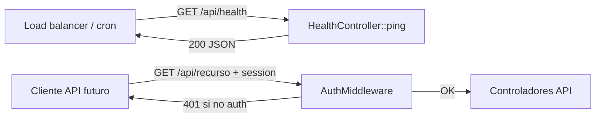

# Design: Higiene del harness package-source — env, instalador y health API

**Fecha:** 2026-07-25  
**Repo:** `Lebytek_Framework` (package source `lebytek/framework`)  
**Estado:** diseño — sin implementación (pasadas deuda técnica D1–D7 + compatibilidad / UX / responsive K1–K6, U1–U8, R1–R6)  
**Auditoría fuente:** [PR #29](https://github.com/Parzival2103/Lebytek_Framework/pull/29) — `docs/audits/2026-07-25-auditoria-tecnica-diaria.md` (**unmerged** al 2026-07-25; reporte solo en rama PR #29)  
**Rama base de trabajo:** `feature/backoffice-api-integration` (referencia VPS) / `main` @ `607a3c6` (package FPS)  
**Rama spec:** `automation/audit-spec-2026-07-25` (deriva de feature, no de `main`)  
**Spec relacionado (cutover VPS):** `docs/superpowers/specs/2026-07-24-audit-vps-cutover-fps-design.md` (rama `automation/audit-spec-2026-07-24`; **ausente en feature branch**)

---

## Problema

Tras el merge FPS (PR #26), `main` es un **package source estable** sin Marketing ni código Portal. La auditoría del 2026-07-25 confirma **cero commits nuevos en `main` en 24 h** — el riesgo dominante sigue siendo operativo (VPS en monolito feature), no deuda nueva en el paquete.

Sin embargo, el **harness local del mantenedor** y la **superficie operativa mínima del paquete** presentan tres desalineaciones concretas detectadas en PR #29:

| ID | Hallazgo | Evidencia | Impacto |
|----|----------|-----------|---------|
| **M2** | `INSTALL_TOKEN` no documentado en `.env.example` | `public/install/index.php` exige token en `APP_ENV=production`; `docs/core/despliegue-y-versionado.md` lo describe; ningún `.env.example` lo listaba | Instalador web bloqueado en producción sin guía clara para ops |
| **M1** | Root `.env.example` mezcla vars Portal/Marketing | `MKT_*`, `LEBYTEK_API_*`, URLs waapi, copy de membresías; `skeleton/.env.example` está limpio | Mantenedores del paquete copian vars obsoletas; confunde FPS vs Portal |
| **M3** | `/api/ping` detrás de `AuthMiddleware` | `routes/api.php:14-24` — grupo `/api` exige sesión; `ping` en línea 23 | Load balancers, cron health y smoke post-deploy requieren cookie de sesión |
| **M4** | Slug `permisos.gestionar` inexistente | `routes/web.php:73-76` — comentario explícito; usa `administracion.ver` | Granularidad RBAC débil para gestión de permisos (fuera de alcance inmediato) |
| **M5** | PRs draft auditoría sin consolidar | #25, #27, #28 en DRAFT | Reportes y fixes duplicados; confusión pipeline specs |
| **M6** | Migración `auth_login_intentos` en rama feature | En feature: `database/migrations/20260612130000_auth_login_intentos.sql` activa; en `main`: archivada en `migrations_legacy/` | Drift feature↔main; greenfield en `main` OK vía `schema.sql` |

Hallazgos críticos **persistentes** (VPS, Stripe #21, bootstrap #23) **no se resuelven en este spec** — permanecen en el spec de cutover del 2026-07-24 y en issues abiertos. Este diseño cubre solo la higiene implementable en el **repo Framework** sin tocar negocio Portal.

---

## Comportamiento esperado

### Post-implementación (Framework package + skeleton)

1. **`.env.example` (root harness + skeleton)** documenta `INSTALL_TOKEN=` con comentario que apunta a `public/install/?token=...` y a `docs/core/despliegue-y-versionado.md`.
2. **Root `.env.example` del harness** deja de listar variables exclusivas de Portal (`MKT_*`, `LEBYTEK_API_*`, URLs waapi de negocio) como si fueran parte del paquete; se mueven a un bloque comentado “solo Lebytek_Portal” o se eliminan del harness.
3. **`skeleton/.env.example`** permanece la referencia canónica para tenants genéricos — sin vars Marketing; incluye `INSTALL_TOKEN`.
4. **Health check público** responde `200` JSON sin autenticación en una ruta dedicada (p. ej. `GET /api/health` o `GET /api/ping` fuera del grupo autenticado), retornando `{ "status": "ok", "timestamp": "<ISO8601>" }`.
5. **Rutas API autenticadas** futuras permanecen bajo el grupo con `AuthMiddleware`; el health público no expone datos sensibles ni estado de BD en v1.
6. **Tests harness** validan que la ruta health es accesible sin sesión y que `EnvLoader` reconoce `INSTALL_TOKEN` cuando está documentado.

### Contexto operativo (sin cambio en este spec)

- VPS sigue en `feature/backoffice-api-integration` hasta cutover Portal (spec 2026-07-24).
- `PAYMENTS_SUBSCRIPTION_CHECKOUT=false` en prod hasta cierre #21.
- Bootstrap leads incompleto (#23) se resuelve en Portal o feature pinneada.

---

## Alcance

### Incluido

- Diseño de limpieza de `.env.example` root harness vs `skeleton/.env.example`.
- Documentación de `INSTALL_TOKEN` (fix parcial ya en PR #29 — merge como Q1).
- Diseño de ruta health API pública en `routes/api.php` (Framework + propagación a `skeleton/routes/api.php`).
- Test smoke: health sin auth; opcional contrato vars `.env.example` vs lecturas documentadas.
- Referencia cruzada a riesgos Stripe/bootstrap/VPS como gates, no como auto-fix.

### Fuera de alcance (no-alcance)

- Implementación de código en `app/` o `src/` en esta automatización (solo spec).
- Cutover VPS, deploy, SSH, DNS, migraciones prod, `.env` real en servidores.
- Fixes Stripe (#21), bootstrap leads (#23), CRUD `mkt_ordenes.status` (C4 / issue Portal).
- Merge `feature/backoffice-api-integration` → `main`.
- Creación repo remoto `Lebytek_Portal`.
- Desactivar RBAC, CSRF, rate limits, firmas webhook, Horizon ni tests de seguridad.
- Cierre de PRs draft #25/#27/#28 — revisión humana posterior.
- Health check con probe de BD/Redis (v2 opcional; v1 solo liveness).
- Fix RBAC slug `permisos.gestionar` (M4) — issue separado, no bloqueante para harness.
- Reconciliar `database/migrations/` feature (19 archivos incl. `mkt_*`) con `main` (3 plataforma) — scope cutover spec 2026-07-24, no este spec.
- Sustituir `scripts/lebytek-api-health.php` (health **externo** `api.lebytek.com` vía `App\Infrastructure\Integrations\LebytekApi\LebytekApiClient`) — es deuda Portal/VPS, distinta de M3 liveness HTTP local.
- Ejecutar `php tests/run.php` en agente cloud (sin PHP/composer en cron) — verificación queda en CI/humano.

---

## Contexto del proyecto

| Ámbito | Repo / ruta | Rol |
|--------|-------------|-----|
| Plataforma | `Lebytek_Framework` → `src/` | Paquete Composer; harness root no es deployable |
| Portal Lebytek | `Lebytek_Portal` (pendiente) | Vars `MKT_*`, `LEBYTEK_API_*`, checkout membresía |
| Skeleton | `skeleton/` | Plantilla tenant — `.env.example` limpio |
| VPS actual | `feature/backoffice-api-integration` | Monolito legacy; script `vps-deploy-lebytek-com.sh` |

**Restricciones absolutas:**

- Negocio Marketing no vuelve al package source.
- Cambios de plataforma → `src/`, `routes/`, `skeleton/`, tests harness.
- No parchear `vendor/` en consumidores.

**Criterios de éxito del diseño:**

- Un mantenedor del paquete distingue vars harness vs Portal sin leer issues.
- Ops puede configurar instalador web en producción siguiendo `.env.example`.
- Smoke post-deploy y load balancer pueden usar health JSON sin sesión.
- Riesgos VPS/Stripe/bootstrap quedan explícitamente fuera del alcance de implementación inmediata.

---

## Enfoques propuestos

### Enfoque A — Doc-only mínimo (recomendado como Fase 1)

**Qué:** Merge PR #29 (`INSTALL_TOKEN` en `.env.example` root + skeleton). PR doc-only separado: podar o comentar bloque Portal en root `.env.example`.

| Pros | Contras |
|------|---------|
| Cero riesgo runtime; mergeable a `main` de inmediato | No resuelve M3 (health tras auth) |
| Alinea harness con FPS sin tocar rutas | VPS sigue sin health público hasta Fase 2 |
| Desbloquea ops del instalador | |

### Enfoque B — Plataforma + docs (recomendado como entrega completa)

**Qué:** Fase 1 + mover `GET /api/ping` (o alias `/api/health`) **fuera** del grupo `AuthMiddleware` en `routes/api.php` y `skeleton/routes/api.php`; añadir test Feature `HealthEndpointTest`.

| Pros | Contras |
|------|---------|
| Resuelve M1, M2 y M3 en un ciclo coherente | Requiere cambio en `routes/` (Presentation layer del harness) |
| Consumidores heredan patrón vía skeleton y Composer update | Debe documentarse que `/api/*` restante sigue protegido |
| Compatible con checklist cutover (staging smoke api health) | |

### Enfoque C — Health en consumidor solamente

**Qué:** Portal/skeleton define ruta pública propia; Framework no cambia `routes/api.php`.

| Pros | Contras |
|------|---------|
| Evita tocar package source | Duplica contrato; tenants nuevos sin health estándar |
| | Contradice auditoría M3 y gates `CUTOVER-PORTAL.md` (api health) |

### Recomendación

**Enfoque B en dos PRs pequeños:**

1. **PR doc-only (Q1 + Q2):** merge PR #29 + limpieza root `.env.example` (vars Portal → comentario o `docs/integration/portal-env-vars.md`).
2. **PR plataforma (M3):** health público + test; bump minor si se publica paquete.

Enfoque A es aceptable si ops necesita solo `INSTALL_TOKEN` antes del cutover; M3 no debe posponerse más allá del primer deploy staging Portal.

---

## Diseño técnico (Enfoque B)

### 1. `.env.example` — INSTALL_TOKEN (M2)

Ubicación: sección `# SEGURIDAD`, después de `CSRF_TOKEN_LENGTH`.

```env
# Token para proteger el instalador web en producción (public/install/?token=...)
INSTALL_TOKEN=
```

- **Root harness:** incluir variable (PR #29).
- **Skeleton:** incluir variable (PR #29).
- **Portal:** documentar en `.env.example` propio del consumidor (fuera de este repo).

Comportamiento existente en `public/install/index.php`: si `APP_ENV=production` y `INSTALL_TOKEN` vacío → 403; si token query no coincide → 403.

### 2. Limpieza root `.env.example` (M1)

**Eliminar o mover a comentario “Portal only”:**

- `MKT_EMAIL_*`, `MKT_ALERT_*`, `MKT_PURCHASE_*`, `MKT_BANK_*`, `MKT_MEMBERSHIP_*`
- `LEBYTEK_API_*`, `WAAPI_PORTAL_ENABLED`
- `LANDING_VARIANT`, `INTEGRATIONS_API_DOCS_URL` (experiments/landing — negocio Portal)
- Copy de CTAs waapi/lebytek.com en comentarios de `APP_URL` (líneas 7–10, 53–55)

**Conservar en harness/skeleton (plataforma genérica):**

- `APP_*`, `DB_*`, `SESSION_*`, `MAIL_*`, `REGISTRO_*`, `LOGIN_RATE_*`
- `BCRYPT_*`, `CSRF_*`, `INSTALL_TOKEN`
- `GREEN_API_*` (integración plataforma, OFF default)
- `STRIPE_*`, `PAYMENTS_*` (vertical genérico OFF default)

Opcional: archivo `docs/integration/portal-env-reference.md` listando vars Portal para copy-paste en `Lebytek_Portal`.

### 3. Health API pública (M3)

**Estado actual:**

```php
$router->group([
    'prefix'      => '/api',
    'middlewares' => [AuthMiddleware::class],
], function ($router) {
    $router->get('/ping', [HealthController::class, 'ping']);
});
```

**Propuesta:**

```php
// Público — liveness para LB/cron (sin datos sensibles)
$router->get('/api/health', [HealthController::class, 'ping']);

$router->group([
    'prefix'      => '/api',
    'middlewares' => [AuthMiddleware::class],
], function ($router) {
    // Futuras rutas autenticadas
    // Deprecar /api/ping autenticado o redirigir a /api/health en docs
});
```

Decisiones:

- **Ruta canónica:** `GET /api/health` (evita colisión semántica con “ping autenticado”).
- **Controller:** reutilizar `HealthController::ping` — sin lógica de negocio.
- **Respuesta:** `{ "status": "ok", "timestamp": "<ISO8601>" }` — sin versión ni DB en v1.
- **Skeleton:** mismo cambio en `skeleton/routes/api.php`.
- **Docs:** actualizar `docs/core/despliegue-y-versionado.md` y checklist cutover.

### 4. Tests sugeridos

| Test | Ubicación | Assert |
|------|-----------|--------|
| `HealthEndpointIsPublicTest` | `tests/` harness | `GET /api/health` → 200, JSON `status=ok`, sin cookie |
| `AuthenticatedApiGroupStillProtectedTest` | `tests/` | Ruta placeholder futura bajo grupo auth → 401/302 sin sesión |
| `EnvExampleInstallTokenDocumentedTest` | opcional | grep `INSTALL_TOKEN` en ambos `.env.example` |

### 5. Diagrama de flujo (health vs API autenticada)



> **No confundir con M3:** `scripts/lebytek-api-health.php` (líneas 77–80 de `vps-deploy-lebytek-com.sh`) valida salud de **api.lebytek.com** vía `LebytekApiClient` y vars `LEBYTEK_API_*`. Es health **externo/Portal**, no sustituto de `GET /api/health` liveness local.

---

## Deuda técnica

Inventario verificado en rama `automation/audit-spec-2026-07-25` (base feature) contra auditoría PR #29 y delta con `main` @ `607a3c6`. **Ningún ítem se auto-fixea en esta automatización.**

### D1 — Drift rama spec ↔ `main` FPS

| Evidencia | Impacto | Acción requerida |
|-----------|---------|------------------|
| Rama spec deriva de `feature/backoffice-api-integration` (~54 commits feature-only vs ~46 `main`-only) | Gates y docs FPS no presentes en la rama donde vive el harness monolito | Implementar Fase 1–2 contra **`main`**, no contra feature; cherry-pick spec a rama FPS si hace falta |
| `docs/CUTOVER-PORTAL.md`, spec `2026-07-24-audit-vps-cutover-fps-design.md` existen en `main` / `automation/audit-spec-2026-07-24`, **no** en feature | Checklist cutover referenciado en criterios de aceptación es ilegible desde rama VPS | Merge o fetch docs desde rama audit 2026-07-24 antes de cutover |
| Tests `FrameworkRootNotPortalTest`, `SkeletonPurityTest`, `FpsPublicationReadinessTest` en `main`; **ausentes** en feature | Sin gate automático de pureza package en rama desplegada | CI en `main`; no confundir verde feature con FPS |

### D2 — Bootstrap / schema drift (#23)

| Evidencia | Impacto | Acción requerida |
|-----------|---------|------------------|
| `database/schema/modules/marketing.sql` — tabla `dom_mkt_leads` **sin** columnas lifecycle/churn/`api_instance_public_id` que añaden migraciones `20260701160000+`, `20260706120000+` | Greenfield / `install.php` parcial → SQL error en repos churn/leads | Portal o parche feature; issue #23 |
| Feature: **19** migraciones en `database/migrations/` (incl. `mkt_*`); `main`: **3** plataforma | Manifiesto migrate desalineado post-FPS | Cutover spec 2026-07-24 D1; no mezclar en harness package |
| `scripts/vps-deploy-lebytek-com.sh:56` — `php migrate.php 2>/dev/null \|\| true` | Errores de migración silenciados en prod | Fail-fast o checklist manual pre-cutover |
| Mismo script: bucle `202606*.sql` / `202607*.sql` con `\|\| echo "migration skipped"` (líneas 58–71) | Drift schema persistente sin fallo de deploy | Verificar tablas/columnas en VPS antes de cutover |

### D3 — `.env.example` / docs ops (M1, M2)

| Evidencia | Impacto | Acción requerida |
|-----------|---------|------------------|
| Root `.env.example` — vars Portal activas (`MKT_*`, `LEBYTEK_API_*`, `LANDING_VARIANT` L118) | Mantenedores copian vars obsoletas al harness | Q2 PR doc-only (Enfoque A/B) |
| `INSTALL_TOKEN` documentado en `docs/core/despliegue-y-versionado.md:238` y exigido en `public/install/index.php:56`, pero **ausente** en ambos `.env.example` en rama actual | Instalador prod bloqueado sin guía en template | Merge PR #29 (Q1) |
| `docs/core/seguridad_secretos_deploy.md:6` — “auto-pull de `main`” vs `vps-deploy-lebytek-com.sh:6` — `BRANCH=feature/backoffice-api-integration` | Ops sigue instrucciones incorrectas | PR doc follow-up post-cutover |
| `docs/core/despliegue-y-versionado.md` T1 aún lista `app/` como core inmutable (pre-FPS harness) | Confunde package source (`src/`) vs app consumidora | Actualizar tier table en PR docs (fuera de alcance código) |

### D4 — Health / API (M3)

| Evidencia | Impacto | Acción requerida |
|-----------|---------|------------------|
| `routes/api.php` + `skeleton/routes/api.php` — `/api/ping` dentro de grupo `AuthMiddleware` (L14–24) | LB/cron no pueden liveness HTTP sin sesión | Fase 2 Enfoque B |
| `HealthController::ping` en `src/Presentation/Controllers/Api/HealthController.php` — capa correcta, sin lógica de negocio | — | Reutilizar en `/api/health`; no mover a Domain |
| Sin tests `HealthEndpointIsPublicTest` ni grep `INSTALL_TOKEN` en `tests/` | Regresión M2/M3 no detectada en CI | Añadir en Fase 2 + test opcional Fase 1 |
| Deploy VPS usa `scripts/lebytek-api-health.php` (cliente API externo), no ruta HTTP local | Smoke deploy ≠ contrato M3 | Documentar ambos checks en checklist cutover |

### D5 — RBAC y CRUD (feature / Portal)

| Evidencia | Impacto | Acción requerida |
|-----------|---------|------------------|
| `routes/web.php:73-76` — `permisos.gestionar` no existe; fallback `administracion.ver` (M4) | Permisos admin menos granulares | Issue alineación; doc `docs/audits/correccion_alineacion_modulos_v0.1.md` |
| CRUD `mkt_ordenes.status` editable en feature (C4 auditoría) | Bypass `AutorizarOrdenMembresiaUseCase` | Portal; fuera de alcance harness |

### D6 — Pipeline specs / PRs

| Evidencia | Impacto | Acción requerida |
|-----------|---------|------------------|
| PR #29 **open** — audit report + `INSTALL_TOKEN` en `.env.example` | Spec asume Q1 mergeado; rama actual sin fix | Merge humano PR #29 antes de cerrar Fase 1 |
| Drafts #25, #27, #28 sin consolidar (M5) | Duplicación reportes auditoría | Revisión humana merge/archivo |
| Auditoría 2026-07-25: `php tests/run.php` **no ejecutado** (cloud sin PHP) | Gates 552 tests @ 2026-07-19 solo referencia | CI local o runner con PHP antes de merge plataforma |

### D7 — Stripe (#21) — requisito documentado, no implementación

Gaps persistentes en rama VPS (first-activation subscription, metadata invoice, recover/reactivate). **Gate ops:** `PAYMENTS_SUBSCRIPTION_CHECKOUT=false` en `.env.example` L110 y prod hasta cierre #21. Este spec **no** toca `src/Domain/Payments/` ni use cases Portal.

---

## Compatibilidad (pase UX — PHP, navegadores, admin, móvil)

Inventario derivado de revisión estática en rama `automation/audit-spec-2026-07-25` (base feature): install wizard (`public/install/`, `skeleton/public/install/`), `routes/api.php`, `AuthMiddleware`, `.env.example` harness vs skeleton, y `docs/core/ui_ux.md`. **Solo requisitos de diseño** — sin implementación en este pipeline.

### K1 — Runtime PHP y extensiones (install + health)

| Ítem | Evidencia | Requisito |
|------|-----------|-----------|
| PHP mínimo | `composer.json`: `"php": ">=8.1"` | Staging/prod del paquete y tenants skeleton deben ejecutar **PHP ≥ 8.1** antes de Fase 2 |
| Extensiones install | `paso_requisitos.php` valida `pdo_mysql`, `mbstring`, `json`, `openssl`, `fileinfo` | Documentar en checklist ops; fallo en requisitos debe bloquear wizard (comportamiento actual OK) |
| JSON health | `HealthController::ping` → `$this->json([...])` | `GET /api/health` debe responder `Content-Type: application/json; charset=utf-8` sin sesión |

### K2 — Navegadores soportados (install wizard vs admin)

| Superficie | Stack | Compatibilidad esperada |
|------------|-------|-------------------------|
| Install wizard | Bootstrap 5.3 local (`/assets/css/bootstrap.min.css`) + `lebytek-ui.css`; layout 720px | Chrome/Firefox/Safari/Edge **últimas 2 versiones**; usable en iOS Safari ≥ 15 |
| Admin post-install | Bootstrap 5.3 + jQuery + DataTables Responsive (CDN en `base.php`) | Misma baseline; ver `docs/core/ui_ux.md` §542 |
| Health API | JSON puro — sin HTML | Compatible con curl, UptimeRobot, nginx `proxy_pass`, AWS ALB; **no** debe devolver redirect HTML |

**Gap K2a — iconos Bootstrap Icons ausentes en install:** `_layout.php` del wizard referencia clases `bi-*` (`paso_requisitos`, `paso_error`, `ya_instalado`, `paso_resultado`) pero **no** carga `bootstrap-icons.css` (el admin sí lo carga vía CDN en `src/Presentation/Views/layouts/base.php` L32). En install, los checks OK/error pueden mostrarse sin icono visual.

**Requisito Fase 1.5 (opcional, bajo riesgo):** añadir `bootstrap-icons` al layout install (local o CDN coherente con admin) en `public/install/views/_layout.php` y `skeleton/public/install/views/_layout.php`.

### K3 — `/api/ping` autenticado: redirect HTML vs contrato LB (M3)

Estado actual: `AuthMiddleware` (`src/Presentation/Middlewares/AuthMiddleware.php` L21–24) redirige a `/login` con **302 HTML** cuando no hay sesión — no devuelve `401` JSON.

| Cliente | Comportamiento actual `/api/ping` | Riesgo compat |
|---------|-----------------------------------|---------------|
| Load balancer HTTP | 302 → `/login` (200 HTML login) | LB puede marcar **healthy** incorrectamente si sigue redirect |
| `curl -f` / monitoring | Falla o interpreta redirect como éxito según flags | Smoke post-deploy inconsistente |
| Fetch/XHR API futura | Recibe HTML en lugar de JSON | Clientes API rotos si reutilizan grupo auth sin ajuste |

**Requisito Fase 2:** ruta canónica `GET /api/health` **fuera** de `AuthMiddleware`; respuesta 200 JSON sin redirect. Documentar que `/api/ping` bajo auth **no** es contrato de liveness.

### K4 — Compatibilidad móvil ops (install en producción)

Ops puede abrir `public/install/?token=...` desde móvil durante deploy inicial o recovery.

| Condición | Impacto |
|-----------|---------|
| 403 token inválido — texto plano (`index.php` L59–60) | Sin viewport meta, sin layout; Safari iOS muestra página cruda |
| CSRF 419 — texto plano (`index.php` L73–74) | Misma degradación |
| `paso_admin` — inputs email/password | Funcional con teclado virtual; verificar botón submit visible (R2) |
| Token en URL query | Historial del navegador móvil conserva token — riesgo ops; documentar uso one-shot |

**Requisito:** páginas de error install (403/419) con layout wizard mínimo; copy que indique rotar token si se filtró vía historial compartido.

### K5 — `.env.example` y compatibilidad de copy Portal vs harness (M1)

Root `.env.example` L7–10, L53–55, L69–118 mezcla CTAs de lebytek.com/waapi y vars `MKT_*`/`LEBYTEK_API_*` como si fueran del paquete. Mantenedores en PHP 8.1+ hosting genérico copian vars irrelevantes → confusión en install wizard (`.env` mal configurado → paso BD falla).

**Requisito Q2:** podar vars Portal del harness; referencia cruzada a spec cutover 2026-07-24 para vars Marketing en `Lebytek_Portal`.

### K6 — Distinción health local vs health externo VPS

| Check | Mecanismo | Compatibilidad |
|-------|-----------|----------------|
| M3 liveness | `GET /api/health` HTTP local | Estándar LB; sin auth |
| Deploy smoke VPS | `scripts/lebytek-api-health.php` → `LebytekApiClient` + `LEBYTEK_API_*` | Health **externo** Portal; vars ausentes en skeleton post-Q2 |

**Requisito:** checklist ops distingue ambos; no usar exit code de `lebytek-api-health.php` como sustituto de M3 en tenant skeleton genérico.

---

## UX (pase UX — flujos, copy, estados error/vacío)

### U1 — Install wizard: error de token sin guía visual (M2)

`public/install/index.php` L59–60 responde 403 con string plano:

```text
Instalador protegido. Proporcione ?token=INSTALL_TOKEN (definido en .env).
```

Sin layout Bootstrap, sin enlace a `docs/core/despliegue-y-versionado.md`, sin ejemplo de URL completa `https://dominio.com/install/?token=...`.

| Problema UX | Impacto |
|-------------|---------|
| Página en blanco con texto crudo | Ops en móvil no distingue error de config vs 404 nginx |
| Placeholder `INSTALL_TOKEN` literal en mensaje | Confusión si ops copia literal en lugar del valor `.env` |
| Sin CTA de retorno | Usuario no sabe si debe contactar hosting o editar `.env` |

**Requisito:** vista `install_token_denied.php` con `_layout.php`, instrucciones numeradas (1. definir `INSTALL_TOKEN` en `.env`, 2. recargar con `?token=valor`), enlace a doc despliegue. Aplicar en harness + skeleton.

### U2 — Install wizard: CSRF 419 sin layout

`index.php` L73–74: `Token CSRF inválido. Recargue el asistente.` — mismo patrón plano que U1.

**Requisito:** reutilizar layout wizard con alert Bootstrap danger + botón "Recargar asistente" (`href="?paso=requisitos"` preservando `token` query si prod).

### U3 — `.env.example` harness: copy orientado a Portal (M1)

Comentarios activos referencian flujos inexistentes en package FPS:

- L10: CTA correo `/?compras=1#paquetes` (Marketing Portal)
- L53–55: URLs `docs.lebytek.com`, `waapi.lebytek.com/portal/acceso`
- L117–118: `LANDING_VARIANT` con rollback v1/v2

**Requisito UX documental:** comentarios genéricos en harness (`APP_URL` = URL del tenant); bloque Portal comentado con encabezado `# ── Solo Lebytek_Portal ──` o archivo `docs/integration/portal-env-reference.md`.

### U4 — `ya_instalado.php`: lock file crudo sin contexto

Muestra `<pre>` con contenido de `storage/install.lock` sin explicar si es entorno staging vs prod ni cómo proceder si reinstalación es intencional.

**Requisito:** copy que distinga "instalación completada correctamente" vs "lock corrupto"; advertencia explícita de no borrar lock en prod sin runbook; CTA primario "Ir al login" (existente) + enlace secundario a doc despliegue § reinstall.

### U5 — `paso_error.php`: recuperación acoplada a phpMyAdmin

Copy L14–15 asume phpMyAdmin y vaciado manual de BD — no universal en VPS CLI ni hosting managed.

**Requisito:** instrucciones alternativas (CLI `mysql`, panel del hosting); distinguir error de migración vs credenciales BD; mantener referencia a `install-wizard.log`.

### U6 — `paso_requisitos.php`: checks fallidos sin enlace a documentación

Alert warning genérico "Corrige los requisitos en rojo" — no indica cómo habilitar extensión PHP en hosting compartido.

**Requisito:** por cada check fallido (`pdo_mysql`, etc.), texto de ayuda expandible o enlace ancla a `docs/core/despliegue-y-versionado.md` / hosting doc.

### U7 — `paso_revision.php`: listas largas sin estado vacío amigable

Migraciones/seeds pendientes en `<ul class="small">` sin contenedor scroll en móvil — listas de 15+ ítems (feature branch) empujan botón "Instalar ahora" fuera de viewport inicial.

**Requisito responsive:** `max-height` + scroll en listas de revisión; contador visible "N migraciones pendientes"; confirmación explícita antes de submit en prod (`APP_ENV=production`).

### U8 — Health API: contrato ops y mensajes de error

Respuesta actual `{ "status": "ok", "timestamp": "..." }` es adecuada para liveness. Documentar en ops:

- **200** = proceso PHP vivo (no implica BD ni mail OK)
- **404** en `/api/ping` autenticado sin sesión → redirect login (comportamiento legacy confuso); migrar docs a `/api/health`
- No incluir `version`, `env`, ni stack trace en v1 (seguridad)

**Requisito:** actualizar `docs/core/despliegue-y-versionado.md` y smoke checklist con ejemplo curl; v2 opcional `/api/health?deep=1` con probe BD — fuera de alcance v1.

---

## Responsive (pase UX — breakpoints, layout admin/público)

Referencia admin: `docs/core/ui_ux.md` §542 — breakpoint único **992px (`lg`)** para navegación panel. Install wizard usa contenedor **720px** fijo — decisión consciente distinta al admin.

### R1 — Install wizard: layout base (720px)

| Componente | Comportamiento | Verificación |
|------------|----------------|--------------|
| `_layout.php` | `viewport` meta + `container max-width: 720px` + card | Usable 320px–1280px |
| Card padding `p-4` | OK en móvil | Sin horizontal scroll en 320px |
| Bootstrap CSS local | Sin dependencia CDN en wizard | Funciona air-gapped |

### R2 — Install: formularios y CTAs en móvil (375px)

| Paso | Patrón | Riesgo móvil |
|------|--------|--------------|
| `paso_admin` | Stack vertical email + password | Teclado iOS puede ocultar botón "Continuar" — verificar scroll o `padding-bottom` en card |
| `paso_modulos` | Checkboxes con descripción larga | Labels multi-línea OK; badges no deben desbordar |
| `paso_revision` | Botón success full-width opcional | Área táctil ≥ 44px |
| CTAs error/403 | Botones outline en `paso_error` | Full-width en `< sm` recomendado |

**Requisito smoke:** completar wizard en viewport **375×812** (Safari iOS simulado) con token prod simulado en staging.

### R3 — `paso_requisitos.php`: filas flex en pantalla estrecha

Items `d-flex align-items-center` con clave + detalle en una línea — en 320px el detalle largo puede comprimir clave.

**Requisito:** en `< sm`, apilar clave sobre detalle (`flex-column flex-sm-row`) o truncar detalle con `title` tooltip.

### R4 — Post-install admin: breakpoint 992px

Tras "Ir al login", panel admin sigue reglas `ui_ux.md`:

| Componente | < 992px | ≥ 992px |
|------------|---------|---------|
| Sidebar | Offcanvas | Fijo |
| Bottombar | Visible | Oculto |
| Dashboard post-install smoke | Navegar tras wizard | Mismo flujo 1280px |

**Requisito cutover Fase 2:** smoke admin login post-install en 375px y 1280px — independiente de Marketing Portal.

### R5 — Health endpoint: sin UI — verificación cross-device

`/api/health` no tiene vista responsive; verificación es por herramienta. Incluir en checklist:

- curl desde VPS (CLI)
- Request desde panel LB (sin User-Agent móvil especial)
- Verificar que redirect 302 de `/api/ping` legacy **no** se use en monitoring móvil ops (apps curl iOS/Android)

### R6 — Smoke responsive obligatorio (staging harness)

Checklist mínimo antes merge Fase 1–2 a `main`:

| # | Viewport | Flujo |
|---|----------|-------|
| 1 | 375×812 | Install requisitos → BD (mock fail OK) → token 403 page con layout (post U1) |
| 2 | 375×812 | Install paso admin → submit → revisión scroll listas |
| 3 | 1280×800 | Wizard completo staging |
| 4 | cualquiera | `curl -sS /api/health` → 200 JSON (post Fase 2) |
| 5 | 375×812 | Login admin post-install → dashboard carga CSS |
| 6 | prefers-reduced-motion | Admin base layout — sin animaciones obligatorias para completar login |

---

## Riesgos

### Stripe (#21) — contexto, no alcance

| Riesgo | Mitigación en ops |
|--------|-------------------|
| Checkout subscription activo con criticals abiertos | `PAYMENTS_SUBSCRIPTION_CHECKOUT=false` hasta cierre #21 |
| Webhook 200 con fallo silencioso | No habilitar prod; diseño en Portal |

Este spec **no** modifica `ConfirmarPagoStripeUseCase` ni `StripeGateway`.

### Bootstrap / migraciones (#23) — contexto, no alcance

| Riesgo | Mitigación |
|--------|------------|
| Greenfield sin columnas lifecycle/churn en leads (`marketing.sql` vs migraciones `202607*`) | Resolver en Portal; ver spec 2026-07-24 D1 y deuda D2 |
| `migrate.php \|\| true` en deploy VPS (`vps-deploy-lebytek-com.sh:56`) | Fail-fast o checklist manual pre-cutover |
| 19 migraciones `mkt_*` en feature vs 3 plataforma en `main` | No aplicar manifiesto feature al package post-FPS |

Limpieza de `.env.example` **no** corrige schema drift.

### VPS / operaciones

| Riesgo | Relación con este spec |
|--------|------------------------|
| Deploy en feature branch (`vps-deploy-lebytek-com.sh:6`, `sed` marketing ON L23) | Health público ayuda smoke staging Portal; no sustituye cutover |
| `INSTALL_TOKEN` ausente en `.env.example` hasta merge PR #29 | Mitigado por Q1 post-merge; ops debe setear valor fuerte en `.env` prod |
| Docs ops desactualizadas (`seguridad_secretos_deploy.md:6` vs script VPS) | PR doc follow-up alinear con FPS |
| PRs draft #25/#27/#28 sin consolidar | Humano merge/archivo tras specs |
| Spec/docs FPS solo en `main` — ilegibles desde rama VPS | Fetch `docs/CUTOVER-PORTAL.md` desde `main` para ops (deuda D1) |

### Regresión harness

| Riesgo | Mitigación |
|--------|------------|
| Podar vars que el harness stub aún lee | Grep `EnvLoader::get` / `getenv` en `app/` y `config/` antes de eliminar; stub `app/` no debe depender de `MKT_*` en `main` |
| Health expone información | v1 solo timestamp; no incluir `APP_DEBUG`, DB status ni secrets |
| Implementar Fase 2 en rama feature por error | Target branch **`main`**; feature conserva monolito hasta cutover |

### Checklist VPS (incompleto en rama feature)

| Ítem cutover | Estado en rama spec (feature base) | Gate |
|--------------|-----------------------------------|------|
| `docs/CUTOVER-PORTAL.md` presente | **Ausente** — solo en `main` | Bloqueante cutover |
| Staging smoke `GET /api/health` | **No implementado** (M3 pendiente) | Bloqueante post Fase 2 |
| `INSTALL_TOKEN` en `.env.example` | **Pendiente** merge PR #29 | Bloqueante Fase 1 |
| `PAYMENTS_SUBSCRIPTION_CHECKOUT=false` | Documentado en `.env.example` L110 | Gate #21 |
| Verificación migraciones leads/churn | Manual — bootstrap #23 | Bloqueante Portal |
| `php tests/run.php` verde | No verificado en agente 2026-07-25 | CI/humano pre-merge |

---

## Criterios de aceptación

### Documentación (Fase 1 — PR #29 + Q2)

- [ ] PR #29 mergeado a `main` (prerrequisito — actualmente **open**).
- [ ] `INSTALL_TOKEN=` presente en root `.env.example` y `skeleton/.env.example` con comentario operativo.
- [ ] Root `.env.example` no lista `MKT_*`, `LEBYTEK_API_*`, `LANDING_VARIANT` ni `INTEGRATIONS_API_DOCS_URL` como vars activas del paquete (eliminadas o bloque comentado “Portal only”).
- [ ] `skeleton/.env.example` sigue sin vars Marketing.
- [ ] `docs/core/despliegue-y-versionado.md` referencia `INSTALL_TOKEN` de forma consistente con `.env.example`.
- [ ] `docs/core/seguridad_secretos_deploy.md` alineado con rama real de deploy VPS (feature → Portal post-cutover).

### Health API (Fase 2 — M3)

- [ ] `GET /api/health` responde 200 JSON sin sesión ni token.
- [ ] `/api/ping` autenticado deprecado o documentado como alias legacy (no canónico).
- [ ] Rutas API futuras bajo `/api` con `AuthMiddleware` permanecen protegidas.
- [ ] `skeleton/routes/api.php` refleja el mismo contrato.
- [ ] Test `HealthEndpointIsPublicTest` en `tests/` confirma health público.
- [ ] Checklist `docs/CUTOVER-PORTAL.md` (en `main`) / staging smoke puede usar `/api/health`.
- [ ] Checklist distingue M3 liveness local vs `scripts/lebytek-api-health.php` (API externa).

### Deuda técnica — verificación post-implementación

- [ ] Deuda D1: cambios mergeados a `main`, no solo a feature.
- [ ] Deuda D2: sin acción en harness package; #23 tracked en Portal.
- [ ] Deuda D3: grep confirma cero refs `MKT_*` activas en root `.env.example` post-Q2.
- [ ] Deuda D4: test harness verde para health + opcional grep `INSTALL_TOKEN`.
- [ ] Deuda D6: reporte `docs/audits/2026-07-25-auditoria-tecnica-diaria.md` en `main` tras merge PR #29.

### Gates FPS (independientes)

- [ ] `main` permanece sin Marketing (`FrameworkRootNotPortal`, `SkeletonPurity` verdes).
- [ ] No merge feature → main sin orden explícita.
- [ ] Issues #21 y #23 permanecen abiertos con scope Portal/VPS hasta implementación dedicada.
- [ ] `PAYMENTS_SUBSCRIPTION_CHECKOUT=false` mantenido hasta cierre #21.

### Compatibilidad (pase UX — K1–K6)

- [ ] PHP ≥ 8.1 verificado en checklist ops pre Fase 2.
- [ ] `GET /api/health` responde JSON con `Content-Type: application/json` sin sesión (K1, K3).
- [ ] `/api/ping` bajo auth documentado como **no** liveness; sin redirect 302 en ruta canónica health.
- [ ] Install wizard carga iconos `bi-*` correctamente (K2a) — local o CDN coherente con admin.
- [ ] Checklist ops distingue M3 liveness local vs `lebytek-api-health.php` externo (K6).
- [ ] Root `.env.example` post-Q2 sin vars Portal activas que confundan install (K5).

### UX (pase UX — U1–U8)

- [ ] Error 403 install usa layout wizard + instrucciones token + enlace doc (U1).
- [ ] Error 419 CSRF usa layout wizard + botón recargar preservando token (U2).
- [ ] `ya_instalado.php` explica lock y runbook reinstalación (U4).
- [ ] `paso_error.php` incluye alternativas a phpMyAdmin (U5).
- [ ] `paso_requisitos.php` enlaza ayuda por extensión fallida (U6).
- [ ] `paso_revision.php` listas scrollables + confirmación prod (U7).
- [ ] Docs despliegue documentan contrato `/api/health` y ejemplo curl (U8).

### Responsive (pase UX — R1–R6)

- [ ] Wizard install usable en 320px sin scroll horizontal (R1).
- [ ] `paso_admin` submit accesible con teclado virtual iOS 375px (R2).
- [ ] `paso_requisitos` apila clave/detalle en móvil estrecho (R3).
- [ ] Smoke post-install admin en 375px y 1280px (R4).
- [ ] Checklist R6 ejecutado en staging antes merge Fase 2.

### Consolidación auditorías (humano)

- [ ] PR #29 mergeado (reporte + `INSTALL_TOKEN`).
- [ ] Spec 2026-07-24 (cutover VPS) accesible desde `main`; C1–C3 cross-referenced.
- [ ] Drafts #25/#27/#28 revisados vs estado actual post-#29.
- [ ] `php tests/run.php` ejecutado en entorno con PHP antes de publicar paquete Fase 2.

---

## Referencias

| Recurso | Ubicación |
|---------|-----------|
| PR auditoría fuente | https://github.com/Parzival2103/Lebytek_Framework/pull/29 |
| Reporte auditoría | `docs/audits/2026-07-25-auditoria-tecnica-diaria.md` (rama PR #29; **no** en `main` hasta merge) |
| Spec cutover VPS | `docs/superpowers/specs/2026-07-24-audit-vps-cutover-fps-design.md` (rama `automation/audit-spec-2026-07-24` / `main`) |
| Cutover checklist | `docs/CUTOVER-PORTAL.md` (`main` only) |
| Instalador web | `public/install/index.php`, `skeleton/public/install/index.php` |
| Health controller | `src/Presentation/Controllers/Api/HealthController.php` |
| Health externo VPS | `scripts/lebytek-api-health.php` (Portal — `LebytekApiClient`) |
| Rutas API harness | `routes/api.php`, `skeleton/routes/api.php` |
| Deploy VPS | `scripts/vps-deploy-lebytek-com.sh` |
| Migraciones plataforma (`main`) | `database/migrations/` (3 archivos) |
| Migraciones feature (monolito) | `database/migrations/202606*.sql`, `202607*.sql` (19 archivos en feature) |
| Bootstrap Marketing | `database/schema/modules/marketing.sql` |
| Issue Stripe criticals | #21 |
| Issue bootstrap leads | #23 |
| Despliegue / versionado | `docs/core/despliegue-y-versionado.md` |
| Seguridad deploy VPS | `docs/core/seguridad_secretos_deploy.md` |
| RBAC permisos admin | `routes/web.php:73-76` |

---

## Próximo paso (fuera de este documento)

1. Merge humano PR #29 (reporte auditoría + `INSTALL_TOKEN`).
2. Invocar skill `writing-plans` para PR doc-only Q2 (limpieza `.env.example` harness).
3. Plan separado para Fase 2 health API + tests en `src/`/`routes/`/`tests/`.
4. Cutover VPS y fixes #21/#23 según spec 2026-07-24 — **no en esta automatización**.
