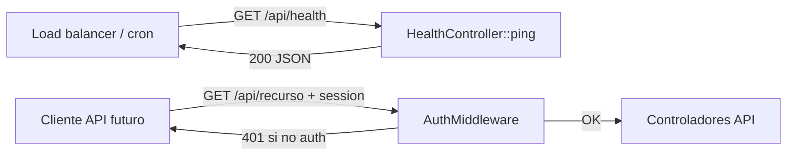

# Design: Higiene del harness package-source — env, instalador y health API

**Fecha:** 2026-07-25  
**Repo:** `Lebytek_Framework` (package source `lebytek/framework`)  
**Estado:** diseño — sin implementación  
**Auditoría fuente:** [PR #29](https://github.com/Parzival2103/Lebytek_Framework/pull/29) — `docs/audits/2026-07-25-auditoria-tecnica-diaria.md`  
**Rama base de trabajo:** `feature/backoffice-api-integration` (referencia VPS) / `main` @ `607a3c6` (package FPS)  
**Spec relacionado (cutover VPS):** `docs/superpowers/specs/2026-07-24-audit-vps-cutover-fps-design.md`

---

## Problema

Tras el merge FPS (PR #26), `main` es un **package source estable** sin Marketing ni código Portal. La auditoría del 2026-07-25 confirma **cero commits nuevos en `main` en 24 h** — el riesgo dominante sigue siendo operativo (VPS en monolito feature), no deuda nueva en el paquete.

Sin embargo, el **harness local del mantenedor** y la **superficie operativa mínima del paquete** presentan tres desalineaciones concretas detectadas en PR #29:

| ID | Hallazgo | Evidencia | Impacto |
|----|----------|-----------|---------|
| **M2** | `INSTALL_TOKEN` no documentado en `.env.example` | `public/install/index.php` exige token en `APP_ENV=production`; `docs/core/despliegue-y-versionado.md` lo describe; ningún `.env.example` lo listaba | Instalador web bloqueado en producción sin guía clara para ops |
| **M1** | Root `.env.example` mezcla vars Portal/Marketing | `MKT_*`, `LEBYTEK_API_*`, URLs waapi, copy de membresías; `skeleton/.env.example` está limpio | Mantenedores del paquete copian vars obsoletas; confunde FPS vs Portal |
| **M3** | `/api/ping` detrás de `AuthMiddleware` | `routes/api.php:14-17` — grupo `/api` exige sesión | Load balancers, cron health y smoke post-deploy requieren cookie de sesión |

Hallazgos críticos **persistentes** (VPS, Stripe #21, bootstrap #23) **no se resuelven en este spec** — permanecen en el spec de cutover del 2026-07-24 y en issues abiertos. Este diseño cubre solo la higiene implementable en el **repo Framework** sin tocar negocio Portal.

---

## Comportamiento esperado

### Post-implementación (Framework package + skeleton)

1. **`.env.example` (root harness + skeleton)** documenta `INSTALL_TOKEN=` con comentario que apunta a `public/install/?token=...` y a `docs/core/despliegue-y-versionado.md`.
2. **Root `.env.example` del harness** deja de listar variables exclusivas de Portal (`MKT_*`, `LEBYTEK_API_*`, URLs waapi de negocio) como si fueran parte del paquete; se mueven a un bloque comentado “solo Lebytek_Portal” o se eliminan del harness.
3. **`skeleton/.env.example`** permanece la referencia canónica para tenants genéricos — sin vars Marketing; incluye `INSTALL_TOKEN`.
4. **Health check público** responde `200` JSON sin autenticación en una ruta dedicada (p. ej. `GET /api/health` o `GET /api/ping` fuera del grupo autenticado), retornando `{ "status": "ok", "timestamp": "<ISO8601>" }`.
5. **Rutas API autenticadas** futuras permanecen bajo el grupo con `AuthMiddleware`; el health público no expone datos sensibles ni estado de BD en v1.
6. **Tests harness** validan que la ruta health es accesible sin sesión y que `EnvLoader` reconoce `INSTALL_TOKEN` cuando está documentado.

### Contexto operativo (sin cambio en este spec)

- VPS sigue en `feature/backoffice-api-integration` hasta cutover Portal (spec 2026-07-24).
- `PAYMENTS_SUBSCRIPTION_CHECKOUT=false` en prod hasta cierre #21.
- Bootstrap leads incompleto (#23) se resuelve en Portal o feature pinneada.

---

## Alcance

### Incluido

- Diseño de limpieza de `.env.example` root harness vs `skeleton/.env.example`.
- Documentación de `INSTALL_TOKEN` (fix parcial ya en PR #29 — merge como Q1).
- Diseño de ruta health API pública en `routes/api.php` (Framework + propagación a `skeleton/routes/api.php`).
- Test smoke: health sin auth; opcional contrato vars `.env.example` vs lecturas documentadas.
- Referencia cruzada a riesgos Stripe/bootstrap/VPS como gates, no como auto-fix.

### Fuera de alcance (no-alcance)

- Implementación de código en `app/` o `src/` en esta automatización (solo spec).
- Cutover VPS, deploy, SSH, DNS, migraciones prod, `.env` real en servidores.
- Fixes Stripe (#21), bootstrap leads (#23), CRUD `mkt_ordenes.status` (#23 medio).
- Merge `feature/backoffice-api-integration` → `main`.
- Creación repo remoto `Lebytek_Portal`.
- Desactivar RBAC, CSRF, rate limits, firmas webhook, Horizon ni tests de seguridad.
- Cierre de PRs draft #25/#27/#28 — revisión humana posterior.
- Health check con probe de BD/Redis (v2 opcional; v1 solo liveness).

---

## Contexto del proyecto

| Ámbito | Repo / ruta | Rol |
|--------|-------------|-----|
| Plataforma | `Lebytek_Framework` → `src/` | Paquete Composer; harness root no es deployable |
| Portal Lebytek | `Lebytek_Portal` (pendiente) | Vars `MKT_*`, `LEBYTEK_API_*`, checkout membresía |
| Skeleton | `skeleton/` | Plantilla tenant — `.env.example` limpio |
| VPS actual | `feature/backoffice-api-integration` | Monolito legacy; script `vps-deploy-lebytek-com.sh` |

**Restricciones absolutas:**

- Negocio Marketing no vuelve al package source.
- Cambios de plataforma → `src/`, `routes/`, `skeleton/`, tests harness.
- No parchear `vendor/` en consumidores.

**Criterios de éxito del diseño:**

- Un mantenedor del paquete distingue vars harness vs Portal sin leer issues.
- Ops puede configurar instalador web en producción siguiendo `.env.example`.
- Smoke post-deploy y load balancer pueden usar health JSON sin sesión.
- Riesgos VPS/Stripe/bootstrap quedan explícitamente fuera del alcance de implementación inmediata.

---

## Enfoques propuestos

### Enfoque A — Doc-only mínimo (recomendado como Fase 1)

**Qué:** Merge PR #29 (`INSTALL_TOKEN` en `.env.example` root + skeleton). PR doc-only separado: podar o comentar bloque Portal en root `.env.example`.

| Pros | Contras |
|------|---------|
| Cero riesgo runtime; mergeable a `main` de inmediato | No resuelve M3 (health tras auth) |
| Alinea harness con FPS sin tocar rutas | VPS sigue sin health público hasta Fase 2 |
| Desbloquea ops del instalador | |

### Enfoque B — Plataforma + docs (recomendado como entrega completa)

**Qué:** Fase 1 + mover `GET /api/ping` (o alias `/api/health`) **fuera** del grupo `AuthMiddleware` en `routes/api.php` y `skeleton/routes/api.php`; añadir test Feature `HealthEndpointTest`.

| Pros | Contras |
|------|---------|
| Resuelve M1, M2 y M3 en un ciclo coherente | Requiere cambio en `routes/` (Presentation layer del harness) |
| Consumidores heredan patrón vía skeleton y Composer update | Debe documentarse que `/api/*` restante sigue protegido |
| Compatible con checklist cutover (staging smoke api health) | |

### Enfoque C — Health en consumidor solamente

**Qué:** Portal/skeleton define ruta pública propia; Framework no cambia `routes/api.php`.

| Pros | Contras |
|------|---------|
| Evita tocar package source | Duplica contrato; tenants nuevos sin health estándar |
| | Contradice auditoría M3 y gates `CUTOVER-PORTAL.md` (api health) |

### Recomendación

**Enfoque B en dos PRs pequeños:**

1. **PR doc-only (Q1 + Q2):** merge PR #29 + limpieza root `.env.example` (vars Portal → comentario o `docs/integration/portal-env-vars.md`).
2. **PR plataforma (M3):** health público + test; bump minor si se publica paquete.

Enfoque A es aceptable si ops necesita solo `INSTALL_TOKEN` antes del cutover; M3 no debe posponerse más allá del primer deploy staging Portal.

---

## Diseño técnico (Enfoque B)

### 1. `.env.example` — INSTALL_TOKEN (M2)

Ubicación: sección `# SEGURIDAD`, después de `CSRF_TOKEN_LENGTH`.

```env
# Token para proteger el instalador web en producción (public/install/?token=...)
INSTALL_TOKEN=
```

- **Root harness:** incluir variable (PR #29).
- **Skeleton:** incluir variable (PR #29).
- **Portal:** documentar en `.env.example` propio del consumidor (fuera de este repo).

Comportamiento existente en `public/install/index.php`: si `APP_ENV=production` y `INSTALL_TOKEN` vacío → 403; si token query no coincide → 403.

### 2. Limpieza root `.env.example` (M1)

**Eliminar o mover a comentario “Portal only”:**

- `MKT_EMAIL_*`, `MKT_ALERT_*`, `MKT_PURCHASE_*`, `MKT_BANK_*`, `MKT_MEMBERSHIP_*`
- `LEBYTEK_API_*`, `WAAPI_PORTAL_ENABLED`
- Copy de CTAs waapi/lebytek.com en comentarios de `APP_URL`

**Conservar en harness/skeleton (plataforma genérica):**

- `APP_*`, `DB_*`, `SESSION_*`, `MAIL_*`, `REGISTRO_*`, `LOGIN_RATE_*`
- `BCRYPT_*`, `CSRF_*`, `INSTALL_TOKEN`
- `GREEN_API_*` (integración plataforma, OFF default)
- `STRIPE_*`, `PAYMENTS_*` (vertical genérico OFF default)

Opcional: archivo `docs/integration/portal-env-reference.md` listando vars Portal para copy-paste en `Lebytek_Portal`.

### 3. Health API pública (M3)

**Estado actual:**

```php
$router->group([
    'prefix'      => '/api',
    'middlewares' => [AuthMiddleware::class],
], function ($router) {
    $router->get('/ping', [HealthController::class, 'ping']);
});
```

**Propuesta:**

```php
// Público — liveness para LB/cron (sin datos sensibles)
$router->get('/api/health', [HealthController::class, 'ping']);

$router->group([
    'prefix'      => '/api',
    'middlewares' => [AuthMiddleware::class],
], function ($router) {
    // Futuras rutas autenticadas
    // Deprecar /api/ping autenticado o redirigir a /api/health en docs
});
```

Decisiones:

- **Ruta canónica:** `GET /api/health` (evita colisión semántica con “ping autenticado”).
- **Controller:** reutilizar `HealthController::ping` — sin lógica de negocio.
- **Respuesta:** `{ "status": "ok", "timestamp": "<ISO8601>" }` — sin versión ni DB en v1.
- **Skeleton:** mismo cambio en `skeleton/routes/api.php`.
- **Docs:** actualizar `docs/core/despliegue-y-versionado.md` y checklist cutover.

### 4. Tests sugeridos

| Test | Ubicación | Assert |
|------|-----------|--------|
| `HealthEndpointIsPublicTest` | `tests/` harness | `GET /api/health` → 200, JSON `status=ok`, sin cookie |
| `AuthenticatedApiGroupStillProtectedTest` | `tests/` | Ruta placeholder futura bajo grupo auth → 401/302 sin sesión |
| `EnvExampleInstallTokenDocumentedTest` | opcional | grep `INSTALL_TOKEN` en ambos `.env.example` |

### 5. Diagrama de flujo (health vs API autenticada)



---

## Riesgos

### Stripe (#21) — contexto, no alcance

| Riesgo | Mitigación en ops |
|--------|-------------------|
| Checkout subscription activo con criticals abiertos | `PAYMENTS_SUBSCRIPTION_CHECKOUT=false` hasta cierre #21 |
| Webhook 200 con fallo silencioso | No habilitar prod; diseño en Portal |

Este spec **no** modifica `ConfirmarPagoStripeUseCase` ni `StripeGateway`.

### Bootstrap / migraciones (#23) — contexto, no alcance

| Riesgo | Mitigación |
|--------|------------|
| Greenfield sin columnas lifecycle/churn en leads | Resolver en Portal; ver spec 2026-07-24 D1 |
| `migrate.php \|\| true` en deploy VPS | Fail-fast o checklist manual pre-cutover |

Limpieza de `.env.example` **no** corrige schema drift.

### VPS / operaciones

| Riesgo | Relación con este spec |
|--------|------------------------|
| Deploy en feature branch | Health público ayuda smoke staging Portal; no sustituye cutover |
| `INSTALL_TOKEN` ausente en prod | Mitigado por Q1; ops debe setear valor fuerte en `.env` |
| Docs ops desactualizadas (`seguridad_secretos_deploy.md`) | PR doc follow-up alinear con FPS |
| PRs draft #25/#27/#28 sin consolidar | Humano merge/archivo tras specs |

### Regresión harness

| Riesgo | Mitigación |
|--------|------------|
| Podar vars que el harness stub aún lee | Grep `EnvLoader::get` / `getenv` antes de eliminar; stub `app/` no debe depender de `MKT_*` |
| Health expone información | v1 solo timestamp; no incluir `APP_DEBUG`, DB status ni secrets |

---

## Criterios de aceptación

### Documentación (Fase 1 — PR #29 + Q2)

- [ ] `INSTALL_TOKEN=` presente en root `.env.example` y `skeleton/.env.example` con comentario operativo.
- [ ] Root `.env.example` no lista `MKT_*` ni `LEBYTEK_API_*` como vars activas del paquete (eliminadas o bloque comentado “Portal only”).
- [ ] `skeleton/.env.example` sigue sin vars Marketing.
- [ ] `docs/core/despliegue-y-versionado.md` referencia `INSTALL_TOKEN` de forma consistente con `.env.example`.

### Health API (Fase 2 — M3)

- [ ] `GET /api/health` responde 200 JSON sin sesión ni token.
- [ ] Rutas API futuras bajo `/api` con `AuthMiddleware` permanecen protegidas.
- [ ] `skeleton/routes/api.php` refleja el mismo contrato.
- [ ] Test harness confirma health público.
- [ ] Checklist `docs/CUTOVER-PORTAL.md` / staging smoke puede usar `/api/health`.

### Gates FPS (independientes)

- [ ] `main` permanece sin Marketing (`FrameworkRootNotPortal`, `SkeletonPurity` verdes).
- [ ] No merge feature → main sin orden explícita.
- [ ] Issues #21 y #23 permanecen abiertos con scope Portal/VPS hasta implementación dedicada.

### Consolidación auditorías (humano)

- [ ] PR #29 mergeado (reporte + INSTALL_TOKEN).
- [ ] Spec 2026-07-24 (cutover VPS) sigue siendo referencia para C1–C3.
- [ ] Drafts #25/#27 revisados vs estado actual post-#29.

---

## Referencias

| Recurso | Ubicación |
|---------|-----------|
| PR auditoría fuente | https://github.com/Parzival2103/Lebytek_Framework/pull/29 |
| Reporte auditoría | `docs/audits/2026-07-25-auditoria-tecnica-diaria.md` (rama PR #29) |
| Spec cutover VPS | `docs/superpowers/specs/2026-07-24-audit-vps-cutover-fps-design.md` |
| Cutover checklist | `docs/CUTOVER-PORTAL.md` |
| Instalador web | `public/install/index.php` |
| Health controller | `src/Presentation/Controllers/Api/HealthController.php` |
| Rutas API harness | `routes/api.php`, `skeleton/routes/api.php` |
| Issue Stripe criticals | #21 |
| Issue bootstrap leads | #23 |
| Despliegue / versionado | `docs/core/despliegue-y-versionado.md` |

---

## Próximo paso (fuera de este documento)

1. Merge humano PR #29 (reporte auditoría + `INSTALL_TOKEN`).
2. Invocar skill `writing-plans` para PR doc-only Q2 (limpieza `.env.example` harness).
3. Plan separado para Fase 2 health API + tests en `src/`/`routes/`/`tests/`.
4. Cutover VPS y fixes #21/#23 según spec 2026-07-24 — **no en esta automatización**.
