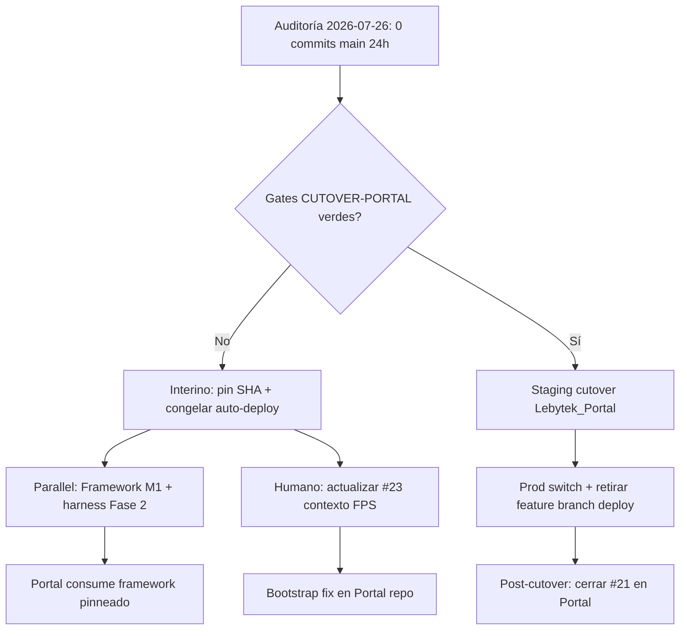

# Design: Cutover Portal/VPS estancado post-FPS y hardening paralelo de plataforma

**Fecha:** 2026-07-26  
**Repo:** `Lebytek_Framework` (package source `lebytek/framework`)  
**Estado:** diseño — sin implementación (pasadas deuda técnica D1–D12 + compatibilidad K1–K7 + UX U1–U9 + responsive R1–R7)  
**Auditoría fuente:** [PR #31](https://github.com/Parzival2103/Lebytek_Framework/pull/31) — `docs/audits/2026-07-26-auditoria-tecnica-diaria.md` (draft, base `main`)  
**Rama base de trabajo:** `feature/backoffice-api-integration` (referencia VPS @ `4789f95`) / `main` @ `607a3c6` (package FPS)  
**Rama spec:** `automation/audit-spec-2026-07-26` (deriva de feature, no de `main`)  
**Specs relacionados:**  
- `docs/superpowers/specs/2026-07-24-audit-vps-cutover-fps-design.md` (cutover objetivo)  
- `docs/superpowers/specs/2026-07-25-audit-harness-env-health-design.md` (higiene harness; `INSTALL_TOKEN` parcialmente en PR #31)

---

## Problema

La auditoría del 2026-07-26 confirma **cero commits en `main` en las últimas 24 h** y **ningún avance operativo** desde la auditoría del 2026-07-25. El package source post-FPS (merge PR #26) permanece estable, pero el ecosistema sigue en un **estado crítico de cutover estancado**:

| ID | Hallazgo | Evidencia | Impacto |
|----|----------|-----------|---------|
| **C1** | VPS despliega monolito feature, no arquitectura FPS | `scripts/vps-deploy-lebytek-com.sh:6`, `vps-deploy-waapi.sh:6` → `BRANCH=feature/backoffice-api-integration`; `main` sin Marketing | Deploy accidental de `main` rompe lebytek.com; feature congelada en SHA distinto al paquete publicado |
| **C2** | Bootstrap `marketing.sql` incompleto en feature/VPS | Columnas lifecycle/churn/Stripe ausentes en schema base vs migraciones `202607*` | Fresh install + `install.php` → schema incompatible con PHP de feature |
| **C3** | CRUD `mkt_ordenes.status` editable | `config/cruds/mkt_ordenes.json` (solo feature) permite `"paid"` sin transición | Admin puede activar plan sin Stripe ni Autorizar pago |
| **C4** | Stripe subscription gaps | Issue **#21** abierto (6 criticals) | Checkout recurrente inseguro si se habilita |
| **M5** | Deploy lebytek traga errores de migración | `vps-deploy-lebytek-com.sh` L56–70: `\|\| true` / `migration skipped` | Schema parcial silencioso en prod |
| **M6** | Deploy waapi sin migraciones | `vps-deploy-waapi.sh` solo clone + composer + nginx | waapi puede quedar sin SQL post-deploy |
| **M7** | RBAC: permisos CRUD usa `administracion.ver` | `routes/web.php:73-76` — slug `permisos.gestionar` inexistente | Gestión permisos accesible con permiso admin amplio |
| **M8** | Docs VPS desactualizadas | `docs/integration/VPS_CHECKLIST.md` — ítems sin marcar; branch feature como permanente | Ops sigue creyendo que feature es target final |

**Nuevo en `main` (implementable en Framework, independiente del cutover):**

| ID | Hallazgo | Evidencia | Impacto |
|----|----------|-----------|---------|
| **M1** | Path traversal en loaders de config | `CrudConfigLoader.php:33`, `CalendarConfigLoader.php:38` — `{resource}`/`{key}` sin allowlist | Usuario autenticado puede leer JSON bajo `config/` fuera de `cruds/` o `calendars/` |
| **M2** | AuthMiddleware no revalida usuario activo | `AuthMiddleware.php` — solo `Session::has('auth_user')` | Usuario desactivado mantiene sesión hasta expiración |
| **M3** | Instalador sin token fuera de production | `public/install/index.php:53–64` — `INSTALL_TOKEN` solo si `APP_ENV=production` | Staging/local con wizard abierto (aceptable dev; riesgo si staging expuesto) |
| **M4** | Root `.env.example` drift Portal post-FPS | Vars `MKT_*`, `LEBYTEK_API_*` activas; `skeleton/.env.example` limpio | Mantenedores copian vars obsoletas al harness |

El PR #31 entrega solo documentación de `INSTALL_TOKEN` en `.env.example` (mejora Q1); **no resuelve** C1–C4 ni M5–M8. La recomendación de auditoría permanece: **requiere revisión humana** para cutover Portal/VPS.

---

## Comportamiento esperado

### Cutover Portal/VPS (estado objetivo — sin cambio vs spec 2026-07-24)

1. **lebytek.com / waapi** se despliegan desde **`Lebytek_Portal`**, no desde `Lebytek_Framework`.
2. Framework llega al VPS **solo vía Composer** (`vendor/lebytek/framework`), versión pinneada en `composer.lock`.
3. Scripts de deploy referencian rama/tag del **Portal**, no `feature/backoffice-api-integration`.
4. Bootstrap Marketing alineado con migraciones y repositorios PHP (cierre #23 en contexto Portal).
5. Gates de `docs/CUTOVER-PORTAL.md` verdes en staging antes de switch de producción.
6. `PAYMENTS_SUBSCRIPTION_CHECKOUT=false` / checkout subscription OFF hasta cierre #21.

### Estado interino (semana estancada — comportamiento mínimo aceptable)

Mientras el cutover siga **deferred**:

1. **Auto-deploy congelado o con SHA pinneado** documentado — no HEAD flotante en feature sin checklist humano.
2. **Scripts VPS fallan en error** (no `\|\| true`) en migraciones críticas; logs visibles para ops.
3. **`vps-deploy-waapi.sh`** incluye paso de migraciones SQL equivalente al script lebytek.com (o documenta por qué waapi no las necesita).
4. **`docs/integration/VPS_CHECKLIST.md`** y `docs/core/seguridad_secretos_deploy.md` reflejan realidad post-FPS (branch feature = interino, fecha cutover TBD).
5. Issues **#21** y **#23** actualizados al contexto FPS (`main` sin marketing; bootstrap = Portal/VPS pinneada).
6. Ningún merge `feature/backoffice-api-integration` → `main` sin orden explícita.

### Hardening paralelo en Framework `main` (puede avanzar sin cutover)

1. **Config loaders** rechazan identificadores que no cumplan `^[a-z0-9_]+$` antes de construir path.
2. **AuthMiddleware** (opcional v1.1) revalida `auth_usuarios.activo` en requests autenticados o invalida sesión.
3. **Tests harness** cubren path traversal negativo en `CrudConfigLoader` y `CalendarConfigLoader`.
4. Health API pública y limpieza `.env.example` harness según spec 2026-07-25 (Fase 2 pendiente).

---

## Alcance

### Incluido

- Diseño de desbloqueo del estancamiento: gates de go/no-go, checklist interino, y criterios de escalación humana.
- Plan de remediación para scripts deploy (M5, M6) en `scripts/` — diseño only.
- Re-scope explícito de #23 (bootstrap/manifiestos → Portal o feature pinneada, no `main`).
- Política Stripe (#21) como gate duro pre-cutover y pre-habilitación checkout recurrente.
- Diseño de sanitización config loaders (M1) en `src/Application/Services/`.
- Referencia cruzada a specs 2026-07-24 y 2026-07-25; PR #31 como fuente de auditoría.

### Fuera de alcance (no-alcance)

- Implementación de código en `app/` o `src/` en esta automatización (solo spec).
- Cutover VPS real, deploy, SSH, DNS, migraciones prod, `.env`/secretos en servidores.
- Fixes Stripe (#21), bootstrap leads (#23), CRUD `mkt_ordenes.status` (C3) — Portal/feature pinneada.
- Renumerar migración `20260715120000_*` duplicada ni registrar `20260706120200_rep_churn_metrics.sql` en manifiesto — Portal/feature.
- Merge `feature/backoffice-api-integration` → `main`.
- Creación repo remoto `Lebytek_Portal` (orden explícita requerida).
- Cierre de PR #31 — lo ejecuta el pase UX (este pipeline), no el pase deuda técnica previo.
- Creación de `.github/workflows/` CI — issue/PR separado; solo documentado en deuda D9.
- Slug RBAC `permisos.gestionar` (M7/D5) — issue alineación, no bloqueante cutover.
- Purga vars `MKT_*` del harness `.env.example` — spec 2026-07-25 Fase 1 Q2.
- Desactivar RBAC, CSRF, rate limits, Horizon, firmas webhook Stripe, ni tests de seguridad.
- Ejecutar `php tests/run.php` en agente cloud (sin PHP en cron).
- Parche directo de `vendor/lebytek/framework` en consumidores.

---

## Contexto del proyecto

| Ámbito | Repo / ruta | Rol |
|--------|-------------|-----|
| Plataforma | `Lebytek_Framework` → `src/` | Paquete Composer; harness root no deployable |
| Portal Lebytek | `Lebytek_Portal` (pendiente) | lebytek.com / waapi — negocio Marketing |
| VPS actual | `feature/backoffice-api-integration` @ `4789f95` | Monolito legacy en producción |
| Skeleton | `skeleton/` | Plantilla tenant genérico |

**Restricciones absolutas:**

- Negocio Marketing no vuelve al package source.
- Cambios de plataforma → `src/`, `scripts/`, `skeleton/`, tests harness.
- No parchear `vendor/` en consumidores.
- Cutover VPS requiere sign-off humano en `docs/CUTOVER-PORTAL.md`.

**Criterios de éxito del diseño:**

- Un operador distingue claramente estado interino (feature pinneada) vs estado objetivo (Portal + Composer).
- No hay ambigüedad sobre qué acciones pueden ejecutarse en paralelo en Framework vs qué requiere Portal.
- Bootstrap greenfield no falla por columnas faltantes una vez aplicado el plan #23 en repo correcto.
- Loaders de config no permiten lectura fuera de directorios permitidos.
- Stripe recurrente permanece OFF hasta evidencia de cierre #21.

---

## Enfoques propuestos

### Enfoque A — Cutover completo inmediato (ideal, bloqueado)

**Qué:** Ejecutar `docs/CUTOVER-PORTAL.md` de punta a punta — crear `Lebytek_Portal`, migrar deploy scripts, retirar auto-pull monolito.

| Pros | Contras |
|------|---------|
| Elimina C1–C4 de raíz | Requiere repo Portal, auth Composer privado, staging E2E — **deferred** sin orden explícita |
| Alinea prod con FPS | Alto riesgo si se apresura con #21/#23 abiertos |
| Un solo modelo arquitectónico | No ejecutable autonomously por agente |

**Veredicto:** Objetivo correcto; **no viable esta semana** sin sign-off humano y gates verdes.

### Enfoque B — Congelamiento operativo + docs (interino mínimo)

**Qué:** Pin SHA feature en scripts/checklist; deshabilitar auto-pull; actualizar VPS_CHECKLIST; re-etiquetar #23; **sin** cambios en `src/`.

| Pros | Contras |
|------|---------|
| Bajo riesgo; ejecutable por ops | No reduce deuda feature; C2–C4 persisten en monolito |
| Evita deploy accidental de `main` | waapi sigue sin migrate (M6) si no se documenta workaround |
| Desbloquea tiempo para cutover real | No corrige M1 path traversal en package `main` |

**Veredicto:** Necesario como **mínimo interino**, insuficiente solo.

### Enfoque C — Dual track: interino ops + hardening Framework (recomendado)

**Qué:** Enfoque B (pin + docs + scripts fail-fast) **en paralelo** con PR Framework para M1 (config loader allowlist) y avance spec 2026-07-25 Fase 2 (health API). Cutover Portal planificado en ventana con gates #21/#23.

| Pros | Contras |
|------|---------|
| Progreso medible en `main` aunque cutover esté deferred | Dos frentes requieren coordinación maintainer/ops |
| M1 cierra vulnerabilidad en paquete que consumirá Portal | Bootstrap/Stripe siguen en feature hasta cutover |
| Scripts fail-fast reducen schema parcial silencioso | Requiere PRs separados (Framework vs Portal) |

**Veredicto:** **Recomendado.** Separa lo implementable en package source de lo bloqueado en monolito VPS.

---

## Diseño propuesto (Enfoque C)

### 1. Escalación cutover estancado



**Acciones interinas (ops/maintainer):**

1. Documentar SHA pinneado `4789f95` (o HEAD actual verificado) en `VPS_CHECKLIST.md` § Deploy.
2. Añadir banner en `vps-deploy-*.sh`: `# INTERINO post-FPS — NO cambiar a main hasta cutover Portal`.
3. Reemplazar `\|\| true` por exit code failure + mensaje en migraciones lebytek deploy (PR dedicado).
4. Añadir bloque migrate a `vps-deploy-waapi.sh` o checklist manual post-deploy.
5. Comentario en issue #23: bootstrap/manifiestos ya no aplican a `main`; scope = Portal + feature pinneada.

### 2. Config loader sanitization (M1)

**Componentes:** `CrudConfigLoader`, `CalendarConfigLoader`, `ReporteConfigLoader` (`src/Application/Reporte/ReporteConfigLoader.php:43`).

**Regla:**

```php
private static function assertSafeConfigKey(string $key): void
{
    if ($key === '' || !preg_match('/^[a-z0-9_]+$/', $key)) {
        throw new ValidationException('Identificador de configuración inválido.');
    }
}
```

Invocar **antes** de concatenar path. Cache key = valor ya validado.

**Tests:** `tests/Platform/CrudConfigLoaderSecurityTest.php` — casos `../secrets`, `foo/bar`, `%00`, vacío → `ValidationException`.

**Capa:** `Application` — sin lógica en Presentation.

### 3. Auth session revalidation (M2 — fase opcional)

**v1 (este ciclo):** Documentar comportamiento actual en spec/issue; login ya verifica `activo`.

**v1.1 (follow-up):** `AuthMiddleware` consulta repositorio auth (cache request-scoped) y destruye sesión si `activo = 0`. Test: usuario desactivado mid-session → redirect login.

No bloquea cutover; puede ir en PR separado post-M1.

### 4. Riesgos Stripe (#21) — gates

| Critical | Mitigación diseño |
|----------|-------------------|
| C1 first-activation no-op | No habilitar subscription checkout hasta fix ConfirmarPagoStripe |
| C2 invoice.paid metadata | Resolver orden vía subscription/customer id, no metadata checkout |
| C3 recover new checkout | Billing Portal o external_ref estable |
| C4 post-claim swallow | Propagar error o cola retry; no 200 silencioso |
| C5 recover cancelled desync | No `markActive` si API falla |
| C6 amount bypass | Validar currency + amount siempre |

**Política ops:** `STRIPE_ENABLED` y `PAYMENTS_SUBSCRIPTION_CHECKOUT` según checklist; default OFF en VPS hasta cierre issue.

### 5. Bootstrap (#23) — re-scope Portal

Fresh install en **Portal** debe garantizar paridad:

- `database/schema/modules/marketing.sql` incluye columnas de migraciones `20260701160000`–`20260706120000` y Stripe órdenes.
- Manifiesto `config/modules/marketing.php` = union de migraciones en disco.
- Test `SchemaBootstrapTest` (Portal) valida columnas críticas en `dom_mkt_leads`, no solo existencia de tablas.

En `main` Framework: **ninguna acción** — marketing.sql eliminado post-FPS.

---

## Deuda técnica

Inventario verificado en rama `automation/audit-spec-2026-07-26` (base `feature/backoffice-api-integration` @ `4789f95`) contra auditoría [PR #31](https://github.com/Parzival2103/Lebytek_Framework/pull/31) (`docs/audits/2026-07-26-auditoria-tecnica-diaria.md`) y delta con `main` @ `607a3c6`. **Ningún ítem se auto-fixea en esta automatización** — solo queda documentado como requisito de spec/PR/issue.

### D1 — Cutover estancado (semana sin avance)

| Evidencia | Impacto | Acción requerida |
|-----------|---------|------------------|
| `main`: **0 commits** en ventana 24 h (2026-07-26); último merge FPS PR #26 el 2026-07-21 | Riesgo operativo persiste sin progreso medible hacia Portal | Escalación humana; fecha revisión en `VPS_CHECKLIST.md` |
| VPS sigue en `feature/backoffice-api-integration` @ `4789f95`; scripts `vps-deploy-lebytek-com.sh:6`, `vps-deploy-waapi.sh:6` | Deploy accidental de `main` rompe lebytek.com; monolito congelado | Enfoque B/C: pin SHA + banner interino |
| ~46 commits solo en `main` / ~53 solo en feature (~239 archivos) | Drift feature↔FPS crece cada semana sin cutover | `docs/CUTOVER-PORTAL.md`; no merge feature→main |

### D2 — Bootstrap / schema drift (#23)

| Evidencia | Impacto | Acción requerida |
|-----------|---------|------------------|
| `database/schema/modules/marketing.sql` — `dom_mkt_leads` **sin** `api_instance_public_id`, `api_lifecycle_status`, columnas churn ni tablas Stripe/membresías que añaden migraciones `20260701160000+`, `20260706120000+`, `20260714200000+`, `20260715120000_mkt_ordenes_stripe.sql`, `20260715210000_mkt_membresias.sql` | Fresh install vía `install.php` + bootstrap → repos PHP (`LeadApiProvisioningService`, churn, órdenes) fallan en columnas/tabs ausentes | Portal o parche feature pinneada; issue **#23** re-scope post-FPS |
| `config/modules/marketing.php:15-31` lista 15 migraciones en manifiesto, pero **`20260706120200_rep_churn_metrics.sql` ausente** (tablas `rep_churn_monthly`, `rep_risk_signals`) | `scripts/compute-churn-snapshot.php` no tiene DDL garantizado en greenfield ni en bucle deploy | Añadir al manifiesto Portal/feature; incluir en checklist bootstrap |
| **Colisión de timestamp:** dos archivos `20260715120000_*` (`mkt_landing_experiments.sql`, `mkt_ordenes_stripe.sql`) | Orden de apply no determinístico entre entornos (`migrate.php` / bucle manual deploy) | Renumerar una migración en Portal/feature antes de cutover |
| Feature: **14+** migraciones `202607*.sql` en `database/migrations/`; `main`: **3** plataforma (`20260609120000`, `20260612120000`, `20260614120000`) | Manifiesto migrate desalineado post-FPS; confusión sobre qué aplica al harness | Ninguna acción en `main`; cutover spec 2026-07-24 |

### D3 — Scripts deploy silencian fallos (M5, M6)

| Evidencia | Impacto | Acción requerida |
|-----------|---------|------------------|
| `scripts/vps-deploy-lebytek-com.sh:56` — `php migrate.php 2>/dev/null \|\| true` | Errores de migración silenciados | Fail-fast PR scripts (Enfoque C §1) |
| Mismo script L58–71: bucle `202606*.sql` / `202607*.sql` con `\|\| echo "migration skipped"` | Schema parcial persistente sin fallo de deploy | Post-deploy: `\d dom_mkt_leads`; verificar columnas lifecycle/churn |
| `scripts/vps-fix-lebytek-db.sh:17` — apply SQL con `\|\| true` | Parches manuales ops también tragan errores | Documentar en checklist; alinear con fail-fast |
| `scripts/vps-deploy-waapi.sh` — **cero** paso SQL/migrate post-clone | waapi puede quedar sin tablas post-deploy | Bloque migrate o checklist manual § waapi |

### D4 — Config loaders path traversal (M1)

| Evidencia | Impacto | Capa | Acción requerida |
|-----------|---------|------|------------------|
| `src/Application/Services/CrudConfigLoader.php:33` — concat `{resource}.json` sin allowlist | Lectura bajo `config/` fuera de `cruds/` | Application | PR Framework: `^[a-z0-9_]+$` |
| `src/Application/Services/CalendarConfigLoader.php:38` — mismo patrón `{key}.json` | Idem en `config/calendars/` | Application | Mismo PR |
| `src/Application/Reporte/ReporteConfigLoader.php:43` — `{key}.json` en `config/reportes/` | Superficie adicional no citada en auditoría | Application | Incluir en PR M1 |
| Sin `tests/Platform/CrudConfigLoaderSecurityTest.php` ni casos negativos en `CalendarConfigLoaderTest` / `ReporteConfigLoaderTest` | Regresión M1 no detectada | Tests harness | Añadir en PR M1 |

### D5 — RBAC permisos admin (M7)

| Evidencia | Impacto | Acción requerida |
|-----------|---------|------------------|
| `routes/web.php:73-76` — comentario explícito: slug `permisos.gestionar` **no existe** en seeds; rutas `/admin/permisos/*` usan `administracion.ver` | Cualquier rol con administración amplia gestiona permisos RBAC | Issue alineación; referencia `docs/audits/correccion_alineacion_modulos_v0.1.md` |
| CRUD `/admin/crud/*` — Auth en ruta; RBAC en servicio (defense-in-depth gap, PR #31) | Superficie admin menos granular de lo deseable | Documentar; no bloqueante cutover |

### D6 — Harness `.env.example` / docs ops (M4, M3 parcial)

| Evidencia | Impacto | Acción requerida |
|-----------|---------|------------------|
| Root `.env.example` — vars Portal activas (`MKT_*`, `LEBYTEK_API_*`); `skeleton/.env.example` limpio | Mantenedores copian vars obsoletas al harness | Spec 2026-07-25 Fase 1 Q2 (doc-only); PR pendiente |
| PR #31 añade `INSTALL_TOKEN` en `.env.example` + skeleton — **draft, no mergeado** | Q1 documentado pero no en `main` | Merge humano PR #31 |
| `docs/composer-setup.md:101,118` — `feature/backoffice-api-integration` / `dev-feature/backoffice-api-integration` como pin permanente | Consumidores nuevos instalan monolito legacy en lugar de paquete FPS | Actualizar doc post-cutover; bloque “solo interino VPS” |
| `docs/integration/VPS_CHECKLIST.md:89` — “Branch: feature/backoffice-api-integration (until merge)” sin fecha cutover | Ops trata feature como target final | Marcar **deferred** + SHA pinneado + fecha revisión |

### D7 — Cron / jobs fuera del deploy (feature/VPS)

| Evidencia | Impacto | Acción requerida |
|-----------|---------|------------------|
| `scripts/compute-churn-snapshot.php` — cron mensual documentado en cabecera; depende de `rep_churn_monthly` (D2) | Métricas churn no calculadas si cron no está en crontab VPS | Checklist ops post-deploy |
| `scripts/expire-membership-grace.php` — cron cada 30 min documentado | Membresías en grace no expiran automáticamente | Idem |
| `VPS_CHECKLIST.md:16-17,118` — cron health cada 5 min **pendiente confirmar crontab** | Smoke E2E verde 2026-07-01 pero monitorización incompleta | Confirmar crontab operador |

### D8 — CRUD state machine bypass (C3 — Portal/feature)

| Evidencia | Impacto | Acción requerida |
|-----------|---------|------------------|
| `config/cruds/mkt_ordenes.json:55-63` — campo `status` editable en form con opción `"paid"` | Admin puede marcar pagada → acción **Activar plan** (`L73-75`) sin Stripe ni Autorizar pago | Issue Portal; `status` readonly o enforcement transiciones en update |
| `CrudTransitionService` aplica a acciones `type: transition`, no a guardado directo de formulario (patrón general CRUD) | Bypass de máquina de estados en recursos con `states.transitions` | Diseño CRUD engine follow-up opcional en Framework |

### D9 — Tests / CI ausentes en pipeline cloud

| Evidencia | Impacto | Acción requerida |
|-----------|---------|------------------|
| Auditoría 2026-07-26: `php tests/run.php` **no ejecutado** (cloud sin PHP) | Gates harness (~240 tests en `tests/`) no verificados esta semana | CI GitHub Actions con PHP 8.x en push `main` — **no existe** `.github/workflows/` en repo |
| Tests FPS (`FrameworkRootNotPortalTest`, `SkeletonPurityTest`, `FpsPublicationReadinessTest`) en `main`; **ausentes** en feature | Rama VPS sin gate automático de pureza package | No confundir verde feature con FPS |
| Sin tests path traversal (D4), session revalidation (M2), health público (spec 2026-07-25 M3) | Regresiones M1–M3 no detectadas | PRs Framework + Fase 2 harness |

### D10 — Uploads SVG (superficie secundaria)

| Evidencia | Impacto | Acción requerida |
|-----------|---------|------------------|
| PR #31: `UploadValidator` + finfo OK; SVG permitido si config CRUD lo habilita | XSS potencial vía SVG en uploads admin | Revisar configs CRUD con `type: file` + SVG; fuera de alcance cutover inmediato |

### D11 — Stripe subscription (#21) — requisito documentado

Gaps persistentes en rama VPS (6 criticals en issue **#21**): first-activation no-op, `invoice.paid` metadata, recover crea nuevo checkout, post-claim swallow, desync cancelled, amount bypass. Clases afectadas (feature): `ConfirmarPagoStripeUseCase`, `IniciarPagoStripeUseCase`, `ActivarPlanOrdenPagadaUseCase`.

**Gate ops:** `STRIPE_ENABLED=false`, `PAYMENTS_SUBSCRIPTION_CHECKOUT=false` en prod hasta cierre #21. Este spec **no** toca `src/Domain/Payments/` ni use cases Marketing en `app/Application/Marketing/`.

### D12 — Pipeline specs / PRs auditoría

| Evidencia | Impacto | Acción requerida |
|-----------|---------|------------------|
| PR #31 **draft** — informe 2026-07-26 + `INSTALL_TOKEN` en `.env.example` | Spec asume auditoría fuente accesible; fix Q1 no en `main` | Cerrar PR #31 en pase UX; merge humano contenido `.env.example` |
| PR #29 (2026-07-25) **cerrado**; PR #30 spec harness **cerrado** | Progreso parcial harness; Fase 2 health API sigue pendiente | Continuar spec 2026-07-25 en PR Framework |
| Specs audit `2026-07-24`, `2026-07-25` en ramas `automation/audit-spec-*`; **no** en feature branch desplegada | Gates cutover/harness ilegibles desde VPS | Fetch docs desde ramas audit o `main` |

---

## Compatibilidad (pase UX — PHP, navegadores, admin, móvil)

Inventario derivado de revisión estática en rama `automation/audit-spec-2026-07-26` (base `feature/backoffice-api-integration` @ `4789f95`), delta `main` @ `607a3c6`, auditoría [PR #31](https://github.com/Parzival2103/Lebytek_Framework/pull/31), `docs/core/ui_ux.md`, install wizard, flujos Marketing en feature/VPS y hardening Framework `main`. **Solo requisitos de diseño** — sin implementación en este pipeline.

**Contexto estancamiento:** la semana sin commits en `main` no cambia la superficie UX en VPS (sigue monolito feature); los requisitos K/U/R siguen aplicando al **estado interino pinneado** y al **cutover objetivo Portal**.

### K1 — Runtime PHP y dependencias Composer

| Ítem | Evidencia | Requisito |
|------|-----------|-----------|
| PHP mínimo | `composer.json`: `"php": ">=8.1"` | VPS, staging Portal y harness deben ejecutar **PHP ≥ 8.1** antes de cutover o pin interino |
| VOs Payments | PR #10: `readonly class` en domain Payments | Hosting PHP 8.0 o inferior **no compatible** — bloqueante |
| Extensiones install | `paso_requisitos.php` + PDO repos | `pdo_mysql`, `mbstring`, `json`, `openssl`, `fileinfo` requeridas; documentar en `VPS_CHECKLIST.md` |
| Cloud agent sin PHP | Auditoría 2026-07-26; D9 | Compatibilidad runtime **no verificada** esta semana — gate humano/CI antes de confiar en smoke |

### K2 — Navegadores soportados (admin vs público vs install)

| Superficie | Stack | Compatibilidad esperada |
|------------|-------|-------------------------|
| Admin / CRUD | Bootstrap 5.3 + jQuery + DataTables Responsive (CDN) | Chrome/Firefox/Safari/Edge **últimas 2 versiones**; sin IE11 |
| Landing v1 | Bootstrap 5.3 (`publico/layout.php`) | Misma baseline admin |
| Landing v2 | CSS/JS standalone (`landing_v2.css/js`) — **sin Bootstrap** | `IntersectionObserver`, CSS `clamp()`, `prefers-reduced-motion`; Safari iOS ≥ 15 |
| Install wizard | Bootstrap 5.3 local; layout 720px | Funcional móvil; token 403/419 texto plano (ver U1, K6) |
| Health API (Fase 2 pendiente) | JSON puro | curl/LB/UptimeRobot; **no** redirect HTML (ver K5) |

**Gap K2a — iconos Bootstrap Icons ausentes en install:** `_layout.php` del wizard referencia `bi-*` sin cargar `bootstrap-icons.css` (admin sí lo carga en `base.php`). Checks OK/error pueden mostrarse sin icono — ver spec 2026-07-25 K2a.

**Requisito cutover/interino:** smoke manual **Safari iOS + Chrome Android** para landing activa (`LANDING_VARIANT`) y login admin; repetir tras cada deploy pinneado si cambia SHA feature.

### K3 — Divergencia stacks y rutas post-FPS (Portal vs monolito VPS)

Tras cutover, lebytek.com consumirá **Portal + vendor framework**. Mientras C1 persista, compatibilidad de rutas públicas se valida en **feature @ SHA pinneado**, no en `main` harness.

| Ruta pública | Middleware / deps | Riesgo compat |
|--------------|-------------------|---------------|
| `POST /marketing/collect` | Sin CSRF (by design); rate limit | WAF/CDN si body JSON mal formado |
| `POST /webhooks/stripe` | Fuera CSRF; firma Stripe | Body raw intacto en nginx |
| `GET /portal` | Magic-link | Links rotos si `APP_URL` desalineado post-DNS |
| waapi sin migrate (M6) | Tablas ausentes | **500 HTML** en cualquier navegador — no bug cliente |

### K4 — Schema drift → errores 500 en admin y API (D2, M5)

Columnas lifecycle/churn/Stripe ausentes en bootstrap + migraciones silenciadas (`|| true`) provocan SQL exceptions en `PdoLeadRepository`, reportes churn y CRUD leads/órdenes. **Cualquier navegador** ve pantalla de error 500 — no es bug de cliente.

**Requisito interino:** post-deploy query `SHOW COLUMNS FROM dom_mkt_leads LIKE 'api_%'` y `'demo_%'` antes de exponer admin; fail-fast scripts (D3) para evitar schema parcial silencioso.

### K5 — Stripe Checkout, health API y redirects móvil

| Condición | Evidencia | Impacto compat/UX |
|-----------|-----------|-------------------|
| `PAYMENTS_SUBSCRIPTION_CHECKOUT=true` (#21) | D11 | Checkout subscription no activa orden — retorno "éxito" engañoso |
| Webhook 200 con fallo silencioso (C4) | Issue #21 | Página éxito desacoplada del estado real |
| `/api/ping` bajo auth | `AuthMiddleware` → 302 HTML login | LB puede marcar healthy incorrectamente — ver spec 2026-07-25 K3 |
| `GET /api/health` (Fase 2) | Pendiente en `main` | Contrato liveness sin sesión — no reutilizar `/api/ping` autenticado |

**Gate:** checkout recurrente OFF; smoke return URL Stripe en viewport **375px**; monitoring VPS debe usar endpoint JSON público post-Fase 2.

### K6 — Install wizard, token y entornos

| Ítem | Evidencia | Requisito |
|------|-----------|-----------|
| `INSTALL_TOKEN` | PR #31 documenta en `.env.example` — **draft, no mergeado** | Merge humano PR #31 o equivalente antes cutover |
| Respuesta 403/419 | `public/install/index.php` — texto plano | Layout wizard mínimo + copy ops (U1, U2) |
| Wizard abierto staging | M3: token solo en `APP_ENV=production` | Documentar riesgo staging expuesto; no confundir con prod |
| Token en query móvil | Historial navegador | Runbook: rotar token si URL compartida |

### K7 — Superficie admin: path traversal config y sesión desactivada (M1, M2)

| Ítem | Evidencia | Requisito |
|------|-----------|-----------|
| Config loaders sin allowlist | D4: `CrudConfigLoader`, `CalendarConfigLoader`, `ReporteConfigLoader` | Usuario autenticado en **cualquier navegador** puede explotar lectura paths — fix Framework M1 |
| Sesión usuario desactivado | M2: `AuthMiddleware` no revalida `activo` | Admin desactivado mantiene sesión hasta expiry — v1.1 opcional documentada |
| Upload SVG (D10) | `UploadValidator` + CRUD `type: file` | XSS vía SVG en admin si config lo habilita — revisar CRUDs con SVG; fuera cutover inmediato |

---

## UX (pase UX — flujos, copy, estados error/vacío)

Requisitos para **VPS interino pinneado** (feature) y **estado objetivo Portal**. La semana estancada (D1) no exime de corregir flujos que siguen en producción.

### U1 — CRUD `mkt_ordenes`: bypass de flujo de pago (C3, D8)

`config/cruds/mkt_ordenes.json` expone `status` como `select` editable incluyendo `"paid"`; transiciones JSON no aplican al guardado directo del formulario.

| Problema UX | Impacto |
|-------------|---------|
| Operador marca `paid` manualmente | Usuario cree activado; `api_activation_error` vacío o confuso |
| Badge "Pagada" vs tenant sin provisionar | Soporte recibe tickets; inconsistencia API comercial |
| Help text `api_tenant_public_id` mezcla transferencia/Stripe | Error operativo en móvil (campo largo, truncate en lista) |

**Requisito Portal/feature pinneada:** `status` **read-only** o restringido a transiciones RBAC; acciones fila primarias sin editar select.

### U2 — Confirmación pago Stripe: copy optimista vs realidad (#21, D11)

Vista `publico/compra_pago_exito.php` — copy genérico "Estamos confirmando tu pago..." no distingue one-shot confirmado, subscription pendiente webhook, ni fallo activación API.

**Requisito:** estados diferenciados según `order.status` + `metodo_pago` + `api_activation_error`; enlace soporte si activación falla tras N minutos; **no** habilitar subscription checkout hasta cierre #21.

### U3 — Install wizard: errores token/CSRF sin guía visual (M3, PR #31)

403 y 419 responden texto plano sin layout Bootstrap ni enlace a documentación despliegue.

**Requisito:** vistas con `_layout.php`, instrucciones numeradas (`INSTALL_TOKEN` en `.env` + `?token=valor`), enlace `docs/core/despliegue-y-versionado.md`; aplicar harness + skeleton (spec 2026-07-25 U1–U2).

### U4 — Pago cancelado: recuperación de intención débil

`publico/compra_pago_cancelado.php` enlaza a `/?compras=1#paquetes` — pierde contexto orden/plan/ciclo.

**Requisito:** CTA "Reintentar pago" hacia misma orden cuando `status` lo permita; copy que confirme ausencia de cargo.

### U5 — Verificación demo: estados terminales sin CTA retorno

`verificar_demo.php` — estados `expired`, `locked`, `invalid` sin botón "Solicitar demo de nuevo" (`/#demo` o v2 `#demo`).

**Requisito Portal:** enlace consistente al formulario demo en todos los estados error; anchor `#demo` funcional v1/v2.

### U6 — Flujo transferencia vs Stripe en admin: empty-state operador

Acciones CRUD condicionadas por `visible_when.status`; si ocultas en móvil o estado incorrecto, operador no ve siguiente paso. Columna `api_activation_error` depende de schema (D2).

**Requisito:** banner o empty-state en detalle orden con checklist según `metodo_pago`; mensaje explícito si schema incompleto impide mostrar errores activación.

### U7 — Recuperación membresía / dunning (#21)

Rutas `/membresia/reintentar-pago`, `/membresia/reactivar` — recover crea nuevo Checkout (C3); `markActive` local con API caída (C5).

**Requisito:** copy unificado reactivación; fail-closed si API comercial no responde; no mostrar "activo" hasta confirmación.

### U8 — Harness `.env.example` y copy ops confuso (M4, D6)

Root `.env.example` mezcla CTAs lebytek.com/waapi y vars `MKT_*`/`LEBYTEK_API_*` como si fueran del paquete FPS; `skeleton/.env.example` limpio.

**Requisito documental:** podar vars Portal del harness (spec 2026-07-25 Q2); bloque `# ── Solo Lebytek_Portal ──` o doc referencia; evitar que operador copie CTAs Marketing al instalar tenant genérico.

### U9 — Estancamiento cutover: señales UX para ops y mantenedores (D1, D12)

| Problema | Impacto UX ops |
|----------|----------------|
| `VPS_CHECKLIST.md` "until merge" sin fecha | Ops cree que feature es target final |
| PR #31 draft + specs en ramas `automation/*` | Informe y gates ilegibles desde VPS |
| 0 commits `main` 24h | Falsa sensación de estabilidad mientras prod diverge |

**Requisito:** banner/checklist **deferred con fecha revisión** y SHA pinneado visible; enlace a spec final (PR UX) desde checklist; PR auditoría #31 cerrado con referencia al spec mergeable.

---

## Responsive (pase UX — breakpoints, layout admin/público)

Referencia admin: `docs/core/ui_ux.md` §542 — **breakpoint único 992px (`lg`)**. Landing v2 usa 860px / 560px (decisión consciente). Install wizard: contenedor **720px**.

### R1 — Admin: navegación y layout (992px)

| Componente | Comportamiento | Verificación |
|------------|----------------|--------------|
| Sidebar / offcanvas | `< 992px` offcanvas; `≥ 992px` fijo | Marketing → Órdenes en 375px y 1280px |
| Bottombar móvil | `d-lg-none` | Acciones CRUD no bajo barra inferior |
| RBAC permisos (M7) | Misma shell | Smoke gestión permisos en 375px — acceso amplio no debe ocultar acciones críticas |

### R2 — CRUD `mkt_ordenes`: densidad columnas móvil (C3)

Lista **9 columnas** con `priority` 1–5; acciones fila `autorizar_pago`, `activar_plan`, etc.

**Requisito:** smoke 375px — expandir fila `pending_transfer`, tap `Autorizar pago`; área táctil ≥ 44px; `table_compact: true` no reduce target bajo mínimo.

### R3 — Landing v2: breakpoints 860px / 560px

Probar pricing grid, nav sticky, hero en 860px, 560px, **320px**. Lead form: inputs sin desborde (`box-sizing: border-box`).

### R4 — Landing v1, compra, verificación demo (Bootstrap)

| Vista | Verificación móvil |
|-------|-------------------|
| `compra_form.php`, transferencia | Formulario con teclado email abierto |
| `verificar_demo.php` | Input 6 chars, `autocomplete=one-time-code` iOS |
| `compra_pago_*` | `max-width: 720px`; botones full-width opcional `< sm` |

### R5 — Install wizard responsive (720px)

Pasos `paso_bd`, `paso_admin`, `paso_revision` — listas largas migraciones con scroll (`max-height`) para no empujar "Instalar ahora" fuera de viewport (spec 2026-07-25 U7, R2–R3). Requisitos flex en `paso_requisitos` para 320px.

### R6 — Smoke responsive cutover / interino (staging o VPS pinneado)

| # | Viewport | Flujo |
|---|----------|-------|
| 1 | 375×812 | Landing → demo form → flash success/error |
| 2 | 375×812 | `/comprar/starter` → ciclo → submit |
| 3 | 375×812 | Admin login → CRUD `mkt_ordenes` → expand row → acción |
| 4 | 1280×800 | Admin sidebar fijo — mismo flujo |
| 5 | 860px | Landing v2 pricing toggle mensual/anual |
| 6 | prefers-reduced-motion | Landing v2 sin animaciones obligatorias |
| 7 | 375×812 | Install token 403 **con layout** (post U3) |

### R7 — waapi y health: verificación sin UI dedicada

waapi sin migrate (M6) — verificar que rutas admin/API no devuelvan 500 por tablas ausentes tras deploy. Health: curl CLI + panel LB; no usar `/api/ping` autenticado en monitoring móvil ops.

---

## Criterios de aceptación

### Cutover / ops (humano + PRs docs/scripts)

- [ ] `VPS_CHECKLIST.md` marca cutover como **deferred con fecha revisión** y documenta SHA pinneado interino.
- [ ] Scripts deploy no silencian fallos de migración crítica (exit ≠ 0 o flag `--strict`).
- [ ] `vps-deploy-waapi.sh` tiene estrategia migrate documentada o implementada.
- [ ] Issue #23 body actualizado: scope Portal/VPS, no `main @ 2c71d3f`.
- [ ] Ningún deploy prod de `main` en lebytek.com sin cutover completo.
- [ ] Checkout subscription permanece OFF hasta checklist #21 completo.

### Framework package (`main` — PRs separados)

- [ ] `CrudConfigLoader` y `CalendarConfigLoader` rechazan keys con `..`, `/`, `%`, mayúsculas, vacío.
- [ ] Test harness falla si path traversal es posible.
- [ ] (Opcional v1.1) AuthMiddleware invalida sesión de usuario desactivado.
- [ ] (Spec 2026-07-25 Fase 2) Health API pública sin sesión.

### Auditoría / pipeline

- [ ] PR #31 referenciado en spec; **cerrado** por pase UX con enlace al PR spec final.
- [ ] Spec committeado en `automation/audit-spec-2026-07-26` sin cambios en `app/` ni `src/`.

### Compatibilidad / UX / Responsive (pase UX — este spec)

- [ ] Secciones **Compatibilidad** (K1–K7), **UX** (U1–U9) y **Responsive** (R1–R7) revisadas por maintainer.
- [ ] Smoke pre-cutover/interino incluye PHP ≥ 8.1 en VPS/staging y Safari iOS + Chrome Android (K2).
- [ ] CRUD `mkt_ordenes`: campo `status` no editable a `paid` manualmente; acciones fila accesibles en móvil (U1, R2).
- [ ] Página retorno Stripe distingue estados reales de orden — no copy optimista único si webhook/activación pendiente (U2).
- [ ] Install wizard 403/419 con layout/guía ops o documentación equivalente mergeada (U3, K6).
- [ ] Pago cancelado ofrece reintento contextual por orden cuando aplique (U4).
- [ ] Verificación demo: CTA "Solicitar demo" en estados `expired`/`locked`/`invalid` (U5).
- [ ] Harness `.env.example` sin copy Portal activo confuso (U8); `INSTALL_TOKEN` mergeado desde PR #31 (K6).
- [ ] Checklist responsive R6 + R7 ejecutado en staging/VPS pinneado antes switch prod o declaración explícita deferred.
- [ ] Path traversal config (K7/D4) y health API pública (K5) documentados como gates Framework separados del cutover.

### Deuda técnica — verificación post-implementación

- [ ] **D1:** `VPS_CHECKLIST.md` documenta cutover deferred + SHA pinneado + fecha revisión (no “until merge” ambiguo).
- [ ] **D2:** Issue #23 actualizado con scope Portal/VPS; manifiesto incluye `rep_churn_metrics` y resuelve colisión `20260715120000`.
- [ ] **D3:** Scripts deploy fail-fast; `vps-fix-lebytek-db.sh` alineado o documentado.
- [ ] **D4:** PR Framework M1 cubre `CrudConfigLoader`, `CalendarConfigLoader`, `ReporteConfigLoader` + tests negativos.
- [ ] **D5:** Issue RBAC `permisos.gestionar` abierto o documentado como aceptado.
- [ ] **D6:** Root `.env.example` sin vars Portal activas; `INSTALL_TOKEN` mergeado desde PR #31.
- [ ] **D7:** Crontab VPS confirmado (health, churn, membership grace) o checklist explícito “no programado”.
- [ ] **D8:** Issue Portal CRUD `mkt_ordenes.status` o fix en feature pinneada.
- [ ] **D9:** Workflow CI con `php tests/run.php` en `main` (fuera de alcance spec-only).
- [ ] **D11:** Checkout subscription OFF en prod; evidencia issue #21 antes de habilitar.
- [ ] **D12:** Informe auditoría accesible; PR #31 cerrado; spec final en PR hacia `feature/backoffice-api-integration`.

---

## Riesgos

| Riesgo | Severidad | Evidencia | Mitigación |
|--------|-----------|-----------|------------|
| Deploy `main` en lebytek.com | 🔴 Crítico | `vps-deploy-*.sh:6` → feature branch | Pin SHA + banner interino; no auto-pull `main` |
| Fresh install feature sin columnas lifecycle/churn/Stripe | 🔴 Crítico | `marketing.sql` vs migraciones `202607*`; manifiesto sin `rep_churn_metrics` | Plan #23 Portal; post-deploy `\d dom_mkt_leads` |
| Habilitar Stripe subscription con #21 abierto | 🔴 Crítico | 6 criticals issue #21 | Gate ops; `PAYMENTS_SUBSCRIPTION_CHECKOUT=false` |
| CRUD bypass `status=paid` → Activar plan | 🔴 Crítico | `config/cruds/mkt_ordenes.json:55-75` | Issue Portal; no habilitar en prod sin fix |
| Migración fallida silenciada | 🟠 Alto | `vps-deploy-lebytek-com.sh:56-71`, `vps-fix-lebytek-db.sh:17` | Enfoque C: fail-fast scripts |
| waapi deploy sin migrate | 🟠 Alto | `vps-deploy-waapi.sh` sin SQL | Bloque migrate o checklist manual |
| Path traversal config (M1) | 🟠 Alto | 3 loaders Application sin allowlist | PR Framework M1 (D4) |
| Colisión timestamp migraciones `20260715120000_*` | 🟠 Alto | Dos archivos mismo prefijo | Renumerar en Portal/feature antes cutover |
| Cron churn/membership no programado | 🟡 Medio | Scripts existen; no en deploy | Checklist ops D7 |
| RBAC permisos con `administracion.ver` (M7) | 🟡 Medio | `routes/web.php:73-76` | Issue alineación D5 |
| Semanas sin avance cutover | 🟡 Medio | 0 commits `main` 24h; estancamiento desde 2026-07-25 | Escalación humana; fecha revisión checklist |
| Confusión harness `.env.example` Portal vars (M4) | 🟡 Medio | Root vs `skeleton/.env.example` | Spec 2026-07-25 Fase 1 |
| `docs/composer-setup.md` pin feature permanente | 🟡 Medio | L101, L118 | Doc interino + cutover Composer |
| Specs audit ilegibles desde rama VPS | 🟡 Medio | Ramas `automation/audit-spec-*` no en feature | Fetch desde `main`/audit branches |
| Tests harness no verificados (cloud sin PHP) | ℹ️ Info | PR #31; sin `.github/workflows/` | CI local/humano (D9) |
| Agente cloud sin PHP | ℹ️ Info | Cron automation | Verificación en CI/local |

---

## Referencias

- [PR #31 — informe técnico diario 2026-07-26](https://github.com/Parzival2103/Lebytek_Framework/pull/31)
- `docs/audits/2026-07-26-auditoria-tecnica-diaria.md` (en rama PR #31)
- [Issue #21 — Stripe subscription criticals](https://github.com/Parzival2103/Lebytek_Framework/issues/21)
- [Issue #23 — bootstrap leads / re-scope Portal](https://github.com/Parzival2103/Lebytek_Framework/issues/23)
- `docs/CUTOVER-PORTAL.md`
- `docs/superpowers/specs/2026-07-24-audit-vps-cutover-fps-design.md`
- `docs/superpowers/specs/2026-07-25-audit-harness-env-health-design.md`
