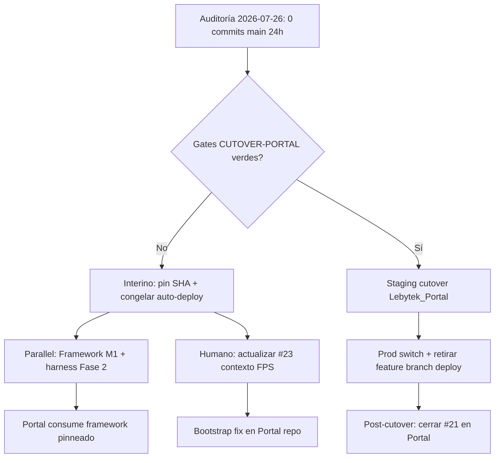

# Design: Cutover Portal/VPS estancado post-FPS y hardening paralelo de plataforma

**Fecha:** 2026-07-26  
**Repo:** `Lebytek_Framework` (package source `lebytek/framework`)  
**Estado:** diseño — sin implementación  
**Auditoría fuente:** [PR #31](https://github.com/Parzival2103/Lebytek_Framework/pull/31) — `docs/audits/2026-07-26-auditoria-tecnica-diaria.md` (draft, base `main`)  
**Rama base de trabajo:** `feature/backoffice-api-integration` (referencia VPS @ `4789f95`) / `main` @ `607a3c6` (package FPS)  
**Rama spec:** `automation/audit-spec-2026-07-26` (deriva de feature, no de `main`)  
**Specs relacionados:**  
- `docs/superpowers/specs/2026-07-24-audit-vps-cutover-fps-design.md` (cutover objetivo)  
- `docs/superpowers/specs/2026-07-25-audit-harness-env-health-design.md` (higiene harness; `INSTALL_TOKEN` parcialmente en PR #31)

---

## Problema

La auditoría del 2026-07-26 confirma **cero commits en `main` en las últimas 24 h** y **ningún avance operativo** desde la auditoría del 2026-07-25. El package source post-FPS (merge PR #26) permanece estable, pero el ecosistema sigue en un **estado crítico de cutover estancado**:

| ID | Hallazgo | Evidencia | Impacto |
|----|----------|-----------|---------|
| **C1** | VPS despliega monolito feature, no arquitectura FPS | `scripts/vps-deploy-lebytek-com.sh:6`, `vps-deploy-waapi.sh:6` → `BRANCH=feature/backoffice-api-integration`; `main` sin Marketing | Deploy accidental de `main` rompe lebytek.com; feature congelada en SHA distinto al paquete publicado |
| **C2** | Bootstrap `marketing.sql` incompleto en feature/VPS | Columnas lifecycle/churn/Stripe ausentes en schema base vs migraciones `202607*` | Fresh install + `install.php` → schema incompatible con PHP de feature |
| **C3** | CRUD `mkt_ordenes.status` editable | `config/cruds/mkt_ordenes.json` (solo feature) permite `"paid"` sin transición | Admin puede activar plan sin Stripe ni Autorizar pago |
| **C4** | Stripe subscription gaps | Issue **#21** abierto (6 criticals) | Checkout recurrente inseguro si se habilita |
| **M5** | Deploy lebytek traga errores de migración | `vps-deploy-lebytek-com.sh` L56–70: `\|\| true` / `migration skipped` | Schema parcial silencioso en prod |
| **M6** | Deploy waapi sin migraciones | `vps-deploy-waapi.sh` solo clone + composer + nginx | waapi puede quedar sin SQL post-deploy |
| **M8** | Docs VPS desactualizadas | `docs/integration/VPS_CHECKLIST.md` — ítems sin marcar; branch feature como permanente | Ops sigue creyendo que feature es target final |

**Nuevo en `main` (implementable en Framework, independiente del cutover):**

| ID | Hallazgo | Evidencia | Impacto |
|----|----------|-----------|---------|
| **M1** | Path traversal en loaders de config | `CrudConfigLoader.php:33`, `CalendarConfigLoader.php:38` — `{resource}`/`{key}` sin allowlist | Usuario autenticado puede leer JSON bajo `config/` fuera de `cruds/` o `calendars/` |
| **M2** | AuthMiddleware no revalida usuario activo | `AuthMiddleware.php` — solo `Session::has('auth_user')` | Usuario desactivado mantiene sesión hasta expiración |
| **M3** | Instalador sin token fuera de production | `public/install/index.php:53–64` — `INSTALL_TOKEN` solo si `APP_ENV=production` | Staging/local con wizard abierto (aceptable dev; riesgo si staging expuesto) |

El PR #31 entrega solo documentación de `INSTALL_TOKEN` en `.env.example` (mejora Q1); **no resuelve** C1–C4 ni M5–M8. La recomendación de auditoría permanece: **requiere revisión humana** para cutover Portal/VPS.

---

## Comportamiento esperado

### Cutover Portal/VPS (estado objetivo — sin cambio vs spec 2026-07-24)

1. **lebytek.com / waapi** se despliegan desde **`Lebytek_Portal`**, no desde `Lebytek_Framework`.
2. Framework llega al VPS **solo vía Composer** (`vendor/lebytek/framework`), versión pinneada en `composer.lock`.
3. Scripts de deploy referencian rama/tag del **Portal**, no `feature/backoffice-api-integration`.
4. Bootstrap Marketing alineado con migraciones y repositorios PHP (cierre #23 en contexto Portal).
5. Gates de `docs/CUTOVER-PORTAL.md` verdes en staging antes de switch de producción.
6. `PAYMENTS_SUBSCRIPTION_CHECKOUT=false` / checkout subscription OFF hasta cierre #21.

### Estado interino (semana estancada — comportamiento mínimo aceptable)

Mientras el cutover siga **deferred**:

1. **Auto-deploy congelado o con SHA pinneado** documentado — no HEAD flotante en feature sin checklist humano.
2. **Scripts VPS fallan en error** (no `\|\| true`) en migraciones críticas; logs visibles para ops.
3. **`vps-deploy-waapi.sh`** incluye paso de migraciones SQL equivalente al script lebytek.com (o documenta por qué waapi no las necesita).
4. **`docs/integration/VPS_CHECKLIST.md`** y `docs/core/seguridad_secretos_deploy.md` reflejan realidad post-FPS (branch feature = interino, fecha cutover TBD).
5. Issues **#21** y **#23** actualizados al contexto FPS (`main` sin marketing; bootstrap = Portal/VPS pinneada).
6. Ningún merge `feature/backoffice-api-integration` → `main` sin orden explícita.

### Hardening paralelo en Framework `main` (puede avanzar sin cutover)

1. **Config loaders** rechazan identificadores que no cumplan `^[a-z0-9_]+$` antes de construir path.
2. **AuthMiddleware** (opcional v1.1) revalida `auth_usuarios.activo` en requests autenticados o invalida sesión.
3. **Tests harness** cubren path traversal negativo en `CrudConfigLoader` y `CalendarConfigLoader`.
4. Health API pública y limpieza `.env.example` harness según spec 2026-07-25 (Fase 2 pendiente).

---

## Alcance

### Incluido

- Diseño de desbloqueo del estancamiento: gates de go/no-go, checklist interino, y criterios de escalación humana.
- Plan de remediación para scripts deploy (M5, M6) en `scripts/` — diseño only.
- Re-scope explícito de #23 (bootstrap/manifiestos → Portal o feature pinneada, no `main`).
- Política Stripe (#21) como gate duro pre-cutover y pre-habilitación checkout recurrente.
- Diseño de sanitización config loaders (M1) en `src/Application/Services/`.
- Referencia cruzada a specs 2026-07-24 y 2026-07-25; PR #31 como fuente de auditoría.

### Fuera de alcance (no-alcance)

- Implementación de código en `app/` o `src/` en esta automatización (solo spec).
- Cutover VPS real, deploy, SSH, DNS, migraciones prod, `.env`/secretos en servidores.
- Fixes Stripe (#21), bootstrap leads (#23), CRUD `mkt_ordenes.status` (C3) — Portal/feature pinneada.
- Merge `feature/backoffice-api-integration` → `main`.
- Creación repo remoto `Lebytek_Portal` (orden explícita requerida).
- Cierre de PR #31 ni otros drafts de auditoría — automation posterior.
- Desactivar RBAC, CSRF, rate limits, Horizon, firmas webhook Stripe, ni tests de seguridad.
- Ejecutar `php tests/run.php` en agente cloud (sin PHP en cron).
- Parche directo de `vendor/lebytek/framework` en consumidores.

---

## Contexto del proyecto

| Ámbito | Repo / ruta | Rol |
|--------|-------------|-----|
| Plataforma | `Lebytek_Framework` → `src/` | Paquete Composer; harness root no deployable |
| Portal Lebytek | `Lebytek_Portal` (pendiente) | lebytek.com / waapi — negocio Marketing |
| VPS actual | `feature/backoffice-api-integration` @ `4789f95` | Monolito legacy en producción |
| Skeleton | `skeleton/` | Plantilla tenant genérico |

**Restricciones absolutas:**

- Negocio Marketing no vuelve al package source.
- Cambios de plataforma → `src/`, `scripts/`, `skeleton/`, tests harness.
- No parchear `vendor/` en consumidores.
- Cutover VPS requiere sign-off humano en `docs/CUTOVER-PORTAL.md`.

**Criterios de éxito del diseño:**

- Un operador distingue claramente estado interino (feature pinneada) vs estado objetivo (Portal + Composer).
- No hay ambigüedad sobre qué acciones pueden ejecutarse en paralelo en Framework vs qué requiere Portal.
- Bootstrap greenfield no falla por columnas faltantes una vez aplicado el plan #23 en repo correcto.
- Loaders de config no permiten lectura fuera de directorios permitidos.
- Stripe recurrente permanece OFF hasta evidencia de cierre #21.

---

## Enfoques propuestos

### Enfoque A — Cutover completo inmediato (ideal, bloqueado)

**Qué:** Ejecutar `docs/CUTOVER-PORTAL.md` de punta a punta — crear `Lebytek_Portal`, migrar deploy scripts, retirar auto-pull monolito.

| Pros | Contras |
|------|---------|
| Elimina C1–C4 de raíz | Requiere repo Portal, auth Composer privado, staging E2E — **deferred** sin orden explícita |
| Alinea prod con FPS | Alto riesgo si se apresura con #21/#23 abiertos |
| Un solo modelo arquitectónico | No ejecutable autonomously por agente |

**Veredicto:** Objetivo correcto; **no viable esta semana** sin sign-off humano y gates verdes.

### Enfoque B — Congelamiento operativo + docs (interino mínimo)

**Qué:** Pin SHA feature en scripts/checklist; deshabilitar auto-pull; actualizar VPS_CHECKLIST; re-etiquetar #23; **sin** cambios en `src/`.

| Pros | Contras |
|------|---------|
| Bajo riesgo; ejecutable por ops | No reduce deuda feature; C2–C4 persisten en monolito |
| Evita deploy accidental de `main` | waapi sigue sin migrate (M6) si no se documenta workaround |
| Desbloquea tiempo para cutover real | No corrige M1 path traversal en package `main` |

**Veredicto:** Necesario como **mínimo interino**, insuficiente solo.

### Enfoque C — Dual track: interino ops + hardening Framework (recomendado)

**Qué:** Enfoque B (pin + docs + scripts fail-fast) **en paralelo** con PR Framework para M1 (config loader allowlist) y avance spec 2026-07-25 Fase 2 (health API). Cutover Portal planificado en ventana con gates #21/#23.

| Pros | Contras |
|------|---------|
| Progreso medible en `main` aunque cutover esté deferred | Dos frentes requieren coordinación maintainer/ops |
| M1 cierra vulnerabilidad en paquete que consumirá Portal | Bootstrap/Stripe siguen en feature hasta cutover |
| Scripts fail-fast reducen schema parcial silencioso | Requiere PRs separados (Framework vs Portal) |

**Veredicto:** **Recomendado.** Separa lo implementable en package source de lo bloqueado en monolito VPS.

---

## Diseño propuesto (Enfoque C)

### 1. Escalación cutover estancado



**Acciones interinas (ops/maintainer):**

1. Documentar SHA pinneado `4789f95` (o HEAD actual verificado) en `VPS_CHECKLIST.md` § Deploy.
2. Añadir banner en `vps-deploy-*.sh`: `# INTERINO post-FPS — NO cambiar a main hasta cutover Portal`.
3. Reemplazar `\|\| true` por exit code failure + mensaje en migraciones lebytek deploy (PR dedicado).
4. Añadir bloque migrate a `vps-deploy-waapi.sh` o checklist manual post-deploy.
5. Comentario en issue #23: bootstrap/manifiestos ya no aplican a `main`; scope = Portal + feature pinneada.

### 2. Config loader sanitization (M1)

**Componentes:** `CrudConfigLoader`, `CalendarConfigLoader` (y revisar `ReporteConfigLoader` por mismo patrón).

**Regla:**

```php
private static function assertSafeConfigKey(string $key): void
{
    if ($key === '' || !preg_match('/^[a-z0-9_]+$/', $key)) {
        throw new ValidationException('Identificador de configuración inválido.');
    }
}
```

Invocar **antes** de concatenar path. Cache key = valor ya validado.

**Tests:** `tests/Platform/CrudConfigLoaderSecurityTest.php` — casos `../secrets`, `foo/bar`, `%00`, vacío → `ValidationException`.

**Capa:** `Application` — sin lógica en Presentation.

### 3. Auth session revalidation (M2 — fase opcional)

**v1 (este ciclo):** Documentar comportamiento actual en spec/issue; login ya verifica `activo`.

**v1.1 (follow-up):** `AuthMiddleware` consulta repositorio auth (cache request-scoped) y destruye sesión si `activo = 0`. Test: usuario desactivado mid-session → redirect login.

No bloquea cutover; puede ir en PR separado post-M1.

### 4. Riesgos Stripe (#21) — gates

| Critical | Mitigación diseño |
|----------|-------------------|
| C1 first-activation no-op | No habilitar subscription checkout hasta fix ConfirmarPagoStripe |
| C2 invoice.paid metadata | Resolver orden vía subscription/customer id, no metadata checkout |
| C3 recover new checkout | Billing Portal o external_ref estable |
| C4 post-claim swallow | Propagar error o cola retry; no 200 silencioso |
| C5 recover cancelled desync | No `markActive` si API falla |
| C6 amount bypass | Validar currency + amount siempre |

**Política ops:** `STRIPE_ENABLED` y `PAYMENTS_SUBSCRIPTION_CHECKOUT` según checklist; default OFF en VPS hasta cierre issue.

### 5. Bootstrap (#23) — re-scope Portal

Fresh install en **Portal** debe garantizar paridad:

- `database/schema/modules/marketing.sql` incluye columnas de migraciones `20260701160000`–`20260706120000` y Stripe órdenes.
- Manifiesto `config/modules/marketing.php` = union de migraciones en disco.
- Test `SchemaBootstrapTest` (Portal) valida columnas críticas en `dom_mkt_leads`, no solo existencia de tablas.

En `main` Framework: **ninguna acción** — marketing.sql eliminado post-FPS.

---

## Criterios de aceptación

### Cutover / ops (humano + PRs docs/scripts)

- [ ] `VPS_CHECKLIST.md` marca cutover como **deferred con fecha revisión** y documenta SHA pinneado interino.
- [ ] Scripts deploy no silencian fallos de migración crítica (exit ≠ 0 o flag `--strict`).
- [ ] `vps-deploy-waapi.sh` tiene estrategia migrate documentada o implementada.
- [ ] Issue #23 body actualizado: scope Portal/VPS, no `main @ 2c71d3f`.
- [ ] Ningún deploy prod de `main` en lebytek.com sin cutover completo.
- [ ] Checkout subscription permanece OFF hasta checklist #21 completo.

### Framework package (`main` — PRs separados)

- [ ] `CrudConfigLoader` y `CalendarConfigLoader` rechazan keys con `..`, `/`, `%`, mayúsculas, vacío.
- [ ] Test harness falla si path traversal es posible.
- [ ] (Opcional v1.1) AuthMiddleware invalida sesión de usuario desactivado.
- [ ] (Spec 2026-07-25 Fase 2) Health API pública sin sesión.

### Auditoría / pipeline

- [ ] PR #31 referenciado en spec; no cerrado por esta automation.
- [ ] Spec committeado en `automation/audit-spec-2026-07-26` sin cambios en `app/` ni `src/`.

---

## Riesgos

| Riesgo | Severidad | Mitigación |
|--------|-----------|------------|
| Deploy `main` en lebytek.com | 🔴 Crítico | Scripts siguen en feature; pin SHA + banner interino |
| Fresh install feature sin migraciones Jul | 🔴 Crítico | Post-deploy `\d dom_mkt_leads`; plan #23 en Portal |
| Habilitar Stripe subscription con #21 abierto | 🔴 Crítico | Gate ops; default OFF |
| Migración fallida silenciada | 🟠 Alto | Enfoque C: fail-fast en scripts |
| Path traversal config (M1) | 🟠 Alto | PR Framework M1 antes/después cutover |
| Semanas sin avance cutover | 🟡 Medio | Escalación humana; checklist fecha revisión |
| Confusión harness `.env.example` Portal vars | 🟡 Medio | Spec 2026-07-25 Fase 1 doc-only |
| Agente cloud sin PHP | ℹ️ Info | Verificación en CI/local |

---

## Referencias

- [PR #31 — informe técnico diario 2026-07-26](https://github.com/Parzival2103/Lebytek_Framework/pull/31)
- `docs/audits/2026-07-26-auditoria-tecnica-diaria.md` (en rama PR #31)
- [Issue #21 — Stripe subscription criticals](https://github.com/Parzival2103/Lebytek_Framework/issues/21)
- [Issue #23 — bootstrap leads / re-scope Portal](https://github.com/Parzival2103/Lebytek_Framework/issues/23)
- `docs/CUTOVER-PORTAL.md`
- `docs/superpowers/specs/2026-07-24-audit-vps-cutover-fps-design.md`
- `docs/superpowers/specs/2026-07-25-audit-harness-env-health-design.md`
